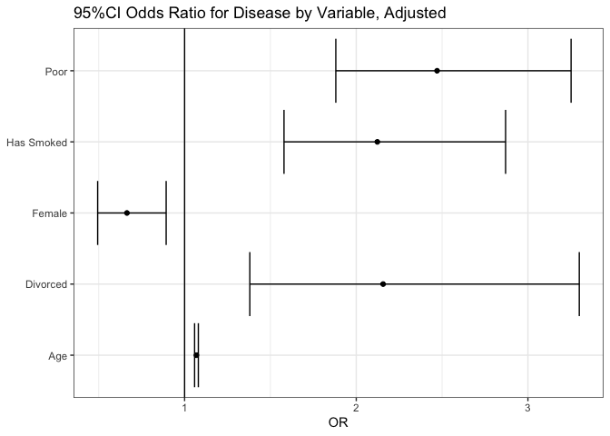
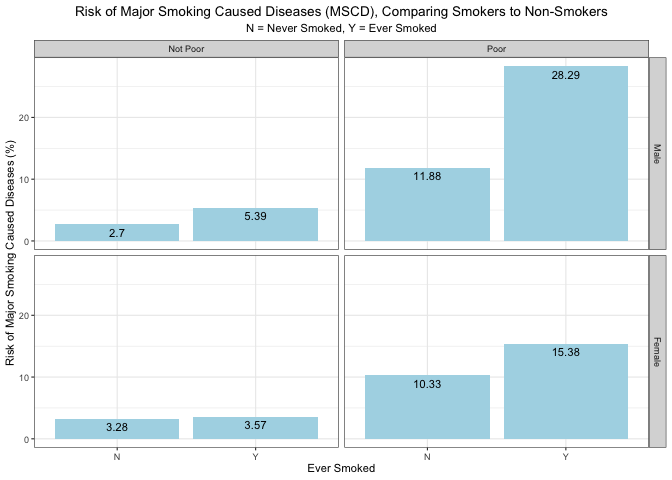
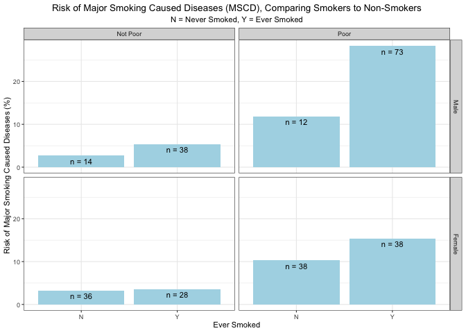
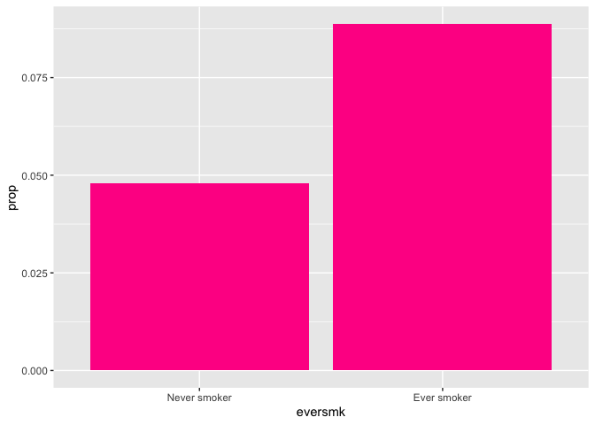
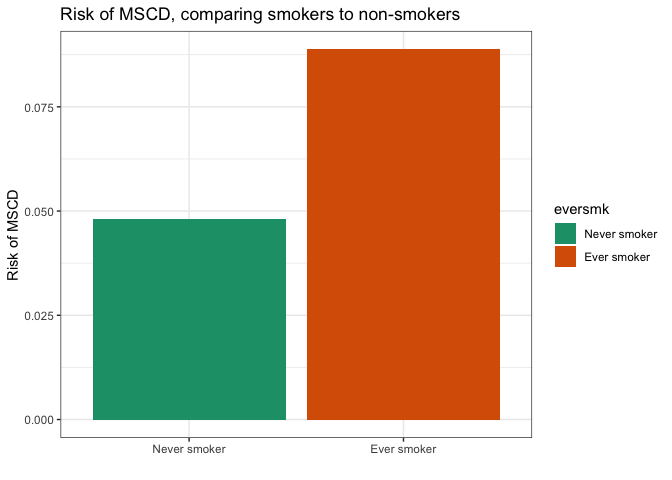
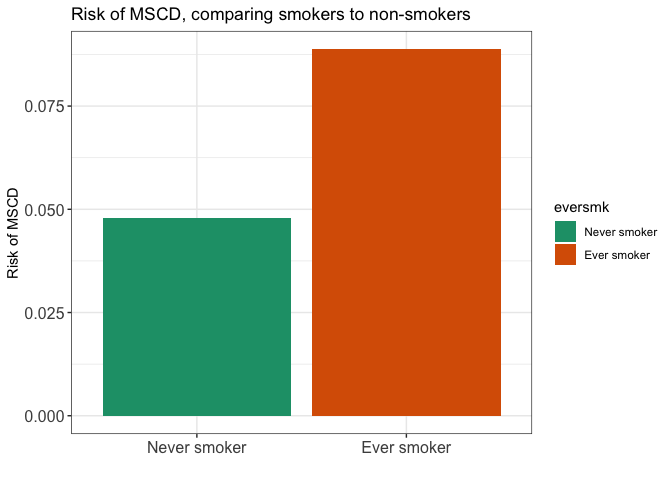
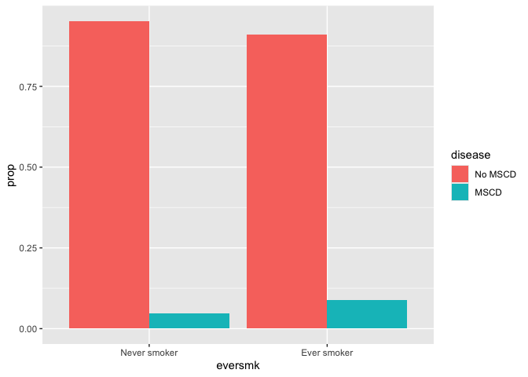
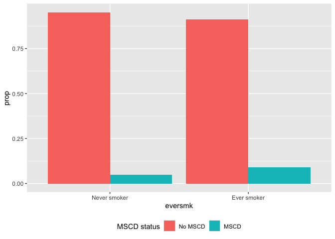
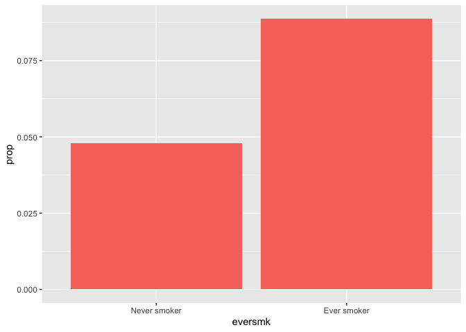

## Preliminaries

Again, first we load the packages that we will be using in this document.  It's good practices to load packages as the beginning so they are all in the same place.  If you decide later you need an additional package, add it to the top of the document!

``` r
library(tidyverse)  # core group of tidyverse packages
library(kableExtra)  # to make nice tables
library(broom)   # for tidy model output
```

## Module 1: Smoking and the risk of disease

Questions of interest:

* **Question 1.1: ** How does the risk of disease compare for smokers and otherwise similar non-smokers?

<center>
{width=500px}
</center>

* **Queston 1.2: ** Does the contribution of smoking to the risk of disease vary by sex or socio-economic status (SES)?

<center>
{width=500px}
</center>

To address each question we want:

* A data display (graph or table)
* A statistical analysis (with interprepration)

We will answer these questions using data from the National Medical Expenditures Survey (NMES)

## Discussion of NMES logistic regression results for Question 1-1

In your breakout groups, take 15-20 minutes to discuss the following sets of logistic regression results and interpretations.  Looking at all 6 sets of results/interpretations, answer the following questions:

(1) In order to address the comparison of interest between smokers and non-smokers, which variable **must** be included in the model?

(2) In order to allow for comparison between smokers and **otherwise similar** non-smokers, what must be included in the model?  What must be included in the interpretation?

(3) To address our question of interest, should we interpret **all** the coefficients in the regression model?  Or just some of them?

(4) To address our question of interest, is it better to present/interpret the regression coefficients or the odds ratios?

(5) To address our question of interest, how can we include information about the significance of the relationship of interest in our interpretation?

(6) If you were to create a nice succinct table of results to communicate the relevant information from the R output to the reader, what pieces of information would you include? What could be excluded?  What aesthetic choices would you make when presenting the information in the table and in the text?

(7) For a variable like age or BMI, should we include it in our regression model in its continuous form or in a categorical form?  Why? How are the coefficients interpreted in these different cases?

(8) Should the variables used to determine "otherwise similar" in the regression model match the variables used to determine "otherwise similar" in the data display (graph)?  Why or why not?

(9) We would like you to be **numerate** in your interpretations of your analysis results.  What do we mean by numerate and which interpretations below do a good job of being numerate?

(10) Are there any interpretations or results shown below that you think are technically incorrect? Are there some that you particularly like? Which ones sound the most like something you think you would read in a scientific publication?


### Results 1

**Holding age constant, females have around a 77% lower odds of having lung cancer compared to males. 
Holding sex constant, each additional year of age is associated with a 7% increase in the odds of lung cancer. **


``` r
model1 <- glm(lc5 ~ age + female, 
              family=binomial(link="logit"), 
              data=nmes_data)

model1 %>%
  tidy(exponentiate = TRUE, conf.int = TRUE, conf.level = 0.95) %>%
  mutate(conf.int = paste0("(", round(conf.low, 2), ", ", round(conf.high,2), ")")) %>%
  select(Term = term, OR = estimate, `p-value` = p.value, `95% CI` = conf.int) %>%
  kable(digits = 3, format = "markdown", align = c("l", "r", "r", "c"))
```


|Term         |    OR| p-value|    95% CI    |
|:------------|-----:|-------:|:------------:|
|(Intercept)  | 0.000|       0|    (0, 0)    |
|age          | 1.074|       0| (1.05, 1.1)  |
|femaleFemale | 0.232|       0| (0.12, 0.44) |


### Results 2

**In the logistic regression model adjusting for age, ever smokers have higher odds of smoking-caused disease (LC OR CHD) compared to never smokers. The odds ratio for smoking represents the comparison between smokers and non-smokers while holding age constant, meaning the groups are otherwise similar with respect to age. This indicates that smoking is associated with an increased risk of disease beyond what can be explained by age differences alone.**


``` r
model1 <- glm(disease ~ eversmk + age,
              family = binomial(link = "logit"),
              data = nmes_data)

### Tidy output on log-odds scale
model_tbl <- model1 %>%
  tidy(exponentiate = TRUE, conf.int = TRUE, conf.level = 0.95) %>%
  filter(term != "(Intercept)") %>%   
  # Remove the intercept since we are interested in covariate effects

  mutate(
    Term = case_when(
      term == "eversmkEver smoker" ~ "Ever Smoker",
      term == "femaleFemale" ~ "Female",
      term == "poorPoor" ~ "Poor",
      TRUE ~ term
    ),
    OR = round(estimate, 3),
    `p-value` = if_else(p.value < 0.001, 0.000, round(p.value, 3)),
    `95% CI` = paste0("(", round(conf.low, 2), ", ", round(conf.high, 2), ")")
  ) %>%
  select(Term, OR, `p-value`, `95% CI`)

# Display the logistic regression results as a formatted table

model_tbl %>%
  kable(format = "html", align = c("l","c","c","c")) %>%
  kable_styling(bootstrap_options = c("striped"), full_width = FALSE)
```

<table class="table table-striped" style="width: auto !important; margin-left: auto; margin-right: auto;">
 <thead>
  <tr>
   <th style="text-align:left;"> Term </th>
   <th style="text-align:center;"> OR </th>
   <th style="text-align:center;"> p-value </th>
   <th style="text-align:center;"> 95% CI </th>
  </tr>
 </thead>
<tbody>
  <tr>
   <td style="text-align:left;"> Ever Smoker </td>
   <td style="text-align:center;"> 2.452 </td>
   <td style="text-align:center;"> 0 </td>
   <td style="text-align:center;"> (1.87, 3.24) </td>
  </tr>
  <tr>
   <td style="text-align:left;"> age </td>
   <td style="text-align:center;"> 1.077 </td>
   <td style="text-align:center;"> 0 </td>
   <td style="text-align:center;"> (1.07, 1.09) </td>
  </tr>
</tbody>
</table>

### Results 3


**I fitted the logistic regression to lung cancer status as the outcome and BMI category + smoking status as the predictors. When BMI category is held constant, ever smokers had significantly higher lung cancer than never smokers. This data indicates that, eversmokers had nearly 11 times the odds of lung cancer relative to never smokers. In contrast, BMI category was not a statistically significant predictor of lung cancer. If we take 0-20 BMI category as reference the difference in odds of cancer was not statistially significant for 20-25, 25-30, 30+ categories.**


What do you notice about the marital variable in this model output?


``` r
# code for logistic regression

# code for logistic regression
model1 <- glm(
  lc5 ~ eversmk + bmi_cat,
  family = binomial(link = "logit"),
  data = nmes_data
)
model1 %>%
  tidy(exponentiate = TRUE, conf.int = TRUE, conf.level = 0.96) %>%
  filter(term != "(Intercept)") %>%
  mutate(conf.int = paste0("(", round(conf.low, 2), ", ", round(conf.high,2), ")")) %>%
  select(Term = term, OR = estimate, `p-value` = p.value, `95% CI` = conf.int) %>%
  kable(digits = 3, format = "markdown")
```


|Term               |     OR| p-value|95% CI        |
|:------------------|------:|-------:|:-------------|
|eversmkEver smoker | 10.878|   0.000|(4.22, 38.83) |
|bmi_cat20–25       |  0.705|   0.461|(0.28, 2.06)  |
|bmi_cat25–30       |  0.558|   0.249|(0.2, 1.71)   |
|bmi_cat30+         |  0.863|   0.788|(0.28, 2.81)  |

### Results 4

**After adjusting for gender, individuals who had ever smoked had higher odds of lung cancer compared to those who had never smoked. The OR for this relationship was 8.95, with a p < 0.001 indicating a statistically significant relationship. Females also had higher odds of lung cancer compared to males. Including gender as a confounding variable didn't eliminate the association between smoking and lung cacner, implying that ever-smoking status is a risk factor for lung cancer. **


``` r
# model that accounts for confounding
model <- glm(lc5 ~ eversmk + female, 
              family=binomial(link="logit"), 
              data=nmes_data)


# filtering and renaming the columns
model %>%
  tidy(exponentiate = TRUE, conf.int = TRUE, conf.level = 0.96) %>%
  filter(term != "(Intercept)") %>%
  mutate(
    Term = case_when(
      term == "eversmkEver smoker" ~ "Ever smoker",
      term == "femalemale"         ~ "Female",
      TRUE ~ term
    ),
    `95% CI` = paste0("(", round(conf.low, 2), ", ", round(conf.high, 2), ")")
  ) %>%
  select(Term, OR = estimate, `p-value` = p.value, `95% CI`) %>%
  kable(digits = 3, format = "markdown")
```


|Term        |    OR| p-value|95% CI        |
|:-----------|-----:|-------:|:-------------|
|Ever smoker | 8.948|   0.000|(3.44, 32.09) |
|Female      | 2.906|   0.001|(1.5, 5.99)   |


### Results 5

**It seems that after adjusting for the confounding variables, age and sex, ever smokers have 72% higher odds of disease compared to otherwise similar never smokers. The p value is ~0.00, indicating a statistically significant association.**


``` r
# code for logistic regression
model3 <- glm(disease ~ eversmk + age, 
              family=binomial(link="logit"), 
              data=nmes_data)

model3 %>%
  tidy(exponentiate = TRUE, conf.int = TRUE, conf.level = 0.96) %>%
  filter(term != "(Intercept)") %>%
  mutate(
    term = case_when(
      term == "eversmkEver smoker" ~ "Ever smoker",
      term == "age" ~ "Age",
    ),
    conf.int = paste0("(", round(conf.low, 2), ", ", round(conf.high,2), ")")) %>%
  select(Term = term, OR = estimate, `p-value` = p.value, `95% CI` = conf.int) %>%
  kable(digits = 3, format = "markdown") %>%
  kable_styling(full_width = F)
```

<table class="table" style="width: auto !important; margin-left: auto; margin-right: auto;">
 <thead>
  <tr>
   <th style="text-align:left;"> Term </th>
   <th style="text-align:right;"> OR </th>
   <th style="text-align:right;"> p-value </th>
   <th style="text-align:left;"> 95% CI </th>
  </tr>
 </thead>
<tbody>
  <tr>
   <td style="text-align:left;"> Ever smoker </td>
   <td style="text-align:right;"> 1.818 </td>
   <td style="text-align:right;"> 0 </td>
   <td style="text-align:left;"> (1.35, 2.46) </td>
  </tr>
  <tr>
   <td style="text-align:left;"> Age </td>
   <td style="text-align:right;"> 1.072 </td>
   <td style="text-align:right;"> 0 </td>
   <td style="text-align:left;"> (1.06, 1.08) </td>
  </tr>
</tbody>
</table>


### Results 6


**Based on the NMES data provided, people who have smoked before have a 2.12 times odds of (lung cancer or CHD/other cancers) disease versus those who have never smoked before, adjusting for other significant variables such as sex, age, poverty level, and marital status. Similarly adjusting, females have 0.66 times the odds of disease versus males, divorced individuals have 2.16 times the odds of disease versus unmarried individuals, and poor people have 2.5 times the odds of disease compared to those not in poverty. With age, for every one year increase there is a 1.07 times increase in odds of disease, or 7%/year.**


``` r
final_fit <- glm(disease ~ eversmk + female + age + poor + marital, data = nmes_data, family = binomial)

##class materials
final_fit %>%
  tidy(exponentiate = TRUE, conf.int = TRUE, conf.level = 0.95) %>%
  filter(term != "(Intercept)") %>% filter(p.value <0.05) %>%
  mutate(conf.int = paste0("(", round(conf.low, 2), ", ", round(conf.high,2), ")")) %>%
  select(Term = term, OR = estimate, `p-value` = p.value, `95% CI` = conf.int) %>%
  
#Using mutate + sub together: https://www.bing.com/search?q=mutate+and+sub+function+used+at+once+in+rstudio&cvid=11196d5d11eb4c1ea13036c9e6e186ab&gs_lcrp=EgRlZGdlKgYIABBFGDkyBggAEEUYOTIHCAEQ6wcYQNIBCDk1NzJqMGo5qAIIsAIB&FORM=ANAB01&adppc=EDGEXST&PC=SMTS
  
  mutate(Term = sub("eversmkSmoked", "Has Smoked", Term), Term = sub("femaleFemale", "Female", Term), Term = sub("age", "Age", Term), Term = sub("poorPoverty", "Poor", Term), Term = sub("marital3", "Divorced", Term),) %>%
  
  kable(digits = 3, format = "markdown")
```


|Term       |    OR| p-value|95% CI       |
|:----------|-----:|-------:|:------------|
|Has Smoked | 2.123|   0.000|(1.58, 2.87) |
|Female     | 0.664|   0.007|(0.49, 0.89) |
|Age        | 1.069|   0.000|(1.06, 1.08) |
|Poor       | 2.471|   0.000|(1.88, 3.25) |
|Divorced   | 2.156|   0.001|(1.38, 3.3)  |

``` r
#https://stackoverflow.com/questions/47085514/simple-way-to-visualise-odds-ratios-in-r
#WON'T LET ME PIPE (fixed, just copy pasted)
#https://jeongayoung.com/odds-ratio-using-ggplot2/?ckattempt=1 #cheatsheet of ggplot

final_fit %>%
  tidy(exponentiate = TRUE,
       conf.int = TRUE,
       conf.level = 0.95) %>%
  filter(term != "(Intercept)", p.value < 0.05) %>%
  mutate(
    Term = term, OR = estimate,
    Term = sub("eversmkSmoked", "Has Smoked", Term),
    Term = sub("femaleFemale", "Female", Term),
    Term = sub("age", "Age", Term),
    Term = sub("poorPoverty", "Poor", Term),
    Term = sub("marital3", "Divorced", Term)
  ) %>% 
  #didn't relabel, relabel estimate = OR.
ggplot(aes(x = OR, y = Term)) + geom_point() + geom_errorbarh(aes(xmin = conf.low, xmax = conf.high)) + 
  #vline creates a reference line at an intercept
  geom_vline(xintercept =1) + labs(y = NULL, title = "95%CI Odds Ratio for Disease by Variable, Adjusted") + theme_bw()
```

```
## Warning: `geom_errorbarh()` was deprecated in ggplot2 4.0.0.
## ℹ Please use the `orientation` argument of `geom_errorbar()` instead.
## This warning is displayed once every 8 hours.
## Call `lifecycle::last_lifecycle_warnings()` to see where this warning was
## generated.
```

<!-- -->

## R notes based Assignment 1-2

We're including some notes here on aesthetics for improving your tables/displays as we start to work to a final project report.  You should also feel free to ask questions on Piazza if there is something you would like us to help you learn how to do!

### Annotating data displays


``` r
nmes_table <- nmes_data %>%
  count(eversmk,disease,female, poor)%>%
  group_by(eversmk,female, poor)%>%
  mutate(percent=n/sum(n)*100)

### Plots the graph
nmes_table %>%
  filter (disease == "Disease")%>%
  ggplot()+ 
  geom_bar(aes(x = eversmk, y = percent, fill=disease), fill = "lightblue", stat="identity")+
  facet_grid(female~poor)+
  theme_bw(base_size=8.5)+
  geom_text(aes(x=eversmk, y= percent, label=round(percent, digits=2), vjust=1.5))+
  labs(y = "Risk of Major Smoking Caused Diseases (%)",
       x = "Ever Smoked",
       title = "Risk of Major Smoking Caused Diseases (MSCD), Comparing Smokers to Non-Smokers",
       subtitle = "N = Never Smoked, Y = Ever Smoked")+
  theme(legend.position = "none",
        plot.title = element_text(hjust = 0.5),
        plot.subtitle = element_text(hjust = 0.5))
```

<!-- -->

``` r
### Plots the graph - sample sizes instead
nmes_table %>%
  filter (disease == "Disease")%>%
  ggplot()+ 
  geom_bar(aes(x = eversmk, y = percent, fill=disease), fill = "lightblue", stat="identity")+
  facet_grid(female~poor)+
  theme_bw(base_size=8.5)+
  geom_text(aes(x=eversmk, y= percent, label=paste0("n = ", n), vjust=1.5))+
  labs(y = "Risk of Major Smoking Caused Diseases (%)",
       x = "Ever Smoked",
       title = "Risk of Major Smoking Caused Diseases (MSCD), Comparing Smokers to Non-Smokers",
       subtitle = "N = Never Smoked, Y = Ever Smoked")+
  theme(legend.position = "none",
        plot.title = element_text(hjust = 0.5),
        plot.subtitle = element_text(hjust = 0.5))
```

<!-- -->


### Recoding the data


### Using knitr/kableExtra and the pander package for tables

We already talked about using the `kable()` function (from the `knitr` package) to make your tables look nicer:

Original:

``` r
nmes_data %>%
  count(disease)
```

```
## # A tibble: 2 × 2
##   disease     n
##   <fct>   <int>
## 1 No MSCD  3801
## 2 MSCD      277
```

Nicer:

``` r
nmes_data %>%
  count(disease) %>%
  kable(format = "pipe")
```


|disease |    n|
|:-------|----:|
|No MSCD | 3801|
|MSCD    |  277|

You can also add a caption to a table directly with the `kable()` function:

``` r
nmes_data %>%
  count(disease) %>%
  kable(format = "pipe",
        caption = "Table 1: Number of individuals with and without Major smoking-caused disease")
```


Table: Table 1: Number of individuals with and without Major smoking-caused disease

|disease |    n|
|:-------|----:|
|No MSCD | 3801|
|MSCD    |  277|

And you can change the number of decimals displayed in the table pretty easily as well.  Generally displaying only 3 significant figures in your tables is a good idea when you have values that include decimals.

``` r
nmes_data %>%
  count(eversmk, disease) %>%
  group_by(eversmk) %>%
  mutate(prop = n/sum(n)) %>%
  filter(disease == "MSCD") %>%
  kable(format = "pipe",
        caption = "Table 2: Proportions of individuals with and without a MSCD by smoking status",
        digits=3)
```


Table: Table 2: Proportions of individuals with and without a MSCD by smoking status

|eversmk      |disease |   n|  prop|
|:------------|:-------|---:|-----:|
|Never smoker |MSCD    | 100| 0.048|
|Ever smoker  |MSCD    | 177| 0.089|

You can find lots of information about fine-tuning tables using `kable()` and the `kableExtra` package [here](https://bookdown.org/yihui/rmarkdown-cookbook/tables.html).

There is also another package called `pander` which makes nice tables. You can install `pander` by running `install.packages("pander")`.  It works very similarly to `kable()` and you can find more information on how to modify settings [here](http://rapporter.github.io/pander/).


``` r
library(pander)  # usually you would want to put this at the top of your document
nmes_data %>%
  count(eversmk, disease) %>%
  group_by(eversmk) %>%
  mutate(prop = n/sum(n)) %>%
  filter(disease == "MSCD") %>%
  pander(caption = "Table 2: Proportions of individuals with and without a MSCD by smoking status",
        digits=3)
```


---------------------------------------
   eversmk      disease    n     prop  
-------------- --------- ----- --------
 Never smoker    MSCD     100   0.048  

 Ever smoker     MSCD     177   0.0888 
---------------------------------------

Table: Table 2: Proportions of individuals with and without a MSCD by smoking status

To nicely display regression model output in a table, you can first store the results in a tidy format that can be manipulated like any other table/data in R. This is easy to do using the `tidy()` function from the `broom` package in R.  Remember, you'll have to use `install.packages("broom")` the first time you use it.


``` r
library(broom)  # usually you would want to put this at the top of your document

my_model <- glm(disease ~ eversmk + age + female, family=binomial(link="logit"), data=nmes_data)
tidy(my_model)
```

```
## # A tibble: 4 × 5
##   term               estimate std.error statistic  p.value
##   <chr>                 <dbl>     <dbl>     <dbl>    <dbl>
## 1 (Intercept)         -7.13     0.351      -20.3  1.67e-91
## 2 eversmkEver smoker   0.791    0.148        5.35 8.68e- 8
## 3 age                  0.0737   0.00458     16.1  2.31e-58
## 4 femaleFemale        -0.307    0.141       -2.18 2.96e- 2
```

In this tidy version of the model output, you see the results are arranged as a data set with variables names `term`, `estimate`, `std.error`, `statistic`, and `p.value`.  You can put this into a nicer table form using `kable()` or `pander()`, but can also easily change column names and add/remove columns and rows:

``` r
my_model <- glm(disease ~ eversmk + age + female, family=binomial(link="logit"), data=nmes_data)
my_model_results <- tidy(my_model)

my_model_results %>%
  kable(format = "pipe",
        digits = 3)
```


|term               | estimate| std.error| statistic| p.value|
|:------------------|--------:|---------:|---------:|-------:|
|(Intercept)        |   -7.130|     0.351|   -20.287|    0.00|
|eversmkEver smoker |    0.791|     0.148|     5.352|    0.00|
|age                |    0.074|     0.005|    16.106|    0.00|
|femaleFemale       |   -0.307|     0.141|    -2.175|    0.03|

``` r
my_model_results %>%
  mutate(odds.ratio = exp(estimate)) %>%  # add a column with the odds ratios
  filter(term != "(Intercept)") %>% # remove the row with the intercept
  select(Variable = term, `Odds Ratio` = odds.ratio, `p-value` = p.value ) %>% # select only the columns we want, rearrange columns, and change names
  kable(format = "pipe",
        digits = 3)
```


|Variable           | Odds Ratio| p-value|
|:------------------|----------:|-------:|
|eversmkEver smoker |      2.207|    0.00|
|age                |      1.077|    0.00|
|femaleFemale       |      0.736|    0.03|

Some of these things can be done automatically with options in the `tidy()` function.  You can see more options using `?tidy.glm`.

``` r
my_model_results <- tidy(my_model, 
                         exponentiate = TRUE,
                         conf.int = TRUE)

my_model_results
```

```
## # A tibble: 4 × 7
##   term               estimate std.error statistic  p.value conf.low conf.high
##   <chr>                 <dbl>     <dbl>     <dbl>    <dbl>    <dbl>     <dbl>
## 1 (Intercept)        0.000801   0.351      -20.3  1.67e-91 0.000393   0.00156
## 2 eversmkEver smoker 2.21       0.148        5.35 8.68e- 8 1.66       2.96   
## 3 age                1.08       0.00458     16.1  2.31e-58 1.07       1.09   
## 4 femaleFemale       0.736      0.141       -2.18 2.96e- 2 0.558      0.970
```

``` r
my_model_results %>%
  filter(term != "(Intercept)") %>% # remove the row with the intercept
  mutate(conf.int = paste0("(", round(conf.low, 2), ", ", round(conf.high, 2), ")")) %>% # combine the CI terms together into nice format 
  select(Variable = term, `Odds Ratio` = estimate, `p-value` = p.value, `95% Confidence Interval` = conf.int) %>% # select only the columns we want, rearrange columns, and change names
  kable(format = "pipe",
        digits = 3,
        align = c("l", "r", "r", "r"))
```


|Variable           | Odds Ratio| p-value| 95% Confidence Interval|
|:------------------|----------:|-------:|-----------------------:|
|eversmkEver smoker |      2.207|    0.00|            (1.66, 2.96)|
|age                |      1.077|    0.00|            (1.07, 1.09)|
|femaleFemale       |      0.736|    0.03|            (0.56, 0.97)|

You can also change the variable names as well (and see some other examples up above, which I actually like better):

``` r
my_model_results$term <- c("Intercept", "Ever smoker", "Age (years)", "Female")

my_model_results %>%
  filter(term != "Intercept") %>% # remove the row with the intercept
  mutate(conf.int = paste0("(", round(conf.low, 2), ", ", round(conf.high, 2), ")")) %>% # combine the CI terms together into nice format 
  select(Variable = term, `Odds Ratio` = estimate, `p-value` = p.value, `95% Confidence Interval` = conf.int) %>% # select only the columns we want, rearrange columns, and change names
  kable(format = "pipe",
        digits = 3,
        align = c("l", "r", "r", "r"))
```


|Variable    | Odds Ratio| p-value| 95% Confidence Interval|
|:-----------|----------:|-------:|-----------------------:|
|Ever smoker |      2.207|    0.00|            (1.66, 2.96)|
|Age (years) |      1.077|    0.00|            (1.07, 1.09)|
|Female      |      0.736|    0.03|            (0.56, 0.97)|

And reformat the p-values to print in scientific notation:

``` r
my_model_results$term <- c("Intercept", "Ever smoker", "Age (years)", "Female")

my_model_results %>%
  filter(term != "Intercept") %>% # remove the row with the intercept
  mutate(conf.int = paste0("(", round(conf.low, 2), ", ", round(conf.high, 2), ")"),
         p.value_format = format(p.value, scientific = TRUE, digits = 3)) %>% # combine the CI terms together into nice format 
  select(Variable = term, `Odds Ratio` = estimate, `p-value` = p.value_format, `95% Confidence Interval` = conf.int) %>% # select only the columns we want, rearrange columns, and change names
  kable(format = "pipe",
        digits = 3,
        align = c("l", "r", "r", "r"))
```


|Variable    | Odds Ratio|  p-value| 95% Confidence Interval|
|:-----------|----------:|--------:|-----------------------:|
|Ever smoker |      2.207| 8.68e-08|            (1.66, 2.96)|
|Age (years) |      1.077| 2.31e-58|            (1.07, 1.09)|
|Female      |      0.736| 2.96e-02|            (0.56, 0.97)|

### Making your report a little more readable

For your final assignment for this module, we will be asking you to write a report presenting your analysis with the answers to the questions posed. We want you to include all the code that you used for the analysis in the Rmd file, but not necessarily to print the output of the code to your html document. There are some very helpful tips for managing whether code and code output get printed to the screen to be found on the second page of this `rmarkdown` cheat sheet: https://rstudio.github.io/cheatsheets/html/rmarkdown.html

For example, if you want to create a table where you display the table, but not the code, you could put `echo=FALSE` in the top of the code chunk for that piece of code:

Table: Table 1: Logistic regression results

|Variable    | Odds Ratio| p-value| 95% Confidence Interval|
|:-----------|----------:|-------:|-----------------------:|
|Ever smoker |      2.207|    0.00|            (1.66, 2.96)|
|Age (years) |      1.077|    0.00|            (1.07, 1.09)|
|Female      |      0.736|    0.03|            (0.56, 0.97)|

Similarly, if you have a code chunk that includes necessary code (that needs to run) but you don't want to see the code or the result of running that code, you can use `echo=FALSE` and `include=FALSE` in the top of the code chunk.


There are some very helpful tips found here: http://kbroman.org/knitr_knutshell/pages/Rmarkdown.html

### Selecting colors for figures

If you want to control the colors you are using in your graphs, [this](https://www.r-graph-gallery.com/ggplot2-color.html) is a great detailed resource for seeing your options!

You can refer to a color in many different ways, but the easiest is by name.  You can see the complete list of 657 colors available in R by typing:

``` r
colors()
```

You can then assign the colors directly (if using only one color) or using the `scale_fill_manual()` function within your graph if you want different colors for different groups:

``` r
plot_data <- nmes_data %>%
  count(eversmk, disease) %>%
  group_by(eversmk) %>%
  mutate(prop = n/sum(n)) %>%
  filter(disease == "MSCD")

ggplot(plot_data) +
  geom_bar(aes(x=eversmk, y=prop),
           stat="identity", fill = "deeppink")
```

<!-- -->

``` r
ggplot(plot_data) +
  geom_bar(aes(x=eversmk, y=prop, fill = eversmk),
           stat="identity") +
  scale_fill_manual(values = c("deeppink", "chartreuse1"))
```

<!-- -->

Sometimes it's better to leave color choices to the professionals, who know which colors look good together.  If you load the `RColorBrewer` package with `install.packages("RColorBrewer")`, you can select from within a predetermined color palatte.  You can see these color palettes [here](https://www.r-graph-gallery.com/38-rcolorbrewers-palettes.html).  You apply them in a similar way as your manual colors:


``` r
library(RColorBrewer)
display.brewer.all() # to see all the colors
```

<!-- -->

``` r
ggplot(plot_data) +
  geom_bar(aes(x=eversmk, y=prop, fill = eversmk),
           stat="identity") +
  scale_fill_brewer(palette = "Dark2")
```

<!-- -->

### Adding labels to figure and changing themes

The cool thing about `ggplot2` is that everything just builds on top of what you've already accomplished, so if you want to change the background, you can just change the theme with one more short line of code. Here, we'll use `theme_bw()` to remove the default gray background. We'll then add an additional line of code to change the color of the bars using `scale_fill_manual()`. Finally, we will relabel the axes and title using `labs()`.


``` r
# Change the appearance of the plot
ggplot(plot_data) +
  geom_bar(aes(x=eversmk, y=prop, fill=eversmk), stat="identity") +
  theme_bw() +
  scale_fill_brewer(palette = "Dark2") +
  labs(y="Risk of MSCD",
       x="",
       title="Risk of MSCD, comparing smokers to non-smokers")
```

<!-- -->

One more important piece of controlling the look of your plot in ggplot2 uses `theme()`. You can control the look of your graphing using the *many* arguments of theme. Here, we'll introduce how to change the axis text size; however, if you type `?theme` below, you'll see all of the things that can be changed on your plots using `theme()`. For a good demonstration of themes, see https://github.com/jrnold/ggthemes.


``` r
# Here, we'll start playing with font size
ggplot(plot_data) +
  geom_bar(aes(x=eversmk, y=prop, fill=eversmk), stat="identity") +
  theme_bw() +
  scale_fill_brewer(palette = "Dark2") +
  labs(y="Risk of MSCD",
       x="",
       title="Risk of MSCD, comparing smokers to non-smokers")+
  theme(axis.text=element_text(size=12))
```

<!-- -->

Finally, here's a link to good resource about adding labels, text, scales, and themes to your graphics: https://r4ds.hadley.nz/communication.html


### Moving or removing legends  in a figure

Whenever you use an aesthetic like `color` or `fill` or `shape` in the `ggplot()` function, R will automatically create a legend to the right of the graph:

``` r
my_table <- nmes_data %>%
  count(disease, eversmk) %>%
  group_by(eversmk) %>%
  mutate(prop = n/sum(n))

ggplot(data = my_table) + 
  geom_bar(aes(x = eversmk, y = prop, fill = disease), stat = "identity", position = "dodge")
```

<!-- -->

You can change the name of this legend in the `labs()` function using the names of the aesthetic shown in the legend.  In this case, the legend shows the `fill` aesthetic, so we can rename it as follows:

``` r
ggplot(data = my_table) + 
  geom_bar(aes(x = eversmk, y = prop, fill = disease), stat = "identity", position = "dodge") +
  labs(fill = "MSCD status")
```

<!-- -->

We can also move the legend to a different location using the `legend.position` option within the `theme()` function:

``` r
ggplot(data = my_table) + 
  geom_bar(aes(x = eversmk, y = prop, fill = disease), stat = "identity", position = "dodge") +
  labs(fill = "MSCD status") +
  theme(legend.position = "bottom")
```

<!-- -->

Choices for the position can be `bottom`, `top`, `right`, `left`, or `none`.  The none option is especially useful when the legend doesn't add any useful information.  Consider the graph where we only show the risk of disease, not the risk of no disease:

``` r
my_table <- nmes_data %>%
  count(disease, eversmk) %>%
  group_by(eversmk) %>%
  mutate(prop = n/sum(n)) %>%
  filter(disease == "MSCD")

ggplot(data = my_table) + 
  geom_bar(aes(x = eversmk, y = prop, fill = disease), stat = "identity", position = "dodge") +
  labs(fill = "MSCD status")
```

<!-- -->

The legend on the side is not useful since there's only one color anyway!  So we can remove it:

``` r
ggplot(data = my_table) + 
  geom_bar(aes(x = eversmk, y = prop, fill = disease), stat = "identity", position = "dodge") +
  labs(fill = "MSCD status") +
  theme(legend.position = "none")
```

<!-- -->

### Removing missing values

You may have noticed that there are missing values of the BMI variable in this dataset.  We can see there are 124 missing values below: 

``` r
nmes_data %>%
  count(is.na(bmi))
```

```
## # A tibble: 2 × 2
##   `is.na(bmi)`     n
##   <lgl>        <int>
## 1 FALSE         3954
## 2 TRUE           124
```

If you were planning to use the BMI variable in your analysis, you would need to do something to account for these missing values.  The topic of missing data could be an entire course of its own; there are many ways to handle the missing values and usually just removing the observations where there are missing values is not appropriate because it can introduce bias into our results.

However much of the topic is beyond the scope of this course.  In this case, only about 3% of the observations have missing BMI data (`124/(124+3954)) = 0.0304`), so we may choose to just exclude those participants.  

If you wanted to remove all participants with missing values of `bmi`, you could use the `drop_na()` function to do this:

``` r
nmes_data_sub <- nmes_data %>%
  drop_na(bmi)

dim(nmes_data)
```

```
## [1] 4078   17
```

``` r
dim(nmes_data_sub)
```

```
## [1] 3954   17
```

``` r
nmes_data_sub %>% count(is.na(bmi))
```

```
## # A tibble: 1 × 2
##   `is.na(bmi)`     n
##   <lgl>        <int>
## 1 FALSE         3954
```

I wouldn't suggest doing this unless you are planning to use BMI in your analysis, because if you do you will be excluding some data that could be used to answer your question of interest!

### Some notes on reporting statistical results

See example papers from JAMA included with the class materials for today. When reporting statistical results include:

* Statement of effect size, being clear what the direction of effect is
* Measure of statistical significance, preferably a 95% CI or p-value
* Do not make a statement about the null hypothesis, or say something like "because the p-value is less than 0.05....". Just provide the interpretation and evidence without any statistical jargon.


## Starting Assignment 1.3

Do the following to address Question 1.1: How does the risk of disease compare for smokers and otherwise similar non-smokers?

1. (**Can work on this now!**) Improve your data display, if needed. Interpret your data display to answer the question. That is, what does this display say about Question 1.1? *Be sure to focus on answering the question being asked!*

2. (**Can work on this now!**) Update your multivariable logistic regression model, if needed.  Interpret your coefficients and associated significance tests to answer the question.  That is, what does this model say about Question 1.1?  *Be sure to focus on answering the question being asked!*

3. (**Wait for Wednesday!**) Complete a propensity score analysis to answer the question:

    * Estimate propensity scores for the treatment of smoking (`eversmk`); that is, use logistic regression to estimate the probability of smoking given possible confounders.
    * Use logistic regression with quintiles of your propensity scores to answer Question 1.1.
    * Interpret the results -- both the relevant coefficient(s) and associated significance tests. *Be sure to focus on answering the question being asked!*
    
    
4. (**Wait for Wednesday!**) Compare the results of your multivariable logistic regression with your propensity score analysis.  Are them similar? Different?  Which analysis method do you prefer and why?

5. Submission notes:
    * Submit your assignment in R Markdown through Github by Sunday (February 8, 2026) at midnight. You can find a link to create this assignment in GitHub on Canvas.
    * Post a **screenshot of your multivariable logistic regression results and your propensity score results**, on Piazza in the  "Assignment 1-3 Results" thread.  **Include your interpretations of what these two models say about Question 1.1 and any thoughts you have on which of these two analysis methods is preferred for answering Question 1.1.** 
    * On Piazza, you are welcome to post anonymously to your classmates. You can also include comments about what your chose to do or questions you had as you were making the display and fitting your model.
    * You may work together on this assignment, but you must submit your own assignment; please credit in your assignment anyone with whom you collaborated.
    * Next week in class we will start with discussion of your work.

