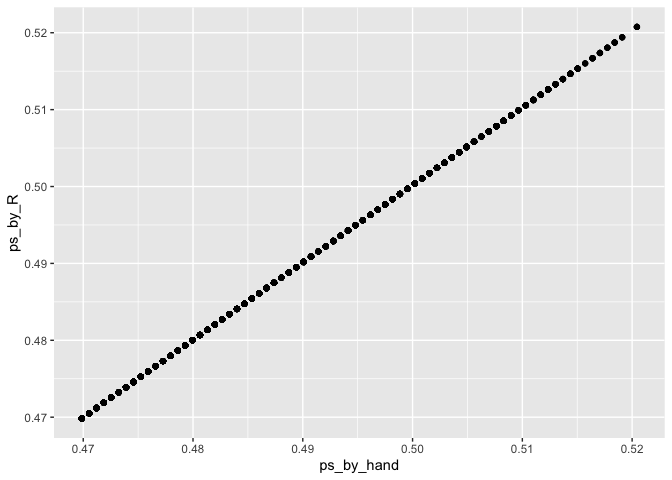
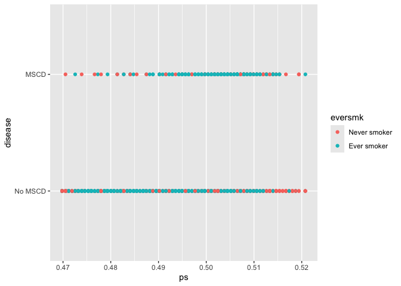
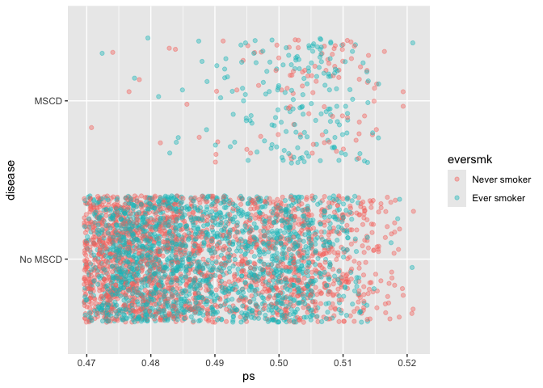
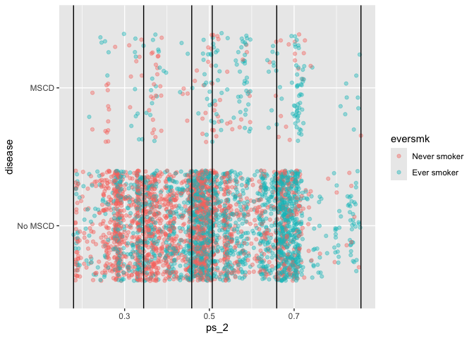

## Preliminaries

Again, first we load the packages that we will be using in this document.  It's good practice to load packages as the beginning so they are all in the same place.  If you decide later you need an additional package, add it to the top of the document!

``` r
library(tidyverse)  # core group of tidyverse packages
library(broom) # for formating model results
library(kableExtra)  # to make nice tables
library(gtsummary) # to create nice summary tables
```

We also can read in and recode the variables in the NMES data set:

``` r
nmes_data <- read_csv("module_1/nmesUNPROC.csv")

nmes_data <- nmes_data %>%
  mutate(eversmk = factor(eversmk, levels = c("0", "1"), labels = c("Never smoker", "Ever smoker")),
         lc5 = factor(lc5, levels = c("0", "1"), labels = c("No LC", "LC")),
         chd5 = factor(chd5, levels = c("0", "1"), labels = c("No CHD", "CHD")),
         female = factor(female, levels= c("0", "1"), labels = c("Male", "Female")),
         current = factor(current, levels= c("0", "1"), labels = c("Not current smoker", "Current smoker")),
         former = factor(former, levels= c("0", "1"), labels = c("Not former smoker", "Former smoker")),
         beltuse = factor(beltuse, levels= c("1", "2", "3"), labels = c("Rare", "Some", "Almost always")),
         educate = factor(educate, levels= c("1", "2", "3", "4"), labels = c("College grad", "Some college", "HS grad", "Other")),
         marital = factor(marital, levels= c("1", "2", "3", "4", "5"), labels = c("Married", "Widowed", "Divorced", "Separated", "Never married")),
         poor = factor(poor, levels= c("0", "1"), labels = c("Not poor", "Poor"))
         )

nmes_data <- nmes_data %>%
  mutate(disease = factor(lc5 == "LC" | chd5 == "CHD", 
                          levels=c(FALSE,TRUE), 
                          labels=c("No MSCD", "MSCD")))
```

## Module 1: Smoking and the risk of disease

Questions of interest:

* **Question 1.1: ** How does the risk of disease compare for smokers and otherwise similar non-smokers?

<center>
{width=500px}
</center>

* **Queston 1.2: ** Does the contribution of smoking to the risk of disease vary by sex or socio-economic status (SES)?

<center>
{width=500px}
</center>

To address each question we want:

* A data display (graph or table)
* A statistical analysis (with interprepration)

We will answer these questions using data from the National Medical Expenditures Survey (NMES)

## Confounding

> There is **confounding** in the effect of a treatment $Z$ (e.g. smoking) on an outcome variable $Y$ (e.g. disease status) if we fail to compare **otherwise similar** units and as a result attribute to $Z$ what is **actually caused by factors $X$** that differ between the $Z=0$ and $Z=1$ observations.

We often display this confounding using a directed acyclic graph (DAG):


Our goal is to estimate the effect of a *treatment* or *risk factor* (e.g., ever smoking) on an *outcome* (e.g., major smoking-caused disease) by **comparing otherwise similar persons with and without the treatment/risk factor.**

## Logistic regression to account for possible confounding

**How can we account for any possible confounding variables in a logistic regression analysis?**

* We could include potential confounding variables as covariates in our analysis using multivariable logistic regression:

$$\log(odds \ of \ MSCD) = \beta_0 + \beta_1 \cdot (ever \ smoke) + \beta_2 \cdot age + \beta_3 \cdot poor$$

* We interpret the regression coefficients in a multivariable model as **ceteris paribus** -- holding all other things equal.

* $\beta_1 = \log(OR)$ of MSCD, comparing ever smokers to never smokers of the same age and poverty status
* $e^{\beta_1} = OR$ of MSCD, comparing ever smokers to never smokers of the same age and poverty status

When we define "otherwise similar" in this way, we are really meaning "exactly the same", in that we are holding all of the other variables constant when making the comparison between ever smokers and never smokers. In the example above, this means we are comparing ever smokers to never smokers of the exact same age and poverty status.

## Stratification to account for possible confounding

We can also account for confounding using stratification.  To do this we:

* Stratify by the covariate
* Compare treatment groups within each covariate stratum by estimating a difference in means (continuous outcome) or a log odds ratio (binary outcome)
* Pool the stratum-specific estimates using inverse-variance weighting to create one overall effect estimate


### Example: stratifying by age

If we think age might confound the relationship between smoking and MCSD, we could stratify by age to address this.

First we stratify by age. In this case, we will use the `quantile()` function to calculate quintiles of the age variable.  These are the values that divide age into 5 equally-sized groups (in terms of number of people in each group, unless there are ties).

``` r
age_quintiles <- quantile(nmes_data$age, probs=c(0, 0.2, 0.4, 0.6, 0.8, 1))
age_quintiles
```

```
##   0%  20%  40%  60%  80% 100% 
##   19   29   38   51   66   94
```

Next we will create age strata based on these quintiles.  For example, the people in age stratum 1 have ages >= 19 and <= 29.  The people in age stratum 2 have ages > 29 and <= 38.  And so on. 

``` r
nmes_data <- nmes_data %>%
  mutate(age_strata = cut(age, breaks=age_quintiles))

nmes_data %>% 
  count(age_strata)
```

```
## # A tibble: 6 × 2
##   age_strata     n
##   <fct>      <int>
## 1 (19,29]      812
## 2 (29,38]      783
## 3 (38,51]      795
## 4 (51,66]      810
## 5 (66,94]      813
## 6 <NA>          65
```

Hmmm. Now we have some missing values, and we can see that the lowest group is those > 19 not those >= 19.  (We see this because that lowest group is `(19,29]` and not `[19,29]`).  We can fix this by including the `include.lowest = TRUE` option in our `cut()` function.  Type `?cut` to see the full documentation for this function.


``` r
nmes_data <- nmes_data %>%
  mutate(age_strata = cut(age, breaks=age_quintiles, include.lowest = TRUE))

nmes_data %>% 
  count(age_strata)
```

```
## # A tibble: 5 × 2
##   age_strata     n
##   <fct>      <int>
## 1 [19,29]      877
## 2 (29,38]      783
## 3 (38,51]      795
## 4 (51,66]      810
## 5 (66,94]      813
```

Now you can see that we've created 5 age strata with roughly equal numbers of people in each stratum.  And within each stratum, people are similar to each other with respect to age.  So if we compare smokers and non-smokers within each stratum, it with be **comparing smokers to otherwise similar smokers with respect to age!**

Let's look at the proportion of MSCD cases for the smoking groups within each stratum:

``` r
nmes_data %>%
  count(age_strata, eversmk, disease) %>%
  group_by(age_strata, eversmk) %>%
  mutate(prop = n/sum(n), N=sum(n)) %>%
  ungroup()
```

```
## # A tibble: 20 × 6
##    age_strata eversmk      disease     n    prop     N
##    <fct>      <fct>        <fct>   <int>   <dbl> <int>
##  1 [19,29]    Never smoker No MSCD   525 0.994     528
##  2 [19,29]    Never smoker MSCD        3 0.00568   528
##  3 [19,29]    Ever smoker  No MSCD   348 0.997     349
##  4 [19,29]    Ever smoker  MSCD        1 0.00287   349
##  5 (29,38]    Never smoker No MSCD   381 0.992     384
##  6 (29,38]    Never smoker MSCD        3 0.00781   384
##  7 (29,38]    Ever smoker  No MSCD   395 0.990     399
##  8 (29,38]    Ever smoker  MSCD        4 0.0100    399
##  9 (38,51]    Never smoker No MSCD   357 0.978     365
## 10 (38,51]    Never smoker MSCD        8 0.0219    365
## 11 (38,51]    Ever smoker  No MSCD   417 0.970     430
## 12 (38,51]    Ever smoker  MSCD       13 0.0302    430
## 13 (51,66]    Never smoker No MSCD   333 0.938     355
## 14 (51,66]    Never smoker MSCD       22 0.0620    355
## 15 (51,66]    Ever smoker  No MSCD   400 0.879     455
## 16 (51,66]    Ever smoker  MSCD       55 0.121     455
## 17 (66,94]    Never smoker No MSCD   388 0.858     452
## 18 (66,94]    Never smoker MSCD       64 0.142     452
## 19 (66,94]    Ever smoker  No MSCD   257 0.712     361
## 20 (66,94]    Ever smoker  MSCD      104 0.288     361
```

We don't really need the proportions for those without the disease, so we can filter to only `MSCD` here:

``` r
nmes_data %>%
  count(age_strata, eversmk, disease) %>%
  group_by(age_strata, eversmk) %>%
  mutate(prop = n/sum(n), N=sum(n)) %>%
  ungroup() %>%
  filter(disease == "MSCD")
```

```
## # A tibble: 10 × 6
##    age_strata eversmk      disease     n    prop     N
##    <fct>      <fct>        <fct>   <int>   <dbl> <int>
##  1 [19,29]    Never smoker MSCD        3 0.00568   528
##  2 [19,29]    Ever smoker  MSCD        1 0.00287   349
##  3 (29,38]    Never smoker MSCD        3 0.00781   384
##  4 (29,38]    Ever smoker  MSCD        4 0.0100    399
##  5 (38,51]    Never smoker MSCD        8 0.0219    365
##  6 (38,51]    Ever smoker  MSCD       13 0.0302    430
##  7 (51,66]    Never smoker MSCD       22 0.0620    355
##  8 (51,66]    Ever smoker  MSCD       55 0.121     455
##  9 (66,94]    Never smoker MSCD       64 0.142     452
## 10 (66,94]    Ever smoker  MSCD      104 0.288     361
```


I can put these into a nice side-by-side table by *reshaping this data frame* using the `pivot_wider()` function:

``` r
nmes_data %>%
  count(age_strata, eversmk, disease) %>%
  group_by(age_strata, eversmk) %>%
  mutate(prop = n/sum(n), N=sum(n)) %>%
  ungroup() %>%
  filter(disease == "MSCD") %>%
  pivot_wider(names_from = eversmk, values_from = c(n, N, prop)) %>%
  print(width = Inf)
```

```
## # A tibble: 5 × 8
##   age_strata disease `n_Never smoker` `n_Ever smoker` `N_Never smoker`
##   <fct>      <fct>              <int>           <int>            <int>
## 1 [19,29]    MSCD                   3               1              528
## 2 (29,38]    MSCD                   3               4              384
## 3 (38,51]    MSCD                   8              13              365
## 4 (51,66]    MSCD                  22              55              355
## 5 (66,94]    MSCD                  64             104              452
##   `N_Ever smoker` `prop_Never smoker` `prop_Ever smoker`
##             <int>               <dbl>              <dbl>
## 1             349             0.00568            0.00287
## 2             399             0.00781            0.0100 
## 3             430             0.0219             0.0302 
## 4             455             0.0620             0.121  
## 5             361             0.142              0.288
```

Now let's only keep the age_strata and proportion columns, and rename them to be a little simpler.  Since the original column names had spaces, we have to use tick marks around their names when we rename them.  We can also save this table as the object `age_strata_table`.

``` r
age_strata_table <- nmes_data %>%
  count(age_strata, eversmk, disease) %>%
  group_by(age_strata, eversmk) %>%
  mutate(prop = n/sum(n), N=sum(n)) %>%
  ungroup() %>%
  filter(disease == "MSCD") %>%
  pivot_wider(names_from = eversmk, values_from = c(n, N, prop)) %>%
  select(age_strata, N_NS = `N_Never smoker`, prop_NS=`prop_Never smoker`, N_ES=`N_Ever smoker`, prop_ES=`prop_Ever smoker`)

age_strata_table
```

```
## # A tibble: 5 × 5
##   age_strata  N_NS prop_NS  N_ES prop_ES
##   <fct>      <int>   <dbl> <int>   <dbl>
## 1 [19,29]      528 0.00568   349 0.00287
## 2 (29,38]      384 0.00781   399 0.0100 
## 3 (38,51]      365 0.0219    430 0.0302 
## 4 (51,66]      355 0.0620    455 0.121  
## 5 (66,94]      452 0.142     361 0.288
```

Now we can compare the proportion with MSCD between the two smoking groups *within each age stratum*.  In all strata but the youngest, the proportion of individuals with MSCD is higher in the ever smokers group compared to the never smokers group.

To explicitly compare the smoking groups within each stratum, we can calculate a $\log(OR)$ and $SE_{\log(OR)}$ within each stratum.  Here we create a new column for each of these two things using the `mutate()` function.  We do this knowing that: 
$$\log(OR) = \log \left( \frac{odds \ for \ ES}{odds\  for \ NS} \right) = \log \left( \frac{p_{ES}\Big/ (1-p_{ES})}{p_{NS}\Big/ (1-p_{NS})} \right)$$
$$SE_{\log(OR)} = \sqrt{ \frac{1}{p_{NS}\cdot n_{NS}} + \frac{1}{(1-p_{NS})\cdot n_{NS}} + \frac{1}{p_{ES}\cdot n_{ES}} + \frac{1}{(1-p_{ES})\cdot n_{ES}} }$$


``` r
age_strata_table <- age_strata_table %>%
  mutate(log_OR = log( (prop_ES/(1 - prop_ES)) / (prop_NS/(1 - prop_NS))),
         SE_LOR = sqrt( 1/(prop_ES*N_ES) + 1/((1-prop_ES)*N_ES) + 1/(prop_NS*N_NS) + 1/((1-prop_NS)*N_NS) ))

age_strata_table
```

```
## # A tibble: 5 × 7
##   age_strata  N_NS prop_NS  N_ES prop_ES log_OR SE_LOR
##   <fct>      <int>   <dbl> <int>   <dbl>  <dbl>  <dbl>
## 1 [19,29]      528 0.00568   349 0.00287 -0.687  1.16 
## 2 (29,38]      384 0.00781   399 0.0100   0.252  0.767
## 3 (38,51]      365 0.0219    430 0.0302   0.330  0.455
## 4 (51,66]      355 0.0620    455 0.121    0.733  0.263
## 5 (66,94]      452 0.142     361 0.288    0.897  0.178
```

In this table, we see the $\log(OR)$ is positive for all strata but the youngest age group. We also see that the estimate of the $\log(OR)$ is the *least precise* in this stratum, as shown by the largest standard error.

To get an estimate of the overall effect of smoking on disease, we want to pool the estimate of the $\log(OR)$ across these five age strata, but we want to give more weight to the more precise estimates.  We do this by weighting each estimate by its *inverse variance*.

First we calculate the inverse variance ($(1/SE_{LOR})^2$) for each stratum:

``` r
age_strata_table <- age_strata_table %>%
  mutate(inv_var = 1/SE_LOR^2)

age_strata_table
```

```
## # A tibble: 5 × 8
##   age_strata  N_NS prop_NS  N_ES prop_ES log_OR SE_LOR inv_var
##   <fct>      <int>   <dbl> <int>   <dbl>  <dbl>  <dbl>   <dbl>
## 1 [19,29]      528 0.00568   349 0.00287 -0.687  1.16    0.747
## 2 (29,38]      384 0.00781   399 0.0100   0.252  0.767   1.70 
## 3 (38,51]      365 0.0219    430 0.0302   0.330  0.455   4.83 
## 4 (51,66]      355 0.0620    455 0.121    0.733  0.263  14.5  
## 5 (66,94]      452 0.142     361 0.288    0.897  0.178  31.5
```

Then we calculate a weight for each stratum, where the weight is the inverse variance divided by the total inverse variance:

``` r
age_strata_table <- age_strata_table %>%
  mutate(weight = inv_var/sum(inv_var))

age_strata_table
```

```
## # A tibble: 5 × 9
##   age_strata  N_NS prop_NS  N_ES prop_ES log_OR SE_LOR inv_var weight
##   <fct>      <int>   <dbl> <int>   <dbl>  <dbl>  <dbl>   <dbl>  <dbl>
## 1 [19,29]      528 0.00568   349 0.00287 -0.687  1.16    0.747 0.0140
## 2 (29,38]      384 0.00781   399 0.0100   0.252  0.767   1.70  0.0319
## 3 (38,51]      365 0.0219    430 0.0302   0.330  0.455   4.83  0.0906
## 4 (51,66]      355 0.0620    455 0.121    0.733  0.263  14.5   0.271 
## 5 (66,94]      452 0.142     361 0.288    0.897  0.178  31.5   0.592
```

Finally, we can get the pooled estimate by multiplying the estimate (`log_OR`) by it's weight (`weight`) and adding these up.  If we exponentiate this pooled $\log(OR)$ we can get the pooled $OR$ as well:

``` r
age_strata_table %>%
  summarize(pooled_log_OR = sum(log_OR*weight), pooled_OR = exp(pooled_log_OR))
```

```
## # A tibble: 1 × 2
##   pooled_log_OR pooled_OR
##           <dbl>     <dbl>
## 1         0.759      2.14
```

The odds of MSCD are *twice as high* for ever smokers compared to never smokers *of similar age*.

Constructing these tables across the strata takes a lot of work!  It turns out that we can get this same pooled estimate of the $\log(OR)$ by simply using logistic regression where we include the strata variable in the regression:

``` r
model_age_strata <- glm(disease ~ eversmk + age_strata, family=binomial(link="logit"), data=nmes_data)
summary(model_age_strata)
```

```
## 
## Call:
## glm(formula = disease ~ eversmk + age_strata, family = binomial(link = "logit"), 
##     data = nmes_data)
## 
## Coefficients:
##                    Estimate Std. Error z value Pr(>|z|)    
## (Intercept)         -5.7573     0.5077 -11.341  < 2e-16 ***
## eversmkEver smoker   0.7578     0.1371   5.526 3.28e-08 ***
## age_strata(29,38]    0.5943     0.6291   0.945  0.34487    
## age_strata(38,51]    1.6753     0.5483   3.055  0.00225 ** 
## age_strata(51,66]    3.0227     0.5158   5.860 4.63e-09 ***
## age_strata(66,94]    4.0339     0.5089   7.926 2.26e-15 ***
## ---
## Signif. codes:  0 '***' 0.001 '**' 0.01 '*' 0.05 '.' 0.1 ' ' 1
## 
## (Dispersion parameter for binomial family taken to be 1)
## 
##     Null deviance: 2024.6  on 4077  degrees of freedom
## Residual deviance: 1630.5  on 4072  degrees of freedom
## AIC: 1642.5
## 
## Number of Fisher Scoring iterations: 8
```

Here we see the coefficient on the `eversmk` variable is 0.7578.  This represents the $\log(OR)$ for MSCD comparing ever smokers to never smokers in the same age stratum.  This is equivalent to what we did in our stratified table and the result is the same except for a slight difference due to rounding in calculations!

Again, we could exponentiate this coefficient to get the $OR$:

``` r
coef(model_age_strata)
```

```
##        (Intercept) eversmkEver smoker  age_strata(29,38]  age_strata(38,51] 
##         -5.7572718          0.7577534          0.5942828          1.6753389 
##  age_strata(51,66]  age_strata(66,94] 
##          3.0227469          4.0339220
```

``` r
exp(coef(model_age_strata))
```

```
##        (Intercept) eversmkEver smoker  age_strata(29,38]  age_strata(38,51] 
##         0.00315972         2.13347781         1.81173102         5.34060468 
##  age_strata(51,66]  age_strata(66,94] 
##        20.54765731        56.48199931
```

Here $OR=2.13$, so the odds of MSCD are *twice as high* for ever smokers compared to never smokers *in the same age group*.

### Stratification with multiple potential confounders

**What could we do with many potential confounders?**

* Stratify on all confounder combinations -- with a large number of strata there would be a large number of stratum combinations to consider!
* Match each smoker to a few "similar" non-smokers -- doesn't use all the data
* Stratify on a single *derived* variable chosen so that the distribution of all the covariates is similar for the two treatment groups within each stratum of this variable.  One such variable is the **propensity score**.

## Propensity scores to account for confounding

A propensity score is the probability of being "treated" (e.g., smoking) as a function of potential confounders: 
$$p(age, sex, SES) = P(eversmk = 1 | age, sex, SES)$$

Propensity scores satisfy the property that the distribution of potential confounders is the same among the "treated" and "untreated" with the same propensity score!

In our example, this means that the treated (ever smokers) and the untreated (never smokers) within a propensity score stratum are alike with respect to the covariates (age, sex, SES).

### Propensity score strategy -- idea

1. Estimate the propensity score using logistic regression: estimate the probability of being an *ever smoker* (treatment) based on age, sex, SES, etc: $P(eversmk = 1|age, sex, SES, etc)$

2. Stratify the data by this propensity score (perhaps into 5 groups based on the quintiles of the scores)

3. Estimate the treatment effect within each stratum: calculate the $\log(OR)$ of MSCD, comparing ever smokers to never smokers, within each PS statum

4. Pool the estimates across the strata using inverse-variance weighting to combine estimates

### Propensity score strategy -- implementation

For this example of implementation, we'll only consider age as a confounding variable.

#### 1. Estimate the propensity score using logistic regression: estimate the probability of being an ever smoker based on age, sex, SES, etc: $P(eversmk = 1|age, sex, SES, etc)$

First, we use logistic regression to model the log odds of ever smoking based on age:

``` r
prop_model <- glm(eversmk ~ age, family = binomial(link="logit"), data=nmes_data, na.action = na.exclude)
summary(prop_model)
```

```
## 
## Call:
## glm(formula = eversmk ~ age, family = binomial(link = "logit"), 
##     data = nmes_data, na.action = na.exclude)
## 
## Coefficients:
##              Estimate Std. Error z value Pr(>|z|)  
## (Intercept) -0.172448   0.085477  -2.017   0.0436 *
## age          0.002719   0.001685   1.614   0.1066  
## ---
## Signif. codes:  0 '***' 0.001 '**' 0.01 '*' 0.05 '.' 0.1 ' ' 1
## 
## (Dispersion parameter for binomial family taken to be 1)
## 
##     Null deviance: 5651.3  on 4077  degrees of freedom
## Residual deviance: 5648.7  on 4076  degrees of freedom
## AIC: 5652.7
## 
## Number of Fisher Scoring iterations: 3
```

We add the `na.action = na.exclude` option when we fit this model in case there are any missing values in any of the variables we are using.  If we don't opt to exclude missing values when we fit the model, then if there are missing values, then we will encounter problems when we use the `predict()` function to calculate propensity scores in a later step.


Next we use this logistic regression model to predict the probability of being an ever smoker for each person in our data set.  We can do this in two ways: by hand or letting R do it for us!

By hand we can do this using the logistic regression equation:
$$\log(odds \ of \ eversmk) = -0.172 + 0.0027*age$$
$$odds \ of \ eversmk = e^{-0.172 + 0.0027*age}$$
$$probability \ of \ eversmk = \frac{e^{-0.172 + 0.0027*age}}{1+e^{-0.172 + 0.0027*age}}$$
So we can calculate a propensity score (probability of smoking) for each person in the dataset:

``` r
nmes_data <- nmes_data %>%
  mutate(ps_by_hand = exp(-0.172 + 0.0027*age)/(1+exp(-0.172 + 0.0027*age)))
```


Instead, we could let R do the prediction for us using the `predict()` function.  Here we tell R we want predictions of the type `response` because we want our predictions on the probability scale.  If we didn't specify this, we would get predictions on the log odds scale, since this is the scale of the coefficients themselves.

``` r
nmes_data <- nmes_data %>%
  mutate(ps_by_R = predict(prop_model, type = "response"))
```

To confirm that these two methods give the same thing, we can plot them against each other in a scatterplot.

``` r
ggplot(data = nmes_data) +
  geom_point(mapping = aes(x=ps_by_hand, y=ps_by_R))
```

<!-- -->

We don't need to calculate them both ways, and we'll just use the ones from R, so let's remove the ones by hand and rename the ones from R to just be `ps`:

``` r
nmes_data <- nmes_data %>%
  select(-ps_by_hand) %>%    # the - in front means to remove it
  rename(ps = ps_by_R)
```


At this point, after calculating the propensity scores, let's take a look at how they relate to our outcome of disease, but color the points by smoking group. 

``` r
ggplot(data = nmes_data) +
  geom_point(mapping = aes(x=ps, y=disease, color=eversmk)) 
```

<!-- -->

Since all the y-values (`disease` values) are either 0 or 1, it's hard to see what's going on here.  If we "jitter" the points a little in each direction using `geom_jitter()` instead of `geom_point()` we can see better that is going on.  We can also change the transparency of the point by changing `alpha`, so we can see through the points that overlap.

``` r
ggplot(data = nmes_data) +
  geom_jitter(mapping = aes(x=ps, y=disease, color=eversmk), alpha = .4) 
```

<!-- -->

**What do we notice from this plot?**  

* The majority (but not all!) of the people with MSCD were smokers. (More blue compared to red points in the MSCD row.)
* Smokers seem to have a higher propensity for smoking compared to non-smokers. (Blue points are *centered* at a higher value on the x-axis compared to red points, although it doesn't look like a big difference!)
* Those with MSCD have a higher propensity for smoking compared to those without MSCD. (MSCD row is *centered* at a higher value on the x-axis compared to the No MSCD row.)

#### 2. Stratify the data by this propensity score (perhaps into 5 groups based on the quintiles of the scores)

Now that we've calculated our propensity scores, we want to stratify the data by this propensity score into 5 groups based on the quintiles of the propensity scores.  We can do this like we did in the age stratification example we looked at earlier.

First we find the cut-offs for dividing into 5 groups.  How would you change this if you wanted to divide into 4 groups?  10 groups?


``` r
ps_quintiles <- quantile(nmes_data$ps, probs=c(0, 0.2, 0.4, 0.6, 0.8, 1))

ps_quintiles
```

```
##        0%       20%       40%       60%       80%      100% 
## 0.4698377 0.4766144 0.4827208 0.4915499 0.5017435 0.5207611
```

Next we will create ps strata based on these quintiles: 

``` r
nmes_data <- nmes_data %>%
  mutate(ps_strata = cut(ps, breaks=ps_quintiles, include.lowest=TRUE))

nmes_data %>% 
  count(ps_strata)
```

```
## # A tibble: 5 × 2
##   ps_strata         n
##   <fct>         <int>
## 1 [0.47,0.477]    877
## 2 (0.477,0.483]   783
## 3 (0.483,0.492]   795
## 4 (0.492,0.502]   810
## 5 (0.502,0.521]   813
```

Just for illustration, let's add these quintiles to our earlier plot:

``` r
ggplot(data = nmes_data) +
  geom_jitter(mapping = aes(x=ps, y=disease, color=eversmk), alpha = .4) + 
  geom_vline(xintercept = ps_quintiles)
```

<!-- -->

Basically the idea here is that we are comparing the risk of disease (the proportions with MSCD) between the smoking groups (red points verses blue points) within each of these vertical strips.

#### 3. Estimate the treatment effect within each stratum: calculate the $\log(OR)$ of MSCD, comparing ever smokers to never smokers, within each PS statum

#### 4. Pool the estimates across the strata using inverse-variance weighting to combine estimates

We can do that last two steps together using logistic regression as we saw in the stratification by age example.  Basically, we need to fit a logistic regression model predicting the log odds of disease from smoking status and the propensity score strata:


``` r
model_ps_strata <- glm(disease ~ eversmk + ps_strata, family = binomial(link="logit"), data=nmes_data)
summary(model_ps_strata)
```

```
## 
## Call:
## glm(formula = disease ~ eversmk + ps_strata, family = binomial(link = "logit"), 
##     data = nmes_data)
## 
## Coefficients:
##                        Estimate Std. Error z value Pr(>|z|)    
## (Intercept)             -5.7573     0.5077 -11.341  < 2e-16 ***
## eversmkEver smoker       0.7578     0.1371   5.526 3.28e-08 ***
## ps_strata(0.477,0.483]   0.5943     0.6291   0.945  0.34487    
## ps_strata(0.483,0.492]   1.6753     0.5483   3.055  0.00225 ** 
## ps_strata(0.492,0.502]   3.0227     0.5158   5.860 4.63e-09 ***
## ps_strata(0.502,0.521]   4.0339     0.5089   7.926 2.26e-15 ***
## ---
## Signif. codes:  0 '***' 0.001 '**' 0.01 '*' 0.05 '.' 0.1 ' ' 1
## 
## (Dispersion parameter for binomial family taken to be 1)
## 
##     Null deviance: 2024.6  on 4077  degrees of freedom
## Residual deviance: 1630.5  on 4072  degrees of freedom
## AIC: 1642.5
## 
## Number of Fisher Scoring iterations: 8
```

Here we see the coefficient on the `eversmk` variable is 0.7578.  This represents the $\log(OR)$ for MSCD comparing ever smokers to never smokers with a *similar propensity for smoking due to age*.

Again, we could exponentiate this coefficient to get the $OR$:

``` r
coef(model_ps_strata)
```

```
##            (Intercept)     eversmkEver smoker ps_strata(0.477,0.483] 
##             -5.7572718              0.7577534              0.5942828 
## ps_strata(0.483,0.492] ps_strata(0.492,0.502] ps_strata(0.502,0.521] 
##              1.6753389              3.0227469              4.0339220
```

``` r
exp(coef(model_ps_strata))
```

```
##            (Intercept)     eversmkEver smoker ps_strata(0.477,0.483] 
##             0.00315972             2.13347781             1.81173102 
## ps_strata(0.483,0.492] ps_strata(0.492,0.502] ps_strata(0.502,0.521] 
##             5.34060468            20.54765731            56.48199931
```

Here $OR=2.13$, so the odds of MSCD are *twice as high* for ever smokers compared to never smokers of *a similar age*.  Notice that the results from this propensity score analysis are almost identical to the results we got when we stratified by age.  This makes sense, since age is the only variable we included in our propensity score!

### Propensity scores with multiple covariates

Let's do one more propensity calculation with more than just age.  Let's construct propensity scores using age, sex, marital status, and education level.

``` r
# fit propensity score model: trt ~ confounders
prop_model_2 <- glm(eversmk ~ age + female + marital + educate, family = binomial(link="logit"), data=nmes_data, na.action = na.exclude)
summary(prop_model_2)
```

```
## 
## Call:
## glm(formula = eversmk ~ age + female + marital + educate, family = binomial(link = "logit"), 
##     data = nmes_data, na.action = na.exclude)
## 
## Coefficients:
##                       Estimate Std. Error z value Pr(>|z|)    
## (Intercept)          -0.248524   0.136606  -1.819   0.0689 .  
## age                   0.004856   0.002185   2.223   0.0262 *  
## femaleFemale         -0.853765   0.069730 -12.244  < 2e-16 ***
## maritalWidowed       -0.567869   0.127095  -4.468 7.89e-06 ***
## maritalDivorced       0.886203   0.125874   7.040 1.92e-12 ***
## maritalSeparated      0.325652   0.183227   1.777   0.0755 .  
## maritalNever married -0.498944   0.100080  -4.985 6.18e-07 ***
## educateSome college   0.572098   0.111117   5.149 2.62e-07 ***
## educateHS grad        0.799405   0.094984   8.416  < 2e-16 ***
## educateOther          0.232116   0.126777   1.831   0.0671 .  
## ---
## Signif. codes:  0 '***' 0.001 '**' 0.01 '*' 0.05 '.' 0.1 ' ' 1
## 
## (Dispersion parameter for binomial family taken to be 1)
## 
##     Null deviance: 5651.3  on 4077  degrees of freedom
## Residual deviance: 5284.6  on 4068  degrees of freedom
## AIC: 5304.6
## 
## Number of Fisher Scoring iterations: 4
```

``` r
# calculate propensity scores:
nmes_data <- nmes_data %>%
  mutate(ps_2 = predict(prop_model_2, type = "response"))

# calculate propensity score quintiles:
ps_quintiles_2 <- quantile(nmes_data$ps_2, probs=c(0, 0.2, 0.4, 0.6, 0.8, 1), na.rm=TRUE)  # need na.rm=TRUE to deal with missing values

nmes_data <- nmes_data %>%
  mutate(ps_strata_2 = cut(ps_2, breaks=ps_quintiles_2, include.lowest=TRUE))

nmes_data %>% 
  count(ps_strata_2)
```

```
## # A tibble: 5 × 2
##   ps_strata_2       n
##   <fct>         <int>
## 1 [0.18,0.345]    819
## 2 (0.345,0.458]   813
## 3 (0.458,0.507]   822
## 4 (0.507,0.659]   810
## 5 (0.659,0.858]   814
```

``` r
# look at these propensity scores:
ggplot(data = nmes_data) +
  geom_jitter(mapping = aes(x=ps_2, y=disease, color=eversmk), alpha = .4) + 
  geom_vline(xintercept = ps_quintiles_2)
```

<!-- -->

``` r
# model log odds of disease from smoking and ps quintiles
model_ps_strata_2 <- glm(disease ~ eversmk + ps_strata_2, family = binomial(link="logit"), data=nmes_data)
summary(model_ps_strata_2)
```

```
## 
## Call:
## glm(formula = disease ~ eversmk + ps_strata_2, family = binomial(link = "logit"), 
##     data = nmes_data)
## 
## Coefficients:
##                          Estimate Std. Error z value Pr(>|z|)    
## (Intercept)               -3.2170     0.1766 -18.220  < 2e-16 ***
## eversmkEver smoker         0.5041     0.1347   3.743 0.000182 ***
## ps_strata_2(0.345,0.458]   0.0885     0.2300   0.385 0.700410    
## ps_strata_2(0.458,0.507]  -0.2114     0.2441  -0.866 0.386446    
## ps_strata_2(0.507,0.659]   0.7885     0.2038   3.869 0.000109 ***
## ps_strata_2(0.659,0.858]   0.5755     0.2107   2.732 0.006298 ** 
## ---
## Signif. codes:  0 '***' 0.001 '**' 0.01 '*' 0.05 '.' 0.1 ' ' 1
## 
## (Dispersion parameter for binomial family taken to be 1)
## 
##     Null deviance: 2024.6  on 4077  degrees of freedom
## Residual deviance: 1962.9  on 4072  degrees of freedom
## AIC: 1974.9
## 
## Number of Fisher Scoring iterations: 6
```

``` r
# exponentiate coefficients to get ORs
coef(model_ps_strata_2)
```

```
##              (Intercept)       eversmkEver smoker ps_strata_2(0.345,0.458] 
##              -3.21699141               0.50412384               0.08850038 
## ps_strata_2(0.458,0.507] ps_strata_2(0.507,0.659] ps_strata_2(0.659,0.858] 
##              -0.21142780               0.78852590               0.57551709
```

``` r
exp(coef(model_ps_strata_2))
```

```
##              (Intercept)       eversmkEver smoker ps_strata_2(0.345,0.458] 
##               0.04007545               1.65553437               1.09253467 
## ps_strata_2(0.458,0.507] ps_strata_2(0.507,0.659] ps_strata_2(0.659,0.858] 
##               0.80942772               2.20015079               1.77804970
```

Here we see the coefficient on the `eversmk` variable is 0.504.  This represents the $\log(OR)$ for MSCD comparing ever smokers to never smokers with a *similar propensity for smoking due to age, sex, marital status, and education level*. Here $OR=1.66$, so the odds of MSCD are *66% higher* for ever smokers compared to never smokers of *similar age, sex, marital status, and education level*.

**Would we say that this relationship between smoking and the risk of disease is significant?**  Yes!  If we look at the p-value associated with the `eversmk` coefficient, we see that it is `0.000182`, which is less that the standard significance level of $\alpha = 0.05$.  Based on our analysis, smokers have 1.66 times the odds of MSCD compared to non-smokers, after controlling for the propensity for smoking due to age, sex, marital status and education level (p = 0.000182).

### "Otherwise similar" with propensity score groups

How does stratifying by the propensity score create "otherwise similar" groups?  Unlike in multivariable regression, where we are holding the confounding variables **exactly equal** when we compare ever smokers to never smokers, when we stratify by propensity scores we are **balancing** the confounding variables across the two smoking groups.

What do we mean by that?

Let's compare the ever smoker and never smoker groups in terms of some potential confounding variables like age, sex, marital status, and education level:

``` r
nmes_data %>%
  tbl_summary(by = eversmk, 
              include = c(age, female, marital, educate))
```

```{=html}
<div id="gnlicidpli" style="padding-left:0px;padding-right:0px;padding-top:10px;padding-bottom:10px;overflow-x:auto;overflow-y:auto;width:auto;height:auto;">
<style>#gnlicidpli table {
  font-family: system-ui, 'Segoe UI', Roboto, Helvetica, Arial, sans-serif, 'Apple Color Emoji', 'Segoe UI Emoji', 'Segoe UI Symbol', 'Noto Color Emoji';
  -webkit-font-smoothing: antialiased;
  -moz-osx-font-smoothing: grayscale;
}

#gnlicidpli thead, #gnlicidpli tbody, #gnlicidpli tfoot, #gnlicidpli tr, #gnlicidpli td, #gnlicidpli th {
  border-style: none;
}

#gnlicidpli p {
  margin: 0;
  padding: 0;
}

#gnlicidpli .gt_table {
  display: table;
  border-collapse: collapse;
  line-height: normal;
  margin-left: auto;
  margin-right: auto;
  color: #333333;
  font-size: 16px;
  font-weight: normal;
  font-style: normal;
  background-color: #FFFFFF;
  width: auto;
  border-top-style: solid;
  border-top-width: 2px;
  border-top-color: #A8A8A8;
  border-right-style: none;
  border-right-width: 2px;
  border-right-color: #D3D3D3;
  border-bottom-style: solid;
  border-bottom-width: 2px;
  border-bottom-color: #A8A8A8;
  border-left-style: none;
  border-left-width: 2px;
  border-left-color: #D3D3D3;
}

#gnlicidpli .gt_caption {
  padding-top: 4px;
  padding-bottom: 4px;
}

#gnlicidpli .gt_title {
  color: #333333;
  font-size: 125%;
  font-weight: initial;
  padding-top: 4px;
  padding-bottom: 4px;
  padding-left: 5px;
  padding-right: 5px;
  border-bottom-color: #FFFFFF;
  border-bottom-width: 0;
}

#gnlicidpli .gt_subtitle {
  color: #333333;
  font-size: 85%;
  font-weight: initial;
  padding-top: 3px;
  padding-bottom: 5px;
  padding-left: 5px;
  padding-right: 5px;
  border-top-color: #FFFFFF;
  border-top-width: 0;
}

#gnlicidpli .gt_heading {
  background-color: #FFFFFF;
  text-align: center;
  border-bottom-color: #FFFFFF;
  border-left-style: none;
  border-left-width: 1px;
  border-left-color: #D3D3D3;
  border-right-style: none;
  border-right-width: 1px;
  border-right-color: #D3D3D3;
}

#gnlicidpli .gt_bottom_border {
  border-bottom-style: solid;
  border-bottom-width: 2px;
  border-bottom-color: #D3D3D3;
}

#gnlicidpli .gt_col_headings {
  border-top-style: solid;
  border-top-width: 2px;
  border-top-color: #D3D3D3;
  border-bottom-style: solid;
  border-bottom-width: 2px;
  border-bottom-color: #D3D3D3;
  border-left-style: none;
  border-left-width: 1px;
  border-left-color: #D3D3D3;
  border-right-style: none;
  border-right-width: 1px;
  border-right-color: #D3D3D3;
}

#gnlicidpli .gt_col_heading {
  color: #333333;
  background-color: #FFFFFF;
  font-size: 100%;
  font-weight: normal;
  text-transform: inherit;
  border-left-style: none;
  border-left-width: 1px;
  border-left-color: #D3D3D3;
  border-right-style: none;
  border-right-width: 1px;
  border-right-color: #D3D3D3;
  vertical-align: bottom;
  padding-top: 5px;
  padding-bottom: 6px;
  padding-left: 5px;
  padding-right: 5px;
  overflow-x: hidden;
}

#gnlicidpli .gt_column_spanner_outer {
  color: #333333;
  background-color: #FFFFFF;
  font-size: 100%;
  font-weight: normal;
  text-transform: inherit;
  padding-top: 0;
  padding-bottom: 0;
  padding-left: 4px;
  padding-right: 4px;
}

#gnlicidpli .gt_column_spanner_outer:first-child {
  padding-left: 0;
}

#gnlicidpli .gt_column_spanner_outer:last-child {
  padding-right: 0;
}

#gnlicidpli .gt_column_spanner {
  border-bottom-style: solid;
  border-bottom-width: 2px;
  border-bottom-color: #D3D3D3;
  vertical-align: bottom;
  padding-top: 5px;
  padding-bottom: 5px;
  overflow-x: hidden;
  display: inline-block;
  width: 100%;
}

#gnlicidpli .gt_spanner_row {
  border-bottom-style: hidden;
}

#gnlicidpli .gt_group_heading {
  padding-top: 8px;
  padding-bottom: 8px;
  padding-left: 5px;
  padding-right: 5px;
  color: #333333;
  background-color: #FFFFFF;
  font-size: 100%;
  font-weight: initial;
  text-transform: inherit;
  border-top-style: solid;
  border-top-width: 2px;
  border-top-color: #D3D3D3;
  border-bottom-style: solid;
  border-bottom-width: 2px;
  border-bottom-color: #D3D3D3;
  border-left-style: none;
  border-left-width: 1px;
  border-left-color: #D3D3D3;
  border-right-style: none;
  border-right-width: 1px;
  border-right-color: #D3D3D3;
  vertical-align: middle;
  text-align: left;
}

#gnlicidpli .gt_empty_group_heading {
  padding: 0.5px;
  color: #333333;
  background-color: #FFFFFF;
  font-size: 100%;
  font-weight: initial;
  border-top-style: solid;
  border-top-width: 2px;
  border-top-color: #D3D3D3;
  border-bottom-style: solid;
  border-bottom-width: 2px;
  border-bottom-color: #D3D3D3;
  vertical-align: middle;
}

#gnlicidpli .gt_from_md > :first-child {
  margin-top: 0;
}

#gnlicidpli .gt_from_md > :last-child {
  margin-bottom: 0;
}

#gnlicidpli .gt_row {
  padding-top: 8px;
  padding-bottom: 8px;
  padding-left: 5px;
  padding-right: 5px;
  margin: 10px;
  border-top-style: solid;
  border-top-width: 1px;
  border-top-color: #D3D3D3;
  border-left-style: none;
  border-left-width: 1px;
  border-left-color: #D3D3D3;
  border-right-style: none;
  border-right-width: 1px;
  border-right-color: #D3D3D3;
  vertical-align: middle;
  overflow-x: hidden;
}

#gnlicidpli .gt_stub {
  color: #333333;
  background-color: #FFFFFF;
  font-size: 100%;
  font-weight: initial;
  text-transform: inherit;
  border-right-style: solid;
  border-right-width: 2px;
  border-right-color: #D3D3D3;
  padding-left: 5px;
  padding-right: 5px;
}

#gnlicidpli .gt_stub_row_group {
  color: #333333;
  background-color: #FFFFFF;
  font-size: 100%;
  font-weight: initial;
  text-transform: inherit;
  border-right-style: solid;
  border-right-width: 2px;
  border-right-color: #D3D3D3;
  padding-left: 5px;
  padding-right: 5px;
  vertical-align: top;
}

#gnlicidpli .gt_row_group_first td {
  border-top-width: 2px;
}

#gnlicidpli .gt_row_group_first th {
  border-top-width: 2px;
}

#gnlicidpli .gt_summary_row {
  color: #333333;
  background-color: #FFFFFF;
  text-transform: inherit;
  padding-top: 8px;
  padding-bottom: 8px;
  padding-left: 5px;
  padding-right: 5px;
}

#gnlicidpli .gt_first_summary_row {
  border-top-style: solid;
  border-top-color: #D3D3D3;
}

#gnlicidpli .gt_first_summary_row.thick {
  border-top-width: 2px;
}

#gnlicidpli .gt_last_summary_row {
  padding-top: 8px;
  padding-bottom: 8px;
  padding-left: 5px;
  padding-right: 5px;
  border-bottom-style: solid;
  border-bottom-width: 2px;
  border-bottom-color: #D3D3D3;
}

#gnlicidpli .gt_grand_summary_row {
  color: #333333;
  background-color: #FFFFFF;
  text-transform: inherit;
  padding-top: 8px;
  padding-bottom: 8px;
  padding-left: 5px;
  padding-right: 5px;
}

#gnlicidpli .gt_first_grand_summary_row {
  padding-top: 8px;
  padding-bottom: 8px;
  padding-left: 5px;
  padding-right: 5px;
  border-top-style: double;
  border-top-width: 6px;
  border-top-color: #D3D3D3;
}

#gnlicidpli .gt_last_grand_summary_row_top {
  padding-top: 8px;
  padding-bottom: 8px;
  padding-left: 5px;
  padding-right: 5px;
  border-bottom-style: double;
  border-bottom-width: 6px;
  border-bottom-color: #D3D3D3;
}

#gnlicidpli .gt_striped {
  background-color: rgba(128, 128, 128, 0.05);
}

#gnlicidpli .gt_table_body {
  border-top-style: solid;
  border-top-width: 2px;
  border-top-color: #D3D3D3;
  border-bottom-style: solid;
  border-bottom-width: 2px;
  border-bottom-color: #D3D3D3;
}

#gnlicidpli .gt_footnotes {
  color: #333333;
  background-color: #FFFFFF;
  border-bottom-style: none;
  border-bottom-width: 2px;
  border-bottom-color: #D3D3D3;
  border-left-style: none;
  border-left-width: 2px;
  border-left-color: #D3D3D3;
  border-right-style: none;
  border-right-width: 2px;
  border-right-color: #D3D3D3;
}

#gnlicidpli .gt_footnote {
  margin: 0px;
  font-size: 90%;
  padding-top: 4px;
  padding-bottom: 4px;
  padding-left: 5px;
  padding-right: 5px;
}

#gnlicidpli .gt_sourcenotes {
  color: #333333;
  background-color: #FFFFFF;
  border-bottom-style: none;
  border-bottom-width: 2px;
  border-bottom-color: #D3D3D3;
  border-left-style: none;
  border-left-width: 2px;
  border-left-color: #D3D3D3;
  border-right-style: none;
  border-right-width: 2px;
  border-right-color: #D3D3D3;
}

#gnlicidpli .gt_sourcenote {
  font-size: 90%;
  padding-top: 4px;
  padding-bottom: 4px;
  padding-left: 5px;
  padding-right: 5px;
}

#gnlicidpli .gt_left {
  text-align: left;
}

#gnlicidpli .gt_center {
  text-align: center;
}

#gnlicidpli .gt_right {
  text-align: right;
  font-variant-numeric: tabular-nums;
}

#gnlicidpli .gt_font_normal {
  font-weight: normal;
}

#gnlicidpli .gt_font_bold {
  font-weight: bold;
}

#gnlicidpli .gt_font_italic {
  font-style: italic;
}

#gnlicidpli .gt_super {
  font-size: 65%;
}

#gnlicidpli .gt_footnote_marks {
  font-size: 75%;
  vertical-align: 0.4em;
  position: initial;
}

#gnlicidpli .gt_asterisk {
  font-size: 100%;
  vertical-align: 0;
}

#gnlicidpli .gt_indent_1 {
  text-indent: 5px;
}

#gnlicidpli .gt_indent_2 {
  text-indent: 10px;
}

#gnlicidpli .gt_indent_3 {
  text-indent: 15px;
}

#gnlicidpli .gt_indent_4 {
  text-indent: 20px;
}

#gnlicidpli .gt_indent_5 {
  text-indent: 25px;
}

#gnlicidpli .katex-display {
  display: inline-flex !important;
  margin-bottom: 0.75em !important;
}

#gnlicidpli div.Reactable > div.rt-table > div.rt-thead > div.rt-tr.rt-tr-group-header > div.rt-th-group:after {
  height: 0px !important;
}
</style>
<table class="gt_table" data-quarto-disable-processing="false" data-quarto-bootstrap="false">
  <thead>
    <tr class="gt_col_headings">
      <th class="gt_col_heading gt_columns_bottom_border gt_left" rowspan="1" colspan="1" scope="col" id="label"><span class='gt_from_md'><strong>Characteristic</strong></span></th>
      <th class="gt_col_heading gt_columns_bottom_border gt_center" rowspan="1" colspan="1" scope="col" id="stat_1"><span class='gt_from_md'><strong>Never smoker</strong><br />
N = 2,084</span><span class="gt_footnote_marks" style="white-space:nowrap;font-style:italic;font-weight:normal;line-height:0;"><sup>1</sup></span></th>
      <th class="gt_col_heading gt_columns_bottom_border gt_center" rowspan="1" colspan="1" scope="col" id="stat_2"><span class='gt_from_md'><strong>Ever smoker</strong><br />
N = 1,994</span><span class="gt_footnote_marks" style="white-space:nowrap;font-style:italic;font-weight:normal;line-height:0;"><sup>1</sup></span></th>
    </tr>
  </thead>
  <tbody class="gt_table_body">
    <tr><td headers="label" class="gt_row gt_left">age</td>
<td headers="stat_1" class="gt_row gt_center">42 (29, 64)</td>
<td headers="stat_2" class="gt_row gt_center">45 (33, 63)</td></tr>
    <tr><td headers="label" class="gt_row gt_left">female</td>
<td headers="stat_1" class="gt_row gt_center"><br /></td>
<td headers="stat_2" class="gt_row gt_center"><br /></td></tr>
    <tr><td headers="label" class="gt_row gt_left">    Male</td>
<td headers="stat_1" class="gt_row gt_center">620 (30%)</td>
<td headers="stat_2" class="gt_row gt_center">963 (48%)</td></tr>
    <tr><td headers="label" class="gt_row gt_left">    Female</td>
<td headers="stat_1" class="gt_row gt_center">1,464 (70%)</td>
<td headers="stat_2" class="gt_row gt_center">1,031 (52%)</td></tr>
    <tr><td headers="label" class="gt_row gt_left">marital</td>
<td headers="stat_1" class="gt_row gt_center"><br /></td>
<td headers="stat_2" class="gt_row gt_center"><br /></td></tr>
    <tr><td headers="label" class="gt_row gt_left">    Married</td>
<td headers="stat_1" class="gt_row gt_center">1,238 (59%)</td>
<td headers="stat_2" class="gt_row gt_center">1,301 (65%)</td></tr>
    <tr><td headers="label" class="gt_row gt_left">    Widowed</td>
<td headers="stat_1" class="gt_row gt_center">268 (13%)</td>
<td headers="stat_2" class="gt_row gt_center">135 (6.8%)</td></tr>
    <tr><td headers="label" class="gt_row gt_left">    Divorced</td>
<td headers="stat_1" class="gt_row gt_center">109 (5.2%)</td>
<td headers="stat_2" class="gt_row gt_center">239 (12%)</td></tr>
    <tr><td headers="label" class="gt_row gt_left">    Separated</td>
<td headers="stat_1" class="gt_row gt_center">60 (2.9%)</td>
<td headers="stat_2" class="gt_row gt_center">75 (3.8%)</td></tr>
    <tr><td headers="label" class="gt_row gt_left">    Never married</td>
<td headers="stat_1" class="gt_row gt_center">409 (20%)</td>
<td headers="stat_2" class="gt_row gt_center">244 (12%)</td></tr>
    <tr><td headers="label" class="gt_row gt_left">educate</td>
<td headers="stat_1" class="gt_row gt_center"><br /></td>
<td headers="stat_2" class="gt_row gt_center"><br /></td></tr>
    <tr><td headers="label" class="gt_row gt_left">    College grad</td>
<td headers="stat_1" class="gt_row gt_center">419 (20%)</td>
<td headers="stat_2" class="gt_row gt_center">261 (13%)</td></tr>
    <tr><td headers="label" class="gt_row gt_left">    Some college</td>
<td headers="stat_1" class="gt_row gt_center">406 (19%)</td>
<td headers="stat_2" class="gt_row gt_center">386 (19%)</td></tr>
    <tr><td headers="label" class="gt_row gt_left">    HS grad</td>
<td headers="stat_1" class="gt_row gt_center">940 (45%)</td>
<td headers="stat_2" class="gt_row gt_center">1,114 (56%)</td></tr>
    <tr><td headers="label" class="gt_row gt_left">    Other</td>
<td headers="stat_1" class="gt_row gt_center">319 (15%)</td>
<td headers="stat_2" class="gt_row gt_center">233 (12%)</td></tr>
  </tbody>
  <tfoot>
    <tr class="gt_footnotes">
      <td class="gt_footnote" colspan="3"><span class="gt_footnote_marks" style="white-space:nowrap;font-style:italic;font-weight:normal;line-height:0;"><sup>1</sup></span> <span class='gt_from_md'>Median (Q1, Q3); n (%)</span></td>
    </tr>
  </tfoot>
</table>
</div>
```

Are the ever smokers and never smokers "similar"?  How are they different? How can these differences cause problems when we compare disease risk between ever smokers and never smokers?

Now, instead, let's compare ever smokers and never smokers just among the **lowest propensity score quintile**:

``` r
nmes_data %>%
  filter(ps_strata_2 == "[0.18,0.345]") %>%
  tbl_summary(by = eversmk, 
              include = c(age, female, marital, educate))
```

```{=html}
<div id="bbxysgqbbt" style="padding-left:0px;padding-right:0px;padding-top:10px;padding-bottom:10px;overflow-x:auto;overflow-y:auto;width:auto;height:auto;">
<style>#bbxysgqbbt table {
  font-family: system-ui, 'Segoe UI', Roboto, Helvetica, Arial, sans-serif, 'Apple Color Emoji', 'Segoe UI Emoji', 'Segoe UI Symbol', 'Noto Color Emoji';
  -webkit-font-smoothing: antialiased;
  -moz-osx-font-smoothing: grayscale;
}

#bbxysgqbbt thead, #bbxysgqbbt tbody, #bbxysgqbbt tfoot, #bbxysgqbbt tr, #bbxysgqbbt td, #bbxysgqbbt th {
  border-style: none;
}

#bbxysgqbbt p {
  margin: 0;
  padding: 0;
}

#bbxysgqbbt .gt_table {
  display: table;
  border-collapse: collapse;
  line-height: normal;
  margin-left: auto;
  margin-right: auto;
  color: #333333;
  font-size: 16px;
  font-weight: normal;
  font-style: normal;
  background-color: #FFFFFF;
  width: auto;
  border-top-style: solid;
  border-top-width: 2px;
  border-top-color: #A8A8A8;
  border-right-style: none;
  border-right-width: 2px;
  border-right-color: #D3D3D3;
  border-bottom-style: solid;
  border-bottom-width: 2px;
  border-bottom-color: #A8A8A8;
  border-left-style: none;
  border-left-width: 2px;
  border-left-color: #D3D3D3;
}

#bbxysgqbbt .gt_caption {
  padding-top: 4px;
  padding-bottom: 4px;
}

#bbxysgqbbt .gt_title {
  color: #333333;
  font-size: 125%;
  font-weight: initial;
  padding-top: 4px;
  padding-bottom: 4px;
  padding-left: 5px;
  padding-right: 5px;
  border-bottom-color: #FFFFFF;
  border-bottom-width: 0;
}

#bbxysgqbbt .gt_subtitle {
  color: #333333;
  font-size: 85%;
  font-weight: initial;
  padding-top: 3px;
  padding-bottom: 5px;
  padding-left: 5px;
  padding-right: 5px;
  border-top-color: #FFFFFF;
  border-top-width: 0;
}

#bbxysgqbbt .gt_heading {
  background-color: #FFFFFF;
  text-align: center;
  border-bottom-color: #FFFFFF;
  border-left-style: none;
  border-left-width: 1px;
  border-left-color: #D3D3D3;
  border-right-style: none;
  border-right-width: 1px;
  border-right-color: #D3D3D3;
}

#bbxysgqbbt .gt_bottom_border {
  border-bottom-style: solid;
  border-bottom-width: 2px;
  border-bottom-color: #D3D3D3;
}

#bbxysgqbbt .gt_col_headings {
  border-top-style: solid;
  border-top-width: 2px;
  border-top-color: #D3D3D3;
  border-bottom-style: solid;
  border-bottom-width: 2px;
  border-bottom-color: #D3D3D3;
  border-left-style: none;
  border-left-width: 1px;
  border-left-color: #D3D3D3;
  border-right-style: none;
  border-right-width: 1px;
  border-right-color: #D3D3D3;
}

#bbxysgqbbt .gt_col_heading {
  color: #333333;
  background-color: #FFFFFF;
  font-size: 100%;
  font-weight: normal;
  text-transform: inherit;
  border-left-style: none;
  border-left-width: 1px;
  border-left-color: #D3D3D3;
  border-right-style: none;
  border-right-width: 1px;
  border-right-color: #D3D3D3;
  vertical-align: bottom;
  padding-top: 5px;
  padding-bottom: 6px;
  padding-left: 5px;
  padding-right: 5px;
  overflow-x: hidden;
}

#bbxysgqbbt .gt_column_spanner_outer {
  color: #333333;
  background-color: #FFFFFF;
  font-size: 100%;
  font-weight: normal;
  text-transform: inherit;
  padding-top: 0;
  padding-bottom: 0;
  padding-left: 4px;
  padding-right: 4px;
}

#bbxysgqbbt .gt_column_spanner_outer:first-child {
  padding-left: 0;
}

#bbxysgqbbt .gt_column_spanner_outer:last-child {
  padding-right: 0;
}

#bbxysgqbbt .gt_column_spanner {
  border-bottom-style: solid;
  border-bottom-width: 2px;
  border-bottom-color: #D3D3D3;
  vertical-align: bottom;
  padding-top: 5px;
  padding-bottom: 5px;
  overflow-x: hidden;
  display: inline-block;
  width: 100%;
}

#bbxysgqbbt .gt_spanner_row {
  border-bottom-style: hidden;
}

#bbxysgqbbt .gt_group_heading {
  padding-top: 8px;
  padding-bottom: 8px;
  padding-left: 5px;
  padding-right: 5px;
  color: #333333;
  background-color: #FFFFFF;
  font-size: 100%;
  font-weight: initial;
  text-transform: inherit;
  border-top-style: solid;
  border-top-width: 2px;
  border-top-color: #D3D3D3;
  border-bottom-style: solid;
  border-bottom-width: 2px;
  border-bottom-color: #D3D3D3;
  border-left-style: none;
  border-left-width: 1px;
  border-left-color: #D3D3D3;
  border-right-style: none;
  border-right-width: 1px;
  border-right-color: #D3D3D3;
  vertical-align: middle;
  text-align: left;
}

#bbxysgqbbt .gt_empty_group_heading {
  padding: 0.5px;
  color: #333333;
  background-color: #FFFFFF;
  font-size: 100%;
  font-weight: initial;
  border-top-style: solid;
  border-top-width: 2px;
  border-top-color: #D3D3D3;
  border-bottom-style: solid;
  border-bottom-width: 2px;
  border-bottom-color: #D3D3D3;
  vertical-align: middle;
}

#bbxysgqbbt .gt_from_md > :first-child {
  margin-top: 0;
}

#bbxysgqbbt .gt_from_md > :last-child {
  margin-bottom: 0;
}

#bbxysgqbbt .gt_row {
  padding-top: 8px;
  padding-bottom: 8px;
  padding-left: 5px;
  padding-right: 5px;
  margin: 10px;
  border-top-style: solid;
  border-top-width: 1px;
  border-top-color: #D3D3D3;
  border-left-style: none;
  border-left-width: 1px;
  border-left-color: #D3D3D3;
  border-right-style: none;
  border-right-width: 1px;
  border-right-color: #D3D3D3;
  vertical-align: middle;
  overflow-x: hidden;
}

#bbxysgqbbt .gt_stub {
  color: #333333;
  background-color: #FFFFFF;
  font-size: 100%;
  font-weight: initial;
  text-transform: inherit;
  border-right-style: solid;
  border-right-width: 2px;
  border-right-color: #D3D3D3;
  padding-left: 5px;
  padding-right: 5px;
}

#bbxysgqbbt .gt_stub_row_group {
  color: #333333;
  background-color: #FFFFFF;
  font-size: 100%;
  font-weight: initial;
  text-transform: inherit;
  border-right-style: solid;
  border-right-width: 2px;
  border-right-color: #D3D3D3;
  padding-left: 5px;
  padding-right: 5px;
  vertical-align: top;
}

#bbxysgqbbt .gt_row_group_first td {
  border-top-width: 2px;
}

#bbxysgqbbt .gt_row_group_first th {
  border-top-width: 2px;
}

#bbxysgqbbt .gt_summary_row {
  color: #333333;
  background-color: #FFFFFF;
  text-transform: inherit;
  padding-top: 8px;
  padding-bottom: 8px;
  padding-left: 5px;
  padding-right: 5px;
}

#bbxysgqbbt .gt_first_summary_row {
  border-top-style: solid;
  border-top-color: #D3D3D3;
}

#bbxysgqbbt .gt_first_summary_row.thick {
  border-top-width: 2px;
}

#bbxysgqbbt .gt_last_summary_row {
  padding-top: 8px;
  padding-bottom: 8px;
  padding-left: 5px;
  padding-right: 5px;
  border-bottom-style: solid;
  border-bottom-width: 2px;
  border-bottom-color: #D3D3D3;
}

#bbxysgqbbt .gt_grand_summary_row {
  color: #333333;
  background-color: #FFFFFF;
  text-transform: inherit;
  padding-top: 8px;
  padding-bottom: 8px;
  padding-left: 5px;
  padding-right: 5px;
}

#bbxysgqbbt .gt_first_grand_summary_row {
  padding-top: 8px;
  padding-bottom: 8px;
  padding-left: 5px;
  padding-right: 5px;
  border-top-style: double;
  border-top-width: 6px;
  border-top-color: #D3D3D3;
}

#bbxysgqbbt .gt_last_grand_summary_row_top {
  padding-top: 8px;
  padding-bottom: 8px;
  padding-left: 5px;
  padding-right: 5px;
  border-bottom-style: double;
  border-bottom-width: 6px;
  border-bottom-color: #D3D3D3;
}

#bbxysgqbbt .gt_striped {
  background-color: rgba(128, 128, 128, 0.05);
}

#bbxysgqbbt .gt_table_body {
  border-top-style: solid;
  border-top-width: 2px;
  border-top-color: #D3D3D3;
  border-bottom-style: solid;
  border-bottom-width: 2px;
  border-bottom-color: #D3D3D3;
}

#bbxysgqbbt .gt_footnotes {
  color: #333333;
  background-color: #FFFFFF;
  border-bottom-style: none;
  border-bottom-width: 2px;
  border-bottom-color: #D3D3D3;
  border-left-style: none;
  border-left-width: 2px;
  border-left-color: #D3D3D3;
  border-right-style: none;
  border-right-width: 2px;
  border-right-color: #D3D3D3;
}

#bbxysgqbbt .gt_footnote {
  margin: 0px;
  font-size: 90%;
  padding-top: 4px;
  padding-bottom: 4px;
  padding-left: 5px;
  padding-right: 5px;
}

#bbxysgqbbt .gt_sourcenotes {
  color: #333333;
  background-color: #FFFFFF;
  border-bottom-style: none;
  border-bottom-width: 2px;
  border-bottom-color: #D3D3D3;
  border-left-style: none;
  border-left-width: 2px;
  border-left-color: #D3D3D3;
  border-right-style: none;
  border-right-width: 2px;
  border-right-color: #D3D3D3;
}

#bbxysgqbbt .gt_sourcenote {
  font-size: 90%;
  padding-top: 4px;
  padding-bottom: 4px;
  padding-left: 5px;
  padding-right: 5px;
}

#bbxysgqbbt .gt_left {
  text-align: left;
}

#bbxysgqbbt .gt_center {
  text-align: center;
}

#bbxysgqbbt .gt_right {
  text-align: right;
  font-variant-numeric: tabular-nums;
}

#bbxysgqbbt .gt_font_normal {
  font-weight: normal;
}

#bbxysgqbbt .gt_font_bold {
  font-weight: bold;
}

#bbxysgqbbt .gt_font_italic {
  font-style: italic;
}

#bbxysgqbbt .gt_super {
  font-size: 65%;
}

#bbxysgqbbt .gt_footnote_marks {
  font-size: 75%;
  vertical-align: 0.4em;
  position: initial;
}

#bbxysgqbbt .gt_asterisk {
  font-size: 100%;
  vertical-align: 0;
}

#bbxysgqbbt .gt_indent_1 {
  text-indent: 5px;
}

#bbxysgqbbt .gt_indent_2 {
  text-indent: 10px;
}

#bbxysgqbbt .gt_indent_3 {
  text-indent: 15px;
}

#bbxysgqbbt .gt_indent_4 {
  text-indent: 20px;
}

#bbxysgqbbt .gt_indent_5 {
  text-indent: 25px;
}

#bbxysgqbbt .katex-display {
  display: inline-flex !important;
  margin-bottom: 0.75em !important;
}

#bbxysgqbbt div.Reactable > div.rt-table > div.rt-thead > div.rt-tr.rt-tr-group-header > div.rt-th-group:after {
  height: 0px !important;
}
</style>
<table class="gt_table" data-quarto-disable-processing="false" data-quarto-bootstrap="false">
  <thead>
    <tr class="gt_col_headings">
      <th class="gt_col_heading gt_columns_bottom_border gt_left" rowspan="1" colspan="1" scope="col" id="label"><span class='gt_from_md'><strong>Characteristic</strong></span></th>
      <th class="gt_col_heading gt_columns_bottom_border gt_center" rowspan="1" colspan="1" scope="col" id="stat_1"><span class='gt_from_md'><strong>Never smoker</strong><br />
N = 547</span><span class="gt_footnote_marks" style="white-space:nowrap;font-style:italic;font-weight:normal;line-height:0;"><sup>1</sup></span></th>
      <th class="gt_col_heading gt_columns_bottom_border gt_center" rowspan="1" colspan="1" scope="col" id="stat_2"><span class='gt_from_md'><strong>Ever smoker</strong><br />
N = 272</span><span class="gt_footnote_marks" style="white-space:nowrap;font-style:italic;font-weight:normal;line-height:0;"><sup>1</sup></span></th>
    </tr>
  </thead>
  <tbody class="gt_table_body">
    <tr><td headers="label" class="gt_row gt_left">age</td>
<td headers="stat_1" class="gt_row gt_center">36 (25, 66)</td>
<td headers="stat_2" class="gt_row gt_center">34 (27, 55)</td></tr>
    <tr><td headers="label" class="gt_row gt_left">female</td>
<td headers="stat_1" class="gt_row gt_center"><br /></td>
<td headers="stat_2" class="gt_row gt_center"><br /></td></tr>
    <tr><td headers="label" class="gt_row gt_left">    Male</td>
<td headers="stat_1" class="gt_row gt_center">0 (0%)</td>
<td headers="stat_2" class="gt_row gt_center">0 (0%)</td></tr>
    <tr><td headers="label" class="gt_row gt_left">    Female</td>
<td headers="stat_1" class="gt_row gt_center">547 (100%)</td>
<td headers="stat_2" class="gt_row gt_center">272 (100%)</td></tr>
    <tr><td headers="label" class="gt_row gt_left">marital</td>
<td headers="stat_1" class="gt_row gt_center"><br /></td>
<td headers="stat_2" class="gt_row gt_center"><br /></td></tr>
    <tr><td headers="label" class="gt_row gt_left">    Married</td>
<td headers="stat_1" class="gt_row gt_center">189 (35%)</td>
<td headers="stat_2" class="gt_row gt_center">88 (32%)</td></tr>
    <tr><td headers="label" class="gt_row gt_left">    Widowed</td>
<td headers="stat_1" class="gt_row gt_center">140 (26%)</td>
<td headers="stat_2" class="gt_row gt_center">55 (20%)</td></tr>
    <tr><td headers="label" class="gt_row gt_left">    Divorced</td>
<td headers="stat_1" class="gt_row gt_center">0 (0%)</td>
<td headers="stat_2" class="gt_row gt_center">0 (0%)</td></tr>
    <tr><td headers="label" class="gt_row gt_left">    Separated</td>
<td headers="stat_1" class="gt_row gt_center">0 (0%)</td>
<td headers="stat_2" class="gt_row gt_center">0 (0%)</td></tr>
    <tr><td headers="label" class="gt_row gt_left">    Never married</td>
<td headers="stat_1" class="gt_row gt_center">218 (40%)</td>
<td headers="stat_2" class="gt_row gt_center">129 (47%)</td></tr>
    <tr><td headers="label" class="gt_row gt_left">educate</td>
<td headers="stat_1" class="gt_row gt_center"><br /></td>
<td headers="stat_2" class="gt_row gt_center"><br /></td></tr>
    <tr><td headers="label" class="gt_row gt_left">    College grad</td>
<td headers="stat_1" class="gt_row gt_center">218 (40%)</td>
<td headers="stat_2" class="gt_row gt_center">104 (38%)</td></tr>
    <tr><td headers="label" class="gt_row gt_left">    Some college</td>
<td headers="stat_1" class="gt_row gt_center">101 (18%)</td>
<td headers="stat_2" class="gt_row gt_center">55 (20%)</td></tr>
    <tr><td headers="label" class="gt_row gt_left">    HS grad</td>
<td headers="stat_1" class="gt_row gt_center">90 (16%)</td>
<td headers="stat_2" class="gt_row gt_center">72 (26%)</td></tr>
    <tr><td headers="label" class="gt_row gt_left">    Other</td>
<td headers="stat_1" class="gt_row gt_center">138 (25%)</td>
<td headers="stat_2" class="gt_row gt_center">41 (15%)</td></tr>
  </tbody>
  <tfoot>
    <tr class="gt_footnotes">
      <td class="gt_footnote" colspan="3"><span class="gt_footnote_marks" style="white-space:nowrap;font-style:italic;font-weight:normal;line-height:0;"><sup>1</sup></span> <span class='gt_from_md'>Median (Q1, Q3); n (%)</span></td>
    </tr>
  </tfoot>
</table>
</div>
```

And among the **second propensity score quintile**:

``` r
nmes_data %>%
  filter(ps_strata_2 == "(0.345,0.458]") %>%
  tbl_summary(by = eversmk, 
              include = c(age, female, marital, educate))
```

```{=html}
<div id="tfnvekzdqv" style="padding-left:0px;padding-right:0px;padding-top:10px;padding-bottom:10px;overflow-x:auto;overflow-y:auto;width:auto;height:auto;">
<style>#tfnvekzdqv table {
  font-family: system-ui, 'Segoe UI', Roboto, Helvetica, Arial, sans-serif, 'Apple Color Emoji', 'Segoe UI Emoji', 'Segoe UI Symbol', 'Noto Color Emoji';
  -webkit-font-smoothing: antialiased;
  -moz-osx-font-smoothing: grayscale;
}

#tfnvekzdqv thead, #tfnvekzdqv tbody, #tfnvekzdqv tfoot, #tfnvekzdqv tr, #tfnvekzdqv td, #tfnvekzdqv th {
  border-style: none;
}

#tfnvekzdqv p {
  margin: 0;
  padding: 0;
}

#tfnvekzdqv .gt_table {
  display: table;
  border-collapse: collapse;
  line-height: normal;
  margin-left: auto;
  margin-right: auto;
  color: #333333;
  font-size: 16px;
  font-weight: normal;
  font-style: normal;
  background-color: #FFFFFF;
  width: auto;
  border-top-style: solid;
  border-top-width: 2px;
  border-top-color: #A8A8A8;
  border-right-style: none;
  border-right-width: 2px;
  border-right-color: #D3D3D3;
  border-bottom-style: solid;
  border-bottom-width: 2px;
  border-bottom-color: #A8A8A8;
  border-left-style: none;
  border-left-width: 2px;
  border-left-color: #D3D3D3;
}

#tfnvekzdqv .gt_caption {
  padding-top: 4px;
  padding-bottom: 4px;
}

#tfnvekzdqv .gt_title {
  color: #333333;
  font-size: 125%;
  font-weight: initial;
  padding-top: 4px;
  padding-bottom: 4px;
  padding-left: 5px;
  padding-right: 5px;
  border-bottom-color: #FFFFFF;
  border-bottom-width: 0;
}

#tfnvekzdqv .gt_subtitle {
  color: #333333;
  font-size: 85%;
  font-weight: initial;
  padding-top: 3px;
  padding-bottom: 5px;
  padding-left: 5px;
  padding-right: 5px;
  border-top-color: #FFFFFF;
  border-top-width: 0;
}

#tfnvekzdqv .gt_heading {
  background-color: #FFFFFF;
  text-align: center;
  border-bottom-color: #FFFFFF;
  border-left-style: none;
  border-left-width: 1px;
  border-left-color: #D3D3D3;
  border-right-style: none;
  border-right-width: 1px;
  border-right-color: #D3D3D3;
}

#tfnvekzdqv .gt_bottom_border {
  border-bottom-style: solid;
  border-bottom-width: 2px;
  border-bottom-color: #D3D3D3;
}

#tfnvekzdqv .gt_col_headings {
  border-top-style: solid;
  border-top-width: 2px;
  border-top-color: #D3D3D3;
  border-bottom-style: solid;
  border-bottom-width: 2px;
  border-bottom-color: #D3D3D3;
  border-left-style: none;
  border-left-width: 1px;
  border-left-color: #D3D3D3;
  border-right-style: none;
  border-right-width: 1px;
  border-right-color: #D3D3D3;
}

#tfnvekzdqv .gt_col_heading {
  color: #333333;
  background-color: #FFFFFF;
  font-size: 100%;
  font-weight: normal;
  text-transform: inherit;
  border-left-style: none;
  border-left-width: 1px;
  border-left-color: #D3D3D3;
  border-right-style: none;
  border-right-width: 1px;
  border-right-color: #D3D3D3;
  vertical-align: bottom;
  padding-top: 5px;
  padding-bottom: 6px;
  padding-left: 5px;
  padding-right: 5px;
  overflow-x: hidden;
}

#tfnvekzdqv .gt_column_spanner_outer {
  color: #333333;
  background-color: #FFFFFF;
  font-size: 100%;
  font-weight: normal;
  text-transform: inherit;
  padding-top: 0;
  padding-bottom: 0;
  padding-left: 4px;
  padding-right: 4px;
}

#tfnvekzdqv .gt_column_spanner_outer:first-child {
  padding-left: 0;
}

#tfnvekzdqv .gt_column_spanner_outer:last-child {
  padding-right: 0;
}

#tfnvekzdqv .gt_column_spanner {
  border-bottom-style: solid;
  border-bottom-width: 2px;
  border-bottom-color: #D3D3D3;
  vertical-align: bottom;
  padding-top: 5px;
  padding-bottom: 5px;
  overflow-x: hidden;
  display: inline-block;
  width: 100%;
}

#tfnvekzdqv .gt_spanner_row {
  border-bottom-style: hidden;
}

#tfnvekzdqv .gt_group_heading {
  padding-top: 8px;
  padding-bottom: 8px;
  padding-left: 5px;
  padding-right: 5px;
  color: #333333;
  background-color: #FFFFFF;
  font-size: 100%;
  font-weight: initial;
  text-transform: inherit;
  border-top-style: solid;
  border-top-width: 2px;
  border-top-color: #D3D3D3;
  border-bottom-style: solid;
  border-bottom-width: 2px;
  border-bottom-color: #D3D3D3;
  border-left-style: none;
  border-left-width: 1px;
  border-left-color: #D3D3D3;
  border-right-style: none;
  border-right-width: 1px;
  border-right-color: #D3D3D3;
  vertical-align: middle;
  text-align: left;
}

#tfnvekzdqv .gt_empty_group_heading {
  padding: 0.5px;
  color: #333333;
  background-color: #FFFFFF;
  font-size: 100%;
  font-weight: initial;
  border-top-style: solid;
  border-top-width: 2px;
  border-top-color: #D3D3D3;
  border-bottom-style: solid;
  border-bottom-width: 2px;
  border-bottom-color: #D3D3D3;
  vertical-align: middle;
}

#tfnvekzdqv .gt_from_md > :first-child {
  margin-top: 0;
}

#tfnvekzdqv .gt_from_md > :last-child {
  margin-bottom: 0;
}

#tfnvekzdqv .gt_row {
  padding-top: 8px;
  padding-bottom: 8px;
  padding-left: 5px;
  padding-right: 5px;
  margin: 10px;
  border-top-style: solid;
  border-top-width: 1px;
  border-top-color: #D3D3D3;
  border-left-style: none;
  border-left-width: 1px;
  border-left-color: #D3D3D3;
  border-right-style: none;
  border-right-width: 1px;
  border-right-color: #D3D3D3;
  vertical-align: middle;
  overflow-x: hidden;
}

#tfnvekzdqv .gt_stub {
  color: #333333;
  background-color: #FFFFFF;
  font-size: 100%;
  font-weight: initial;
  text-transform: inherit;
  border-right-style: solid;
  border-right-width: 2px;
  border-right-color: #D3D3D3;
  padding-left: 5px;
  padding-right: 5px;
}

#tfnvekzdqv .gt_stub_row_group {
  color: #333333;
  background-color: #FFFFFF;
  font-size: 100%;
  font-weight: initial;
  text-transform: inherit;
  border-right-style: solid;
  border-right-width: 2px;
  border-right-color: #D3D3D3;
  padding-left: 5px;
  padding-right: 5px;
  vertical-align: top;
}

#tfnvekzdqv .gt_row_group_first td {
  border-top-width: 2px;
}

#tfnvekzdqv .gt_row_group_first th {
  border-top-width: 2px;
}

#tfnvekzdqv .gt_summary_row {
  color: #333333;
  background-color: #FFFFFF;
  text-transform: inherit;
  padding-top: 8px;
  padding-bottom: 8px;
  padding-left: 5px;
  padding-right: 5px;
}

#tfnvekzdqv .gt_first_summary_row {
  border-top-style: solid;
  border-top-color: #D3D3D3;
}

#tfnvekzdqv .gt_first_summary_row.thick {
  border-top-width: 2px;
}

#tfnvekzdqv .gt_last_summary_row {
  padding-top: 8px;
  padding-bottom: 8px;
  padding-left: 5px;
  padding-right: 5px;
  border-bottom-style: solid;
  border-bottom-width: 2px;
  border-bottom-color: #D3D3D3;
}

#tfnvekzdqv .gt_grand_summary_row {
  color: #333333;
  background-color: #FFFFFF;
  text-transform: inherit;
  padding-top: 8px;
  padding-bottom: 8px;
  padding-left: 5px;
  padding-right: 5px;
}

#tfnvekzdqv .gt_first_grand_summary_row {
  padding-top: 8px;
  padding-bottom: 8px;
  padding-left: 5px;
  padding-right: 5px;
  border-top-style: double;
  border-top-width: 6px;
  border-top-color: #D3D3D3;
}

#tfnvekzdqv .gt_last_grand_summary_row_top {
  padding-top: 8px;
  padding-bottom: 8px;
  padding-left: 5px;
  padding-right: 5px;
  border-bottom-style: double;
  border-bottom-width: 6px;
  border-bottom-color: #D3D3D3;
}

#tfnvekzdqv .gt_striped {
  background-color: rgba(128, 128, 128, 0.05);
}

#tfnvekzdqv .gt_table_body {
  border-top-style: solid;
  border-top-width: 2px;
  border-top-color: #D3D3D3;
  border-bottom-style: solid;
  border-bottom-width: 2px;
  border-bottom-color: #D3D3D3;
}

#tfnvekzdqv .gt_footnotes {
  color: #333333;
  background-color: #FFFFFF;
  border-bottom-style: none;
  border-bottom-width: 2px;
  border-bottom-color: #D3D3D3;
  border-left-style: none;
  border-left-width: 2px;
  border-left-color: #D3D3D3;
  border-right-style: none;
  border-right-width: 2px;
  border-right-color: #D3D3D3;
}

#tfnvekzdqv .gt_footnote {
  margin: 0px;
  font-size: 90%;
  padding-top: 4px;
  padding-bottom: 4px;
  padding-left: 5px;
  padding-right: 5px;
}

#tfnvekzdqv .gt_sourcenotes {
  color: #333333;
  background-color: #FFFFFF;
  border-bottom-style: none;
  border-bottom-width: 2px;
  border-bottom-color: #D3D3D3;
  border-left-style: none;
  border-left-width: 2px;
  border-left-color: #D3D3D3;
  border-right-style: none;
  border-right-width: 2px;
  border-right-color: #D3D3D3;
}

#tfnvekzdqv .gt_sourcenote {
  font-size: 90%;
  padding-top: 4px;
  padding-bottom: 4px;
  padding-left: 5px;
  padding-right: 5px;
}

#tfnvekzdqv .gt_left {
  text-align: left;
}

#tfnvekzdqv .gt_center {
  text-align: center;
}

#tfnvekzdqv .gt_right {
  text-align: right;
  font-variant-numeric: tabular-nums;
}

#tfnvekzdqv .gt_font_normal {
  font-weight: normal;
}

#tfnvekzdqv .gt_font_bold {
  font-weight: bold;
}

#tfnvekzdqv .gt_font_italic {
  font-style: italic;
}

#tfnvekzdqv .gt_super {
  font-size: 65%;
}

#tfnvekzdqv .gt_footnote_marks {
  font-size: 75%;
  vertical-align: 0.4em;
  position: initial;
}

#tfnvekzdqv .gt_asterisk {
  font-size: 100%;
  vertical-align: 0;
}

#tfnvekzdqv .gt_indent_1 {
  text-indent: 5px;
}

#tfnvekzdqv .gt_indent_2 {
  text-indent: 10px;
}

#tfnvekzdqv .gt_indent_3 {
  text-indent: 15px;
}

#tfnvekzdqv .gt_indent_4 {
  text-indent: 20px;
}

#tfnvekzdqv .gt_indent_5 {
  text-indent: 25px;
}

#tfnvekzdqv .katex-display {
  display: inline-flex !important;
  margin-bottom: 0.75em !important;
}

#tfnvekzdqv div.Reactable > div.rt-table > div.rt-thead > div.rt-tr.rt-tr-group-header > div.rt-th-group:after {
  height: 0px !important;
}
</style>
<table class="gt_table" data-quarto-disable-processing="false" data-quarto-bootstrap="false">
  <thead>
    <tr class="gt_col_headings">
      <th class="gt_col_heading gt_columns_bottom_border gt_left" rowspan="1" colspan="1" scope="col" id="label"><span class='gt_from_md'><strong>Characteristic</strong></span></th>
      <th class="gt_col_heading gt_columns_bottom_border gt_center" rowspan="1" colspan="1" scope="col" id="stat_1"><span class='gt_from_md'><strong>Never smoker</strong><br />
N = 505</span><span class="gt_footnote_marks" style="white-space:nowrap;font-style:italic;font-weight:normal;line-height:0;"><sup>1</sup></span></th>
      <th class="gt_col_heading gt_columns_bottom_border gt_center" rowspan="1" colspan="1" scope="col" id="stat_2"><span class='gt_from_md'><strong>Ever smoker</strong><br />
N = 308</span><span class="gt_footnote_marks" style="white-space:nowrap;font-style:italic;font-weight:normal;line-height:0;"><sup>1</sup></span></th>
    </tr>
  </thead>
  <tbody class="gt_table_body">
    <tr><td headers="label" class="gt_row gt_left">age</td>
<td headers="stat_1" class="gt_row gt_center">52 (29, 68)</td>
<td headers="stat_2" class="gt_row gt_center">40 (28, 63)</td></tr>
    <tr><td headers="label" class="gt_row gt_left">female</td>
<td headers="stat_1" class="gt_row gt_center"><br /></td>
<td headers="stat_2" class="gt_row gt_center"><br /></td></tr>
    <tr><td headers="label" class="gt_row gt_left">    Male</td>
<td headers="stat_1" class="gt_row gt_center">50 (9.9%)</td>
<td headers="stat_2" class="gt_row gt_center">37 (12%)</td></tr>
    <tr><td headers="label" class="gt_row gt_left">    Female</td>
<td headers="stat_1" class="gt_row gt_center">455 (90%)</td>
<td headers="stat_2" class="gt_row gt_center">271 (88%)</td></tr>
    <tr><td headers="label" class="gt_row gt_left">marital</td>
<td headers="stat_1" class="gt_row gt_center"><br /></td>
<td headers="stat_2" class="gt_row gt_center"><br /></td></tr>
    <tr><td headers="label" class="gt_row gt_left">    Married</td>
<td headers="stat_1" class="gt_row gt_center">301 (60%)</td>
<td headers="stat_2" class="gt_row gt_center">196 (64%)</td></tr>
    <tr><td headers="label" class="gt_row gt_left">    Widowed</td>
<td headers="stat_1" class="gt_row gt_center">121 (24%)</td>
<td headers="stat_2" class="gt_row gt_center">63 (20%)</td></tr>
    <tr><td headers="label" class="gt_row gt_left">    Divorced</td>
<td headers="stat_1" class="gt_row gt_center">0 (0%)</td>
<td headers="stat_2" class="gt_row gt_center">0 (0%)</td></tr>
    <tr><td headers="label" class="gt_row gt_left">    Separated</td>
<td headers="stat_1" class="gt_row gt_center">10 (2.0%)</td>
<td headers="stat_2" class="gt_row gt_center">10 (3.2%)</td></tr>
    <tr><td headers="label" class="gt_row gt_left">    Never married</td>
<td headers="stat_1" class="gt_row gt_center">73 (14%)</td>
<td headers="stat_2" class="gt_row gt_center">39 (13%)</td></tr>
    <tr><td headers="label" class="gt_row gt_left">educate</td>
<td headers="stat_1" class="gt_row gt_center"><br /></td>
<td headers="stat_2" class="gt_row gt_center"><br /></td></tr>
    <tr><td headers="label" class="gt_row gt_left">    College grad</td>
<td headers="stat_1" class="gt_row gt_center">39 (7.7%)</td>
<td headers="stat_2" class="gt_row gt_center">15 (4.9%)</td></tr>
    <tr><td headers="label" class="gt_row gt_left">    Some college</td>
<td headers="stat_1" class="gt_row gt_center">154 (30%)</td>
<td headers="stat_2" class="gt_row gt_center">100 (32%)</td></tr>
    <tr><td headers="label" class="gt_row gt_left">    HS grad</td>
<td headers="stat_1" class="gt_row gt_center">205 (41%)</td>
<td headers="stat_2" class="gt_row gt_center">134 (44%)</td></tr>
    <tr><td headers="label" class="gt_row gt_left">    Other</td>
<td headers="stat_1" class="gt_row gt_center">107 (21%)</td>
<td headers="stat_2" class="gt_row gt_center">59 (19%)</td></tr>
  </tbody>
  <tfoot>
    <tr class="gt_footnotes">
      <td class="gt_footnote" colspan="3"><span class="gt_footnote_marks" style="white-space:nowrap;font-style:italic;font-weight:normal;line-height:0;"><sup>1</sup></span> <span class='gt_from_md'>Median (Q1, Q3); n (%)</span></td>
    </tr>
  </tfoot>
</table>
</div>
```

And among the **third propensity score quintile**:

``` r
nmes_data %>%
  filter(ps_strata_2 == "(0.458,0.507]") %>%
  tbl_summary(by = eversmk, 
              include = c(age, female, marital, educate))
```

```{=html}
<div id="rrfvzvpjqw" style="padding-left:0px;padding-right:0px;padding-top:10px;padding-bottom:10px;overflow-x:auto;overflow-y:auto;width:auto;height:auto;">
<style>#rrfvzvpjqw table {
  font-family: system-ui, 'Segoe UI', Roboto, Helvetica, Arial, sans-serif, 'Apple Color Emoji', 'Segoe UI Emoji', 'Segoe UI Symbol', 'Noto Color Emoji';
  -webkit-font-smoothing: antialiased;
  -moz-osx-font-smoothing: grayscale;
}

#rrfvzvpjqw thead, #rrfvzvpjqw tbody, #rrfvzvpjqw tfoot, #rrfvzvpjqw tr, #rrfvzvpjqw td, #rrfvzvpjqw th {
  border-style: none;
}

#rrfvzvpjqw p {
  margin: 0;
  padding: 0;
}

#rrfvzvpjqw .gt_table {
  display: table;
  border-collapse: collapse;
  line-height: normal;
  margin-left: auto;
  margin-right: auto;
  color: #333333;
  font-size: 16px;
  font-weight: normal;
  font-style: normal;
  background-color: #FFFFFF;
  width: auto;
  border-top-style: solid;
  border-top-width: 2px;
  border-top-color: #A8A8A8;
  border-right-style: none;
  border-right-width: 2px;
  border-right-color: #D3D3D3;
  border-bottom-style: solid;
  border-bottom-width: 2px;
  border-bottom-color: #A8A8A8;
  border-left-style: none;
  border-left-width: 2px;
  border-left-color: #D3D3D3;
}

#rrfvzvpjqw .gt_caption {
  padding-top: 4px;
  padding-bottom: 4px;
}

#rrfvzvpjqw .gt_title {
  color: #333333;
  font-size: 125%;
  font-weight: initial;
  padding-top: 4px;
  padding-bottom: 4px;
  padding-left: 5px;
  padding-right: 5px;
  border-bottom-color: #FFFFFF;
  border-bottom-width: 0;
}

#rrfvzvpjqw .gt_subtitle {
  color: #333333;
  font-size: 85%;
  font-weight: initial;
  padding-top: 3px;
  padding-bottom: 5px;
  padding-left: 5px;
  padding-right: 5px;
  border-top-color: #FFFFFF;
  border-top-width: 0;
}

#rrfvzvpjqw .gt_heading {
  background-color: #FFFFFF;
  text-align: center;
  border-bottom-color: #FFFFFF;
  border-left-style: none;
  border-left-width: 1px;
  border-left-color: #D3D3D3;
  border-right-style: none;
  border-right-width: 1px;
  border-right-color: #D3D3D3;
}

#rrfvzvpjqw .gt_bottom_border {
  border-bottom-style: solid;
  border-bottom-width: 2px;
  border-bottom-color: #D3D3D3;
}

#rrfvzvpjqw .gt_col_headings {
  border-top-style: solid;
  border-top-width: 2px;
  border-top-color: #D3D3D3;
  border-bottom-style: solid;
  border-bottom-width: 2px;
  border-bottom-color: #D3D3D3;
  border-left-style: none;
  border-left-width: 1px;
  border-left-color: #D3D3D3;
  border-right-style: none;
  border-right-width: 1px;
  border-right-color: #D3D3D3;
}

#rrfvzvpjqw .gt_col_heading {
  color: #333333;
  background-color: #FFFFFF;
  font-size: 100%;
  font-weight: normal;
  text-transform: inherit;
  border-left-style: none;
  border-left-width: 1px;
  border-left-color: #D3D3D3;
  border-right-style: none;
  border-right-width: 1px;
  border-right-color: #D3D3D3;
  vertical-align: bottom;
  padding-top: 5px;
  padding-bottom: 6px;
  padding-left: 5px;
  padding-right: 5px;
  overflow-x: hidden;
}

#rrfvzvpjqw .gt_column_spanner_outer {
  color: #333333;
  background-color: #FFFFFF;
  font-size: 100%;
  font-weight: normal;
  text-transform: inherit;
  padding-top: 0;
  padding-bottom: 0;
  padding-left: 4px;
  padding-right: 4px;
}

#rrfvzvpjqw .gt_column_spanner_outer:first-child {
  padding-left: 0;
}

#rrfvzvpjqw .gt_column_spanner_outer:last-child {
  padding-right: 0;
}

#rrfvzvpjqw .gt_column_spanner {
  border-bottom-style: solid;
  border-bottom-width: 2px;
  border-bottom-color: #D3D3D3;
  vertical-align: bottom;
  padding-top: 5px;
  padding-bottom: 5px;
  overflow-x: hidden;
  display: inline-block;
  width: 100%;
}

#rrfvzvpjqw .gt_spanner_row {
  border-bottom-style: hidden;
}

#rrfvzvpjqw .gt_group_heading {
  padding-top: 8px;
  padding-bottom: 8px;
  padding-left: 5px;
  padding-right: 5px;
  color: #333333;
  background-color: #FFFFFF;
  font-size: 100%;
  font-weight: initial;
  text-transform: inherit;
  border-top-style: solid;
  border-top-width: 2px;
  border-top-color: #D3D3D3;
  border-bottom-style: solid;
  border-bottom-width: 2px;
  border-bottom-color: #D3D3D3;
  border-left-style: none;
  border-left-width: 1px;
  border-left-color: #D3D3D3;
  border-right-style: none;
  border-right-width: 1px;
  border-right-color: #D3D3D3;
  vertical-align: middle;
  text-align: left;
}

#rrfvzvpjqw .gt_empty_group_heading {
  padding: 0.5px;
  color: #333333;
  background-color: #FFFFFF;
  font-size: 100%;
  font-weight: initial;
  border-top-style: solid;
  border-top-width: 2px;
  border-top-color: #D3D3D3;
  border-bottom-style: solid;
  border-bottom-width: 2px;
  border-bottom-color: #D3D3D3;
  vertical-align: middle;
}

#rrfvzvpjqw .gt_from_md > :first-child {
  margin-top: 0;
}

#rrfvzvpjqw .gt_from_md > :last-child {
  margin-bottom: 0;
}

#rrfvzvpjqw .gt_row {
  padding-top: 8px;
  padding-bottom: 8px;
  padding-left: 5px;
  padding-right: 5px;
  margin: 10px;
  border-top-style: solid;
  border-top-width: 1px;
  border-top-color: #D3D3D3;
  border-left-style: none;
  border-left-width: 1px;
  border-left-color: #D3D3D3;
  border-right-style: none;
  border-right-width: 1px;
  border-right-color: #D3D3D3;
  vertical-align: middle;
  overflow-x: hidden;
}

#rrfvzvpjqw .gt_stub {
  color: #333333;
  background-color: #FFFFFF;
  font-size: 100%;
  font-weight: initial;
  text-transform: inherit;
  border-right-style: solid;
  border-right-width: 2px;
  border-right-color: #D3D3D3;
  padding-left: 5px;
  padding-right: 5px;
}

#rrfvzvpjqw .gt_stub_row_group {
  color: #333333;
  background-color: #FFFFFF;
  font-size: 100%;
  font-weight: initial;
  text-transform: inherit;
  border-right-style: solid;
  border-right-width: 2px;
  border-right-color: #D3D3D3;
  padding-left: 5px;
  padding-right: 5px;
  vertical-align: top;
}

#rrfvzvpjqw .gt_row_group_first td {
  border-top-width: 2px;
}

#rrfvzvpjqw .gt_row_group_first th {
  border-top-width: 2px;
}

#rrfvzvpjqw .gt_summary_row {
  color: #333333;
  background-color: #FFFFFF;
  text-transform: inherit;
  padding-top: 8px;
  padding-bottom: 8px;
  padding-left: 5px;
  padding-right: 5px;
}

#rrfvzvpjqw .gt_first_summary_row {
  border-top-style: solid;
  border-top-color: #D3D3D3;
}

#rrfvzvpjqw .gt_first_summary_row.thick {
  border-top-width: 2px;
}

#rrfvzvpjqw .gt_last_summary_row {
  padding-top: 8px;
  padding-bottom: 8px;
  padding-left: 5px;
  padding-right: 5px;
  border-bottom-style: solid;
  border-bottom-width: 2px;
  border-bottom-color: #D3D3D3;
}

#rrfvzvpjqw .gt_grand_summary_row {
  color: #333333;
  background-color: #FFFFFF;
  text-transform: inherit;
  padding-top: 8px;
  padding-bottom: 8px;
  padding-left: 5px;
  padding-right: 5px;
}

#rrfvzvpjqw .gt_first_grand_summary_row {
  padding-top: 8px;
  padding-bottom: 8px;
  padding-left: 5px;
  padding-right: 5px;
  border-top-style: double;
  border-top-width: 6px;
  border-top-color: #D3D3D3;
}

#rrfvzvpjqw .gt_last_grand_summary_row_top {
  padding-top: 8px;
  padding-bottom: 8px;
  padding-left: 5px;
  padding-right: 5px;
  border-bottom-style: double;
  border-bottom-width: 6px;
  border-bottom-color: #D3D3D3;
}

#rrfvzvpjqw .gt_striped {
  background-color: rgba(128, 128, 128, 0.05);
}

#rrfvzvpjqw .gt_table_body {
  border-top-style: solid;
  border-top-width: 2px;
  border-top-color: #D3D3D3;
  border-bottom-style: solid;
  border-bottom-width: 2px;
  border-bottom-color: #D3D3D3;
}

#rrfvzvpjqw .gt_footnotes {
  color: #333333;
  background-color: #FFFFFF;
  border-bottom-style: none;
  border-bottom-width: 2px;
  border-bottom-color: #D3D3D3;
  border-left-style: none;
  border-left-width: 2px;
  border-left-color: #D3D3D3;
  border-right-style: none;
  border-right-width: 2px;
  border-right-color: #D3D3D3;
}

#rrfvzvpjqw .gt_footnote {
  margin: 0px;
  font-size: 90%;
  padding-top: 4px;
  padding-bottom: 4px;
  padding-left: 5px;
  padding-right: 5px;
}

#rrfvzvpjqw .gt_sourcenotes {
  color: #333333;
  background-color: #FFFFFF;
  border-bottom-style: none;
  border-bottom-width: 2px;
  border-bottom-color: #D3D3D3;
  border-left-style: none;
  border-left-width: 2px;
  border-left-color: #D3D3D3;
  border-right-style: none;
  border-right-width: 2px;
  border-right-color: #D3D3D3;
}

#rrfvzvpjqw .gt_sourcenote {
  font-size: 90%;
  padding-top: 4px;
  padding-bottom: 4px;
  padding-left: 5px;
  padding-right: 5px;
}

#rrfvzvpjqw .gt_left {
  text-align: left;
}

#rrfvzvpjqw .gt_center {
  text-align: center;
}

#rrfvzvpjqw .gt_right {
  text-align: right;
  font-variant-numeric: tabular-nums;
}

#rrfvzvpjqw .gt_font_normal {
  font-weight: normal;
}

#rrfvzvpjqw .gt_font_bold {
  font-weight: bold;
}

#rrfvzvpjqw .gt_font_italic {
  font-style: italic;
}

#rrfvzvpjqw .gt_super {
  font-size: 65%;
}

#rrfvzvpjqw .gt_footnote_marks {
  font-size: 75%;
  vertical-align: 0.4em;
  position: initial;
}

#rrfvzvpjqw .gt_asterisk {
  font-size: 100%;
  vertical-align: 0;
}

#rrfvzvpjqw .gt_indent_1 {
  text-indent: 5px;
}

#rrfvzvpjqw .gt_indent_2 {
  text-indent: 10px;
}

#rrfvzvpjqw .gt_indent_3 {
  text-indent: 15px;
}

#rrfvzvpjqw .gt_indent_4 {
  text-indent: 20px;
}

#rrfvzvpjqw .gt_indent_5 {
  text-indent: 25px;
}

#rrfvzvpjqw .katex-display {
  display: inline-flex !important;
  margin-bottom: 0.75em !important;
}

#rrfvzvpjqw div.Reactable > div.rt-table > div.rt-thead > div.rt-tr.rt-tr-group-header > div.rt-th-group:after {
  height: 0px !important;
}
</style>
<table class="gt_table" data-quarto-disable-processing="false" data-quarto-bootstrap="false">
  <thead>
    <tr class="gt_col_headings">
      <th class="gt_col_heading gt_columns_bottom_border gt_left" rowspan="1" colspan="1" scope="col" id="label"><span class='gt_from_md'><strong>Characteristic</strong></span></th>
      <th class="gt_col_heading gt_columns_bottom_border gt_center" rowspan="1" colspan="1" scope="col" id="stat_1"><span class='gt_from_md'><strong>Never smoker</strong><br />
N = 455</span><span class="gt_footnote_marks" style="white-space:nowrap;font-style:italic;font-weight:normal;line-height:0;"><sup>1</sup></span></th>
      <th class="gt_col_heading gt_columns_bottom_border gt_center" rowspan="1" colspan="1" scope="col" id="stat_2"><span class='gt_from_md'><strong>Ever smoker</strong><br />
N = 367</span><span class="gt_footnote_marks" style="white-space:nowrap;font-style:italic;font-weight:normal;line-height:0;"><sup>1</sup></span></th>
    </tr>
  </thead>
  <tbody class="gt_table_body">
    <tr><td headers="label" class="gt_row gt_left">age</td>
<td headers="stat_1" class="gt_row gt_center">41 (33, 53)</td>
<td headers="stat_2" class="gt_row gt_center">43 (35, 53)</td></tr>
    <tr><td headers="label" class="gt_row gt_left">female</td>
<td headers="stat_1" class="gt_row gt_center"><br /></td>
<td headers="stat_2" class="gt_row gt_center"><br /></td></tr>
    <tr><td headers="label" class="gt_row gt_left">    Male</td>
<td headers="stat_1" class="gt_row gt_center">162 (36%)</td>
<td headers="stat_2" class="gt_row gt_center">84 (23%)</td></tr>
    <tr><td headers="label" class="gt_row gt_left">    Female</td>
<td headers="stat_1" class="gt_row gt_center">293 (64%)</td>
<td headers="stat_2" class="gt_row gt_center">283 (77%)</td></tr>
    <tr><td headers="label" class="gt_row gt_left">marital</td>
<td headers="stat_1" class="gt_row gt_center"><br /></td>
<td headers="stat_2" class="gt_row gt_center"><br /></td></tr>
    <tr><td headers="label" class="gt_row gt_left">    Married</td>
<td headers="stat_1" class="gt_row gt_center">395 (87%)</td>
<td headers="stat_2" class="gt_row gt_center">325 (89%)</td></tr>
    <tr><td headers="label" class="gt_row gt_left">    Widowed</td>
<td headers="stat_1" class="gt_row gt_center">3 (0.7%)</td>
<td headers="stat_2" class="gt_row gt_center">1 (0.3%)</td></tr>
    <tr><td headers="label" class="gt_row gt_left">    Divorced</td>
<td headers="stat_1" class="gt_row gt_center">9 (2.0%)</td>
<td headers="stat_2" class="gt_row gt_center">11 (3.0%)</td></tr>
    <tr><td headers="label" class="gt_row gt_left">    Separated</td>
<td headers="stat_1" class="gt_row gt_center">5 (1.1%)</td>
<td headers="stat_2" class="gt_row gt_center">10 (2.7%)</td></tr>
    <tr><td headers="label" class="gt_row gt_left">    Never married</td>
<td headers="stat_1" class="gt_row gt_center">43 (9.5%)</td>
<td headers="stat_2" class="gt_row gt_center">20 (5.4%)</td></tr>
    <tr><td headers="label" class="gt_row gt_left">educate</td>
<td headers="stat_1" class="gt_row gt_center"><br /></td>
<td headers="stat_2" class="gt_row gt_center"><br /></td></tr>
    <tr><td headers="label" class="gt_row gt_left">    College grad</td>
<td headers="stat_1" class="gt_row gt_center">125 (27%)</td>
<td headers="stat_2" class="gt_row gt_center">74 (20%)</td></tr>
    <tr><td headers="label" class="gt_row gt_left">    Some college</td>
<td headers="stat_1" class="gt_row gt_center">49 (11%)</td>
<td headers="stat_2" class="gt_row gt_center">32 (8.7%)</td></tr>
    <tr><td headers="label" class="gt_row gt_left">    HS grad</td>
<td headers="stat_1" class="gt_row gt_center">277 (61%)</td>
<td headers="stat_2" class="gt_row gt_center">259 (71%)</td></tr>
    <tr><td headers="label" class="gt_row gt_left">    Other</td>
<td headers="stat_1" class="gt_row gt_center">4 (0.9%)</td>
<td headers="stat_2" class="gt_row gt_center">2 (0.5%)</td></tr>
  </tbody>
  <tfoot>
    <tr class="gt_footnotes">
      <td class="gt_footnote" colspan="3"><span class="gt_footnote_marks" style="white-space:nowrap;font-style:italic;font-weight:normal;line-height:0;"><sup>1</sup></span> <span class='gt_from_md'>Median (Q1, Q3); n (%)</span></td>
    </tr>
  </tfoot>
</table>
</div>
```

And among the **fourth propensity score quintile**:

``` r
nmes_data %>%
  filter(ps_strata_2 == "(0.507,0.659]") %>%
  tbl_summary(by = eversmk, 
              include = c(age, female, marital, educate))
```

```{=html}
<div id="rcgzerccjx" style="padding-left:0px;padding-right:0px;padding-top:10px;padding-bottom:10px;overflow-x:auto;overflow-y:auto;width:auto;height:auto;">
<style>#rcgzerccjx table {
  font-family: system-ui, 'Segoe UI', Roboto, Helvetica, Arial, sans-serif, 'Apple Color Emoji', 'Segoe UI Emoji', 'Segoe UI Symbol', 'Noto Color Emoji';
  -webkit-font-smoothing: antialiased;
  -moz-osx-font-smoothing: grayscale;
}

#rcgzerccjx thead, #rcgzerccjx tbody, #rcgzerccjx tfoot, #rcgzerccjx tr, #rcgzerccjx td, #rcgzerccjx th {
  border-style: none;
}

#rcgzerccjx p {
  margin: 0;
  padding: 0;
}

#rcgzerccjx .gt_table {
  display: table;
  border-collapse: collapse;
  line-height: normal;
  margin-left: auto;
  margin-right: auto;
  color: #333333;
  font-size: 16px;
  font-weight: normal;
  font-style: normal;
  background-color: #FFFFFF;
  width: auto;
  border-top-style: solid;
  border-top-width: 2px;
  border-top-color: #A8A8A8;
  border-right-style: none;
  border-right-width: 2px;
  border-right-color: #D3D3D3;
  border-bottom-style: solid;
  border-bottom-width: 2px;
  border-bottom-color: #A8A8A8;
  border-left-style: none;
  border-left-width: 2px;
  border-left-color: #D3D3D3;
}

#rcgzerccjx .gt_caption {
  padding-top: 4px;
  padding-bottom: 4px;
}

#rcgzerccjx .gt_title {
  color: #333333;
  font-size: 125%;
  font-weight: initial;
  padding-top: 4px;
  padding-bottom: 4px;
  padding-left: 5px;
  padding-right: 5px;
  border-bottom-color: #FFFFFF;
  border-bottom-width: 0;
}

#rcgzerccjx .gt_subtitle {
  color: #333333;
  font-size: 85%;
  font-weight: initial;
  padding-top: 3px;
  padding-bottom: 5px;
  padding-left: 5px;
  padding-right: 5px;
  border-top-color: #FFFFFF;
  border-top-width: 0;
}

#rcgzerccjx .gt_heading {
  background-color: #FFFFFF;
  text-align: center;
  border-bottom-color: #FFFFFF;
  border-left-style: none;
  border-left-width: 1px;
  border-left-color: #D3D3D3;
  border-right-style: none;
  border-right-width: 1px;
  border-right-color: #D3D3D3;
}

#rcgzerccjx .gt_bottom_border {
  border-bottom-style: solid;
  border-bottom-width: 2px;
  border-bottom-color: #D3D3D3;
}

#rcgzerccjx .gt_col_headings {
  border-top-style: solid;
  border-top-width: 2px;
  border-top-color: #D3D3D3;
  border-bottom-style: solid;
  border-bottom-width: 2px;
  border-bottom-color: #D3D3D3;
  border-left-style: none;
  border-left-width: 1px;
  border-left-color: #D3D3D3;
  border-right-style: none;
  border-right-width: 1px;
  border-right-color: #D3D3D3;
}

#rcgzerccjx .gt_col_heading {
  color: #333333;
  background-color: #FFFFFF;
  font-size: 100%;
  font-weight: normal;
  text-transform: inherit;
  border-left-style: none;
  border-left-width: 1px;
  border-left-color: #D3D3D3;
  border-right-style: none;
  border-right-width: 1px;
  border-right-color: #D3D3D3;
  vertical-align: bottom;
  padding-top: 5px;
  padding-bottom: 6px;
  padding-left: 5px;
  padding-right: 5px;
  overflow-x: hidden;
}

#rcgzerccjx .gt_column_spanner_outer {
  color: #333333;
  background-color: #FFFFFF;
  font-size: 100%;
  font-weight: normal;
  text-transform: inherit;
  padding-top: 0;
  padding-bottom: 0;
  padding-left: 4px;
  padding-right: 4px;
}

#rcgzerccjx .gt_column_spanner_outer:first-child {
  padding-left: 0;
}

#rcgzerccjx .gt_column_spanner_outer:last-child {
  padding-right: 0;
}

#rcgzerccjx .gt_column_spanner {
  border-bottom-style: solid;
  border-bottom-width: 2px;
  border-bottom-color: #D3D3D3;
  vertical-align: bottom;
  padding-top: 5px;
  padding-bottom: 5px;
  overflow-x: hidden;
  display: inline-block;
  width: 100%;
}

#rcgzerccjx .gt_spanner_row {
  border-bottom-style: hidden;
}

#rcgzerccjx .gt_group_heading {
  padding-top: 8px;
  padding-bottom: 8px;
  padding-left: 5px;
  padding-right: 5px;
  color: #333333;
  background-color: #FFFFFF;
  font-size: 100%;
  font-weight: initial;
  text-transform: inherit;
  border-top-style: solid;
  border-top-width: 2px;
  border-top-color: #D3D3D3;
  border-bottom-style: solid;
  border-bottom-width: 2px;
  border-bottom-color: #D3D3D3;
  border-left-style: none;
  border-left-width: 1px;
  border-left-color: #D3D3D3;
  border-right-style: none;
  border-right-width: 1px;
  border-right-color: #D3D3D3;
  vertical-align: middle;
  text-align: left;
}

#rcgzerccjx .gt_empty_group_heading {
  padding: 0.5px;
  color: #333333;
  background-color: #FFFFFF;
  font-size: 100%;
  font-weight: initial;
  border-top-style: solid;
  border-top-width: 2px;
  border-top-color: #D3D3D3;
  border-bottom-style: solid;
  border-bottom-width: 2px;
  border-bottom-color: #D3D3D3;
  vertical-align: middle;
}

#rcgzerccjx .gt_from_md > :first-child {
  margin-top: 0;
}

#rcgzerccjx .gt_from_md > :last-child {
  margin-bottom: 0;
}

#rcgzerccjx .gt_row {
  padding-top: 8px;
  padding-bottom: 8px;
  padding-left: 5px;
  padding-right: 5px;
  margin: 10px;
  border-top-style: solid;
  border-top-width: 1px;
  border-top-color: #D3D3D3;
  border-left-style: none;
  border-left-width: 1px;
  border-left-color: #D3D3D3;
  border-right-style: none;
  border-right-width: 1px;
  border-right-color: #D3D3D3;
  vertical-align: middle;
  overflow-x: hidden;
}

#rcgzerccjx .gt_stub {
  color: #333333;
  background-color: #FFFFFF;
  font-size: 100%;
  font-weight: initial;
  text-transform: inherit;
  border-right-style: solid;
  border-right-width: 2px;
  border-right-color: #D3D3D3;
  padding-left: 5px;
  padding-right: 5px;
}

#rcgzerccjx .gt_stub_row_group {
  color: #333333;
  background-color: #FFFFFF;
  font-size: 100%;
  font-weight: initial;
  text-transform: inherit;
  border-right-style: solid;
  border-right-width: 2px;
  border-right-color: #D3D3D3;
  padding-left: 5px;
  padding-right: 5px;
  vertical-align: top;
}

#rcgzerccjx .gt_row_group_first td {
  border-top-width: 2px;
}

#rcgzerccjx .gt_row_group_first th {
  border-top-width: 2px;
}

#rcgzerccjx .gt_summary_row {
  color: #333333;
  background-color: #FFFFFF;
  text-transform: inherit;
  padding-top: 8px;
  padding-bottom: 8px;
  padding-left: 5px;
  padding-right: 5px;
}

#rcgzerccjx .gt_first_summary_row {
  border-top-style: solid;
  border-top-color: #D3D3D3;
}

#rcgzerccjx .gt_first_summary_row.thick {
  border-top-width: 2px;
}

#rcgzerccjx .gt_last_summary_row {
  padding-top: 8px;
  padding-bottom: 8px;
  padding-left: 5px;
  padding-right: 5px;
  border-bottom-style: solid;
  border-bottom-width: 2px;
  border-bottom-color: #D3D3D3;
}

#rcgzerccjx .gt_grand_summary_row {
  color: #333333;
  background-color: #FFFFFF;
  text-transform: inherit;
  padding-top: 8px;
  padding-bottom: 8px;
  padding-left: 5px;
  padding-right: 5px;
}

#rcgzerccjx .gt_first_grand_summary_row {
  padding-top: 8px;
  padding-bottom: 8px;
  padding-left: 5px;
  padding-right: 5px;
  border-top-style: double;
  border-top-width: 6px;
  border-top-color: #D3D3D3;
}

#rcgzerccjx .gt_last_grand_summary_row_top {
  padding-top: 8px;
  padding-bottom: 8px;
  padding-left: 5px;
  padding-right: 5px;
  border-bottom-style: double;
  border-bottom-width: 6px;
  border-bottom-color: #D3D3D3;
}

#rcgzerccjx .gt_striped {
  background-color: rgba(128, 128, 128, 0.05);
}

#rcgzerccjx .gt_table_body {
  border-top-style: solid;
  border-top-width: 2px;
  border-top-color: #D3D3D3;
  border-bottom-style: solid;
  border-bottom-width: 2px;
  border-bottom-color: #D3D3D3;
}

#rcgzerccjx .gt_footnotes {
  color: #333333;
  background-color: #FFFFFF;
  border-bottom-style: none;
  border-bottom-width: 2px;
  border-bottom-color: #D3D3D3;
  border-left-style: none;
  border-left-width: 2px;
  border-left-color: #D3D3D3;
  border-right-style: none;
  border-right-width: 2px;
  border-right-color: #D3D3D3;
}

#rcgzerccjx .gt_footnote {
  margin: 0px;
  font-size: 90%;
  padding-top: 4px;
  padding-bottom: 4px;
  padding-left: 5px;
  padding-right: 5px;
}

#rcgzerccjx .gt_sourcenotes {
  color: #333333;
  background-color: #FFFFFF;
  border-bottom-style: none;
  border-bottom-width: 2px;
  border-bottom-color: #D3D3D3;
  border-left-style: none;
  border-left-width: 2px;
  border-left-color: #D3D3D3;
  border-right-style: none;
  border-right-width: 2px;
  border-right-color: #D3D3D3;
}

#rcgzerccjx .gt_sourcenote {
  font-size: 90%;
  padding-top: 4px;
  padding-bottom: 4px;
  padding-left: 5px;
  padding-right: 5px;
}

#rcgzerccjx .gt_left {
  text-align: left;
}

#rcgzerccjx .gt_center {
  text-align: center;
}

#rcgzerccjx .gt_right {
  text-align: right;
  font-variant-numeric: tabular-nums;
}

#rcgzerccjx .gt_font_normal {
  font-weight: normal;
}

#rcgzerccjx .gt_font_bold {
  font-weight: bold;
}

#rcgzerccjx .gt_font_italic {
  font-style: italic;
}

#rcgzerccjx .gt_super {
  font-size: 65%;
}

#rcgzerccjx .gt_footnote_marks {
  font-size: 75%;
  vertical-align: 0.4em;
  position: initial;
}

#rcgzerccjx .gt_asterisk {
  font-size: 100%;
  vertical-align: 0;
}

#rcgzerccjx .gt_indent_1 {
  text-indent: 5px;
}

#rcgzerccjx .gt_indent_2 {
  text-indent: 10px;
}

#rcgzerccjx .gt_indent_3 {
  text-indent: 15px;
}

#rcgzerccjx .gt_indent_4 {
  text-indent: 20px;
}

#rcgzerccjx .gt_indent_5 {
  text-indent: 25px;
}

#rcgzerccjx .katex-display {
  display: inline-flex !important;
  margin-bottom: 0.75em !important;
}

#rcgzerccjx div.Reactable > div.rt-table > div.rt-thead > div.rt-tr.rt-tr-group-header > div.rt-th-group:after {
  height: 0px !important;
}
</style>
<table class="gt_table" data-quarto-disable-processing="false" data-quarto-bootstrap="false">
  <thead>
    <tr class="gt_col_headings">
      <th class="gt_col_heading gt_columns_bottom_border gt_left" rowspan="1" colspan="1" scope="col" id="label"><span class='gt_from_md'><strong>Characteristic</strong></span></th>
      <th class="gt_col_heading gt_columns_bottom_border gt_center" rowspan="1" colspan="1" scope="col" id="stat_1"><span class='gt_from_md'><strong>Never smoker</strong><br />
N = 349</span><span class="gt_footnote_marks" style="white-space:nowrap;font-style:italic;font-weight:normal;line-height:0;"><sup>1</sup></span></th>
      <th class="gt_col_heading gt_columns_bottom_border gt_center" rowspan="1" colspan="1" scope="col" id="stat_2"><span class='gt_from_md'><strong>Ever smoker</strong><br />
N = 461</span><span class="gt_footnote_marks" style="white-space:nowrap;font-style:italic;font-weight:normal;line-height:0;"><sup>1</sup></span></th>
    </tr>
  </thead>
  <tbody class="gt_table_body">
    <tr><td headers="label" class="gt_row gt_left">age</td>
<td headers="stat_1" class="gt_row gt_center">46 (29, 69)</td>
<td headers="stat_2" class="gt_row gt_center">56 (39, 68)</td></tr>
    <tr><td headers="label" class="gt_row gt_left">female</td>
<td headers="stat_1" class="gt_row gt_center"><br /></td>
<td headers="stat_2" class="gt_row gt_center"><br /></td></tr>
    <tr><td headers="label" class="gt_row gt_left">    Male</td>
<td headers="stat_1" class="gt_row gt_center">220 (63%)</td>
<td headers="stat_2" class="gt_row gt_center">354 (77%)</td></tr>
    <tr><td headers="label" class="gt_row gt_left">    Female</td>
<td headers="stat_1" class="gt_row gt_center">129 (37%)</td>
<td headers="stat_2" class="gt_row gt_center">107 (23%)</td></tr>
    <tr><td headers="label" class="gt_row gt_left">marital</td>
<td headers="stat_1" class="gt_row gt_center"><br /></td>
<td headers="stat_2" class="gt_row gt_center"><br /></td></tr>
    <tr><td headers="label" class="gt_row gt_left">    Married</td>
<td headers="stat_1" class="gt_row gt_center">193 (55%)</td>
<td headers="stat_2" class="gt_row gt_center">303 (66%)</td></tr>
    <tr><td headers="label" class="gt_row gt_left">    Widowed</td>
<td headers="stat_1" class="gt_row gt_center">4 (1.1%)</td>
<td headers="stat_2" class="gt_row gt_center">16 (3.5%)</td></tr>
    <tr><td headers="label" class="gt_row gt_left">    Divorced</td>
<td headers="stat_1" class="gt_row gt_center">41 (12%)</td>
<td headers="stat_2" class="gt_row gt_center">44 (9.5%)</td></tr>
    <tr><td headers="label" class="gt_row gt_left">    Separated</td>
<td headers="stat_1" class="gt_row gt_center">36 (10%)</td>
<td headers="stat_2" class="gt_row gt_center">42 (9.1%)</td></tr>
    <tr><td headers="label" class="gt_row gt_left">    Never married</td>
<td headers="stat_1" class="gt_row gt_center">75 (21%)</td>
<td headers="stat_2" class="gt_row gt_center">56 (12%)</td></tr>
    <tr><td headers="label" class="gt_row gt_left">educate</td>
<td headers="stat_1" class="gt_row gt_center"><br /></td>
<td headers="stat_2" class="gt_row gt_center"><br /></td></tr>
    <tr><td headers="label" class="gt_row gt_left">    College grad</td>
<td headers="stat_1" class="gt_row gt_center">29 (8.3%)</td>
<td headers="stat_2" class="gt_row gt_center">53 (11%)</td></tr>
    <tr><td headers="label" class="gt_row gt_left">    Some college</td>
<td headers="stat_1" class="gt_row gt_center">88 (25%)</td>
<td headers="stat_2" class="gt_row gt_center">159 (34%)</td></tr>
    <tr><td headers="label" class="gt_row gt_left">    HS grad</td>
<td headers="stat_1" class="gt_row gt_center">165 (47%)</td>
<td headers="stat_2" class="gt_row gt_center">130 (28%)</td></tr>
    <tr><td headers="label" class="gt_row gt_left">    Other</td>
<td headers="stat_1" class="gt_row gt_center">67 (19%)</td>
<td headers="stat_2" class="gt_row gt_center">119 (26%)</td></tr>
  </tbody>
  <tfoot>
    <tr class="gt_footnotes">
      <td class="gt_footnote" colspan="3"><span class="gt_footnote_marks" style="white-space:nowrap;font-style:italic;font-weight:normal;line-height:0;"><sup>1</sup></span> <span class='gt_from_md'>Median (Q1, Q3); n (%)</span></td>
    </tr>
  </tfoot>
</table>
</div>
```

And among the **fifth propensity score quintile**:

``` r
nmes_data %>%
  filter(ps_strata_2 == "(0.659,0.858]") %>%
  tbl_summary(by = eversmk, 
              include = c(age, female, marital, educate))
```

```{=html}
<div id="fzumfonqrr" style="padding-left:0px;padding-right:0px;padding-top:10px;padding-bottom:10px;overflow-x:auto;overflow-y:auto;width:auto;height:auto;">
<style>#fzumfonqrr table {
  font-family: system-ui, 'Segoe UI', Roboto, Helvetica, Arial, sans-serif, 'Apple Color Emoji', 'Segoe UI Emoji', 'Segoe UI Symbol', 'Noto Color Emoji';
  -webkit-font-smoothing: antialiased;
  -moz-osx-font-smoothing: grayscale;
}

#fzumfonqrr thead, #fzumfonqrr tbody, #fzumfonqrr tfoot, #fzumfonqrr tr, #fzumfonqrr td, #fzumfonqrr th {
  border-style: none;
}

#fzumfonqrr p {
  margin: 0;
  padding: 0;
}

#fzumfonqrr .gt_table {
  display: table;
  border-collapse: collapse;
  line-height: normal;
  margin-left: auto;
  margin-right: auto;
  color: #333333;
  font-size: 16px;
  font-weight: normal;
  font-style: normal;
  background-color: #FFFFFF;
  width: auto;
  border-top-style: solid;
  border-top-width: 2px;
  border-top-color: #A8A8A8;
  border-right-style: none;
  border-right-width: 2px;
  border-right-color: #D3D3D3;
  border-bottom-style: solid;
  border-bottom-width: 2px;
  border-bottom-color: #A8A8A8;
  border-left-style: none;
  border-left-width: 2px;
  border-left-color: #D3D3D3;
}

#fzumfonqrr .gt_caption {
  padding-top: 4px;
  padding-bottom: 4px;
}

#fzumfonqrr .gt_title {
  color: #333333;
  font-size: 125%;
  font-weight: initial;
  padding-top: 4px;
  padding-bottom: 4px;
  padding-left: 5px;
  padding-right: 5px;
  border-bottom-color: #FFFFFF;
  border-bottom-width: 0;
}

#fzumfonqrr .gt_subtitle {
  color: #333333;
  font-size: 85%;
  font-weight: initial;
  padding-top: 3px;
  padding-bottom: 5px;
  padding-left: 5px;
  padding-right: 5px;
  border-top-color: #FFFFFF;
  border-top-width: 0;
}

#fzumfonqrr .gt_heading {
  background-color: #FFFFFF;
  text-align: center;
  border-bottom-color: #FFFFFF;
  border-left-style: none;
  border-left-width: 1px;
  border-left-color: #D3D3D3;
  border-right-style: none;
  border-right-width: 1px;
  border-right-color: #D3D3D3;
}

#fzumfonqrr .gt_bottom_border {
  border-bottom-style: solid;
  border-bottom-width: 2px;
  border-bottom-color: #D3D3D3;
}

#fzumfonqrr .gt_col_headings {
  border-top-style: solid;
  border-top-width: 2px;
  border-top-color: #D3D3D3;
  border-bottom-style: solid;
  border-bottom-width: 2px;
  border-bottom-color: #D3D3D3;
  border-left-style: none;
  border-left-width: 1px;
  border-left-color: #D3D3D3;
  border-right-style: none;
  border-right-width: 1px;
  border-right-color: #D3D3D3;
}

#fzumfonqrr .gt_col_heading {
  color: #333333;
  background-color: #FFFFFF;
  font-size: 100%;
  font-weight: normal;
  text-transform: inherit;
  border-left-style: none;
  border-left-width: 1px;
  border-left-color: #D3D3D3;
  border-right-style: none;
  border-right-width: 1px;
  border-right-color: #D3D3D3;
  vertical-align: bottom;
  padding-top: 5px;
  padding-bottom: 6px;
  padding-left: 5px;
  padding-right: 5px;
  overflow-x: hidden;
}

#fzumfonqrr .gt_column_spanner_outer {
  color: #333333;
  background-color: #FFFFFF;
  font-size: 100%;
  font-weight: normal;
  text-transform: inherit;
  padding-top: 0;
  padding-bottom: 0;
  padding-left: 4px;
  padding-right: 4px;
}

#fzumfonqrr .gt_column_spanner_outer:first-child {
  padding-left: 0;
}

#fzumfonqrr .gt_column_spanner_outer:last-child {
  padding-right: 0;
}

#fzumfonqrr .gt_column_spanner {
  border-bottom-style: solid;
  border-bottom-width: 2px;
  border-bottom-color: #D3D3D3;
  vertical-align: bottom;
  padding-top: 5px;
  padding-bottom: 5px;
  overflow-x: hidden;
  display: inline-block;
  width: 100%;
}

#fzumfonqrr .gt_spanner_row {
  border-bottom-style: hidden;
}

#fzumfonqrr .gt_group_heading {
  padding-top: 8px;
  padding-bottom: 8px;
  padding-left: 5px;
  padding-right: 5px;
  color: #333333;
  background-color: #FFFFFF;
  font-size: 100%;
  font-weight: initial;
  text-transform: inherit;
  border-top-style: solid;
  border-top-width: 2px;
  border-top-color: #D3D3D3;
  border-bottom-style: solid;
  border-bottom-width: 2px;
  border-bottom-color: #D3D3D3;
  border-left-style: none;
  border-left-width: 1px;
  border-left-color: #D3D3D3;
  border-right-style: none;
  border-right-width: 1px;
  border-right-color: #D3D3D3;
  vertical-align: middle;
  text-align: left;
}

#fzumfonqrr .gt_empty_group_heading {
  padding: 0.5px;
  color: #333333;
  background-color: #FFFFFF;
  font-size: 100%;
  font-weight: initial;
  border-top-style: solid;
  border-top-width: 2px;
  border-top-color: #D3D3D3;
  border-bottom-style: solid;
  border-bottom-width: 2px;
  border-bottom-color: #D3D3D3;
  vertical-align: middle;
}

#fzumfonqrr .gt_from_md > :first-child {
  margin-top: 0;
}

#fzumfonqrr .gt_from_md > :last-child {
  margin-bottom: 0;
}

#fzumfonqrr .gt_row {
  padding-top: 8px;
  padding-bottom: 8px;
  padding-left: 5px;
  padding-right: 5px;
  margin: 10px;
  border-top-style: solid;
  border-top-width: 1px;
  border-top-color: #D3D3D3;
  border-left-style: none;
  border-left-width: 1px;
  border-left-color: #D3D3D3;
  border-right-style: none;
  border-right-width: 1px;
  border-right-color: #D3D3D3;
  vertical-align: middle;
  overflow-x: hidden;
}

#fzumfonqrr .gt_stub {
  color: #333333;
  background-color: #FFFFFF;
  font-size: 100%;
  font-weight: initial;
  text-transform: inherit;
  border-right-style: solid;
  border-right-width: 2px;
  border-right-color: #D3D3D3;
  padding-left: 5px;
  padding-right: 5px;
}

#fzumfonqrr .gt_stub_row_group {
  color: #333333;
  background-color: #FFFFFF;
  font-size: 100%;
  font-weight: initial;
  text-transform: inherit;
  border-right-style: solid;
  border-right-width: 2px;
  border-right-color: #D3D3D3;
  padding-left: 5px;
  padding-right: 5px;
  vertical-align: top;
}

#fzumfonqrr .gt_row_group_first td {
  border-top-width: 2px;
}

#fzumfonqrr .gt_row_group_first th {
  border-top-width: 2px;
}

#fzumfonqrr .gt_summary_row {
  color: #333333;
  background-color: #FFFFFF;
  text-transform: inherit;
  padding-top: 8px;
  padding-bottom: 8px;
  padding-left: 5px;
  padding-right: 5px;
}

#fzumfonqrr .gt_first_summary_row {
  border-top-style: solid;
  border-top-color: #D3D3D3;
}

#fzumfonqrr .gt_first_summary_row.thick {
  border-top-width: 2px;
}

#fzumfonqrr .gt_last_summary_row {
  padding-top: 8px;
  padding-bottom: 8px;
  padding-left: 5px;
  padding-right: 5px;
  border-bottom-style: solid;
  border-bottom-width: 2px;
  border-bottom-color: #D3D3D3;
}

#fzumfonqrr .gt_grand_summary_row {
  color: #333333;
  background-color: #FFFFFF;
  text-transform: inherit;
  padding-top: 8px;
  padding-bottom: 8px;
  padding-left: 5px;
  padding-right: 5px;
}

#fzumfonqrr .gt_first_grand_summary_row {
  padding-top: 8px;
  padding-bottom: 8px;
  padding-left: 5px;
  padding-right: 5px;
  border-top-style: double;
  border-top-width: 6px;
  border-top-color: #D3D3D3;
}

#fzumfonqrr .gt_last_grand_summary_row_top {
  padding-top: 8px;
  padding-bottom: 8px;
  padding-left: 5px;
  padding-right: 5px;
  border-bottom-style: double;
  border-bottom-width: 6px;
  border-bottom-color: #D3D3D3;
}

#fzumfonqrr .gt_striped {
  background-color: rgba(128, 128, 128, 0.05);
}

#fzumfonqrr .gt_table_body {
  border-top-style: solid;
  border-top-width: 2px;
  border-top-color: #D3D3D3;
  border-bottom-style: solid;
  border-bottom-width: 2px;
  border-bottom-color: #D3D3D3;
}

#fzumfonqrr .gt_footnotes {
  color: #333333;
  background-color: #FFFFFF;
  border-bottom-style: none;
  border-bottom-width: 2px;
  border-bottom-color: #D3D3D3;
  border-left-style: none;
  border-left-width: 2px;
  border-left-color: #D3D3D3;
  border-right-style: none;
  border-right-width: 2px;
  border-right-color: #D3D3D3;
}

#fzumfonqrr .gt_footnote {
  margin: 0px;
  font-size: 90%;
  padding-top: 4px;
  padding-bottom: 4px;
  padding-left: 5px;
  padding-right: 5px;
}

#fzumfonqrr .gt_sourcenotes {
  color: #333333;
  background-color: #FFFFFF;
  border-bottom-style: none;
  border-bottom-width: 2px;
  border-bottom-color: #D3D3D3;
  border-left-style: none;
  border-left-width: 2px;
  border-left-color: #D3D3D3;
  border-right-style: none;
  border-right-width: 2px;
  border-right-color: #D3D3D3;
}

#fzumfonqrr .gt_sourcenote {
  font-size: 90%;
  padding-top: 4px;
  padding-bottom: 4px;
  padding-left: 5px;
  padding-right: 5px;
}

#fzumfonqrr .gt_left {
  text-align: left;
}

#fzumfonqrr .gt_center {
  text-align: center;
}

#fzumfonqrr .gt_right {
  text-align: right;
  font-variant-numeric: tabular-nums;
}

#fzumfonqrr .gt_font_normal {
  font-weight: normal;
}

#fzumfonqrr .gt_font_bold {
  font-weight: bold;
}

#fzumfonqrr .gt_font_italic {
  font-style: italic;
}

#fzumfonqrr .gt_super {
  font-size: 65%;
}

#fzumfonqrr .gt_footnote_marks {
  font-size: 75%;
  vertical-align: 0.4em;
  position: initial;
}

#fzumfonqrr .gt_asterisk {
  font-size: 100%;
  vertical-align: 0;
}

#fzumfonqrr .gt_indent_1 {
  text-indent: 5px;
}

#fzumfonqrr .gt_indent_2 {
  text-indent: 10px;
}

#fzumfonqrr .gt_indent_3 {
  text-indent: 15px;
}

#fzumfonqrr .gt_indent_4 {
  text-indent: 20px;
}

#fzumfonqrr .gt_indent_5 {
  text-indent: 25px;
}

#fzumfonqrr .katex-display {
  display: inline-flex !important;
  margin-bottom: 0.75em !important;
}

#fzumfonqrr div.Reactable > div.rt-table > div.rt-thead > div.rt-tr.rt-tr-group-header > div.rt-th-group:after {
  height: 0px !important;
}
</style>
<table class="gt_table" data-quarto-disable-processing="false" data-quarto-bootstrap="false">
  <thead>
    <tr class="gt_col_headings">
      <th class="gt_col_heading gt_columns_bottom_border gt_left" rowspan="1" colspan="1" scope="col" id="label"><span class='gt_from_md'><strong>Characteristic</strong></span></th>
      <th class="gt_col_heading gt_columns_bottom_border gt_center" rowspan="1" colspan="1" scope="col" id="stat_1"><span class='gt_from_md'><strong>Never smoker</strong><br />
N = 228</span><span class="gt_footnote_marks" style="white-space:nowrap;font-style:italic;font-weight:normal;line-height:0;"><sup>1</sup></span></th>
      <th class="gt_col_heading gt_columns_bottom_border gt_center" rowspan="1" colspan="1" scope="col" id="stat_2"><span class='gt_from_md'><strong>Ever smoker</strong><br />
N = 586</span><span class="gt_footnote_marks" style="white-space:nowrap;font-style:italic;font-weight:normal;line-height:0;"><sup>1</sup></span></th>
    </tr>
  </thead>
  <tbody class="gt_table_body">
    <tr><td headers="label" class="gt_row gt_left">age</td>
<td headers="stat_1" class="gt_row gt_center">43 (34, 63)</td>
<td headers="stat_2" class="gt_row gt_center">48 (35, 64)</td></tr>
    <tr><td headers="label" class="gt_row gt_left">female</td>
<td headers="stat_1" class="gt_row gt_center"><br /></td>
<td headers="stat_2" class="gt_row gt_center"><br /></td></tr>
    <tr><td headers="label" class="gt_row gt_left">    Male</td>
<td headers="stat_1" class="gt_row gt_center">188 (82%)</td>
<td headers="stat_2" class="gt_row gt_center">488 (83%)</td></tr>
    <tr><td headers="label" class="gt_row gt_left">    Female</td>
<td headers="stat_1" class="gt_row gt_center">40 (18%)</td>
<td headers="stat_2" class="gt_row gt_center">98 (17%)</td></tr>
    <tr><td headers="label" class="gt_row gt_left">marital</td>
<td headers="stat_1" class="gt_row gt_center"><br /></td>
<td headers="stat_2" class="gt_row gt_center"><br /></td></tr>
    <tr><td headers="label" class="gt_row gt_left">    Married</td>
<td headers="stat_1" class="gt_row gt_center">160 (70%)</td>
<td headers="stat_2" class="gt_row gt_center">389 (66%)</td></tr>
    <tr><td headers="label" class="gt_row gt_left">    Widowed</td>
<td headers="stat_1" class="gt_row gt_center">0 (0%)</td>
<td headers="stat_2" class="gt_row gt_center">0 (0%)</td></tr>
    <tr><td headers="label" class="gt_row gt_left">    Divorced</td>
<td headers="stat_1" class="gt_row gt_center">59 (26%)</td>
<td headers="stat_2" class="gt_row gt_center">184 (31%)</td></tr>
    <tr><td headers="label" class="gt_row gt_left">    Separated</td>
<td headers="stat_1" class="gt_row gt_center">9 (3.9%)</td>
<td headers="stat_2" class="gt_row gt_center">13 (2.2%)</td></tr>
    <tr><td headers="label" class="gt_row gt_left">    Never married</td>
<td headers="stat_1" class="gt_row gt_center">0 (0%)</td>
<td headers="stat_2" class="gt_row gt_center">0 (0%)</td></tr>
    <tr><td headers="label" class="gt_row gt_left">educate</td>
<td headers="stat_1" class="gt_row gt_center"><br /></td>
<td headers="stat_2" class="gt_row gt_center"><br /></td></tr>
    <tr><td headers="label" class="gt_row gt_left">    College grad</td>
<td headers="stat_1" class="gt_row gt_center">8 (3.5%)</td>
<td headers="stat_2" class="gt_row gt_center">15 (2.6%)</td></tr>
    <tr><td headers="label" class="gt_row gt_left">    Some college</td>
<td headers="stat_1" class="gt_row gt_center">14 (6.1%)</td>
<td headers="stat_2" class="gt_row gt_center">40 (6.8%)</td></tr>
    <tr><td headers="label" class="gt_row gt_left">    HS grad</td>
<td headers="stat_1" class="gt_row gt_center">203 (89%)</td>
<td headers="stat_2" class="gt_row gt_center">519 (89%)</td></tr>
    <tr><td headers="label" class="gt_row gt_left">    Other</td>
<td headers="stat_1" class="gt_row gt_center">3 (1.3%)</td>
<td headers="stat_2" class="gt_row gt_center">12 (2.0%)</td></tr>
  </tbody>
  <tfoot>
    <tr class="gt_footnotes">
      <td class="gt_footnote" colspan="3"><span class="gt_footnote_marks" style="white-space:nowrap;font-style:italic;font-weight:normal;line-height:0;"><sup>1</sup></span> <span class='gt_from_md'>Median (Q1, Q3); n (%)</span></td>
    </tr>
  </tfoot>
</table>
</div>
```

In general, within a propensity score quintile group, the distribution of confounding variables is balanced between the ever and never smoker groups.  So when we compare ever smokers to never smokers within one of these groups, we can say the ever smokers are similar to the never smokers with respect to these variables.

This idea is similar to that of a randomized controlled trial, where we randomly assign participants to treatment groups and the randomization assures that all characteristics are balanced between the treatment groups.  Here we are constructing those balanced groups through the use of propensity scores.

In general, it is best to include all possible confounders (anything associated with both the treatment and the outcome) that are available in your data set when calculating the propensity scores. By doing this, propensity score matching allows us to estimate a causal effect of treatment (given that some assumptions about unobserved confounders and other things are met).

We'll talk more about this on Monday when we discuss your next assignment!


## Assignment 1.3

Do the following to address Question 1.1: How does the risk of disease compare for smokers and otherwise similar non-smokers?

1. Improve your data display, if needed. Interpret your data display to answer the question. That is, what does this display say about Question 1.1? *Be sure to focus on answering the question being asked!*

2. Update your multivariable logistic regression model, if needed.  Intepret your coefficients and associated significance tests to answer the question.  That is, what does this model say about Question 1.1?  *Be sure to focus on answering the question being asked!*

3. Complete a propensity score analysis to answer the question:

    * Estimate propensity scores for the treatment of smoking (`eversmk`); that is, use logistic regression to estimate the probability of smoking given possible confounders.
    * Use logistic regression with quintiles of your propensity scores to answer Question 1.1.
    * Interpret the results -- both the relevant coefficient(s) and associated significance tests. *Be sure to focus on answering the question being asked!*
    
4. Compare the results of your multivariable logistic regression with your propensity score analysis.  Are them similar? Different?  Which analysis method do you prefer and why?

5. Submission notes:
    * Submit your assignment in R Markdown through Github by Sunday (February 8, 2026) at midnight. You can find a link to create this assignment in Github on Canvas
    * Post a **screenshot of your multivariable logistic regression results and your propensity score results**, on Piazza in the  "Assignment 1-3 Results" thread.  **Include your interpretations of what these two models say about Question 1.1 and any thoughts you have on which of these two analysis methods is preferred for answering Question 1.1.** 
    * On Piazza, you are welcome to post anonymously to your classmates. You can also include comments about what your chose to do or questions you had as you were making the display and fitting your model.
    * You may work together on this assignment, but you must submit your own assignment; please credit in your assignment anyone with whom you collaborated.
    * Next week in class we will start with discussion of your work.
