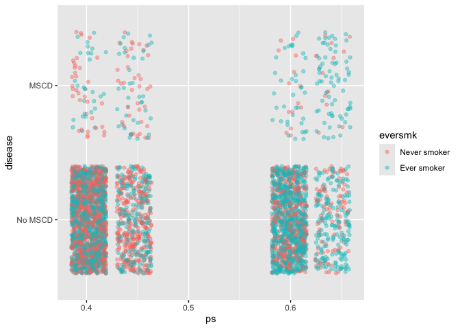
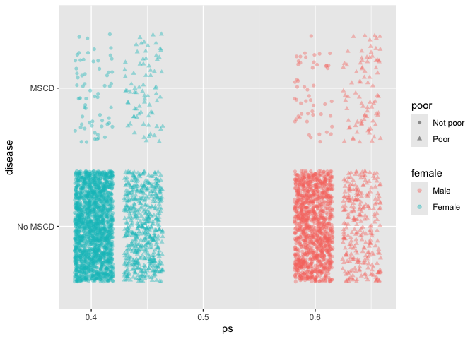
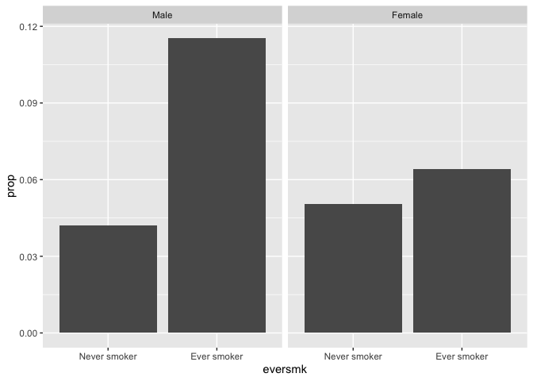

## Preliminaries

First load the packages that we will be using in this document:

``` r
library(tidyverse)  # core group of tidyverse packages
library(kableExtra)  # to make nice tables
library(broom)  # for tidy model summaries
library(gtsummary) # to create nice summary tables
```

## Module 1: Smoking and the risk of disease

Questions of interest:

* **Question 1.1: ** How does the risk of disease compare for smokers and otherwise similar non-smokers?

<center>
{width=500px}
</center>

* **Queston 1.2: ** Does the contribution of smoking to the risk of disease vary by sex or socio-economic status (SES)?

<center>
{width=500px}
</center>

To address each question we want:

* A data display (graph or table)
* A statistical analysis (with interprepration)

We will answer these questions using data from the National Medical Expenditures Survey (NMES)

## Review of propensity scores and how they alleviate confounding

> There is **confounding** in the effect of a treatment $Z$ (e.g. smoking) on an outcome variable $Y$ (e.g. disease status) if we fail to compare **otherwise similar** units and as a result attribute to $Z$ what is **actually caused by factors $X$** that differ between the $Z=0$ and $Z=1$ observations.

We often display this confounding using a directed acyclic graph (DAG):


Propensity scores allow us to break the link between our confounders and our *treatment*, removing the first connection in this DAG. Within a propensity score group, there is no association between the counfounding variables and the treatment, and therefore confounding has been controlled.


``` r
# fit propensity score model
prop_model_2 <- glm(eversmk ~ age + female + marital + educate, family = binomial(link="logit"), data=nmes_data, na.action = na.exclude)

# calculate propensity scores:
nmes_data <- nmes_data %>%
  mutate(ps_2 = predict(prop_model_2, type = "response"))

# calculate propensity score quintiles:
ps_quintiles_2 <- quantile(nmes_data$ps_2, probs=c(0, 0.2, 0.4, 0.6, 0.8, 1), na.rm=TRUE)  # need na.rm=TRUE to deal with missing values

nmes_data <- nmes_data %>%
  mutate(ps_strata_2 = cut(ps_2, breaks=ps_quintiles_2, include.lowest=TRUE))
```

Before stratifying by propensity score groups, we can see clear associations between the counfounders and the treatment:

``` r
nmes_data %>%
  tbl_summary(by = eversmk, 
              include = c(age, female, marital, educate))
```

```{=html}
<div id="iirteccsjz" style="padding-left:0px;padding-right:0px;padding-top:10px;padding-bottom:10px;overflow-x:auto;overflow-y:auto;width:auto;height:auto;">
<style>#iirteccsjz table {
  font-family: system-ui, 'Segoe UI', Roboto, Helvetica, Arial, sans-serif, 'Apple Color Emoji', 'Segoe UI Emoji', 'Segoe UI Symbol', 'Noto Color Emoji';
  -webkit-font-smoothing: antialiased;
  -moz-osx-font-smoothing: grayscale;
}

#iirteccsjz thead, #iirteccsjz tbody, #iirteccsjz tfoot, #iirteccsjz tr, #iirteccsjz td, #iirteccsjz th {
  border-style: none;
}

#iirteccsjz p {
  margin: 0;
  padding: 0;
}

#iirteccsjz .gt_table {
  display: table;
  border-collapse: collapse;
  line-height: normal;
  margin-left: auto;
  margin-right: auto;
  color: #333333;
  font-size: 16px;
  font-weight: normal;
  font-style: normal;
  background-color: #FFFFFF;
  width: auto;
  border-top-style: solid;
  border-top-width: 2px;
  border-top-color: #A8A8A8;
  border-right-style: none;
  border-right-width: 2px;
  border-right-color: #D3D3D3;
  border-bottom-style: solid;
  border-bottom-width: 2px;
  border-bottom-color: #A8A8A8;
  border-left-style: none;
  border-left-width: 2px;
  border-left-color: #D3D3D3;
}

#iirteccsjz .gt_caption {
  padding-top: 4px;
  padding-bottom: 4px;
}

#iirteccsjz .gt_title {
  color: #333333;
  font-size: 125%;
  font-weight: initial;
  padding-top: 4px;
  padding-bottom: 4px;
  padding-left: 5px;
  padding-right: 5px;
  border-bottom-color: #FFFFFF;
  border-bottom-width: 0;
}

#iirteccsjz .gt_subtitle {
  color: #333333;
  font-size: 85%;
  font-weight: initial;
  padding-top: 3px;
  padding-bottom: 5px;
  padding-left: 5px;
  padding-right: 5px;
  border-top-color: #FFFFFF;
  border-top-width: 0;
}

#iirteccsjz .gt_heading {
  background-color: #FFFFFF;
  text-align: center;
  border-bottom-color: #FFFFFF;
  border-left-style: none;
  border-left-width: 1px;
  border-left-color: #D3D3D3;
  border-right-style: none;
  border-right-width: 1px;
  border-right-color: #D3D3D3;
}

#iirteccsjz .gt_bottom_border {
  border-bottom-style: solid;
  border-bottom-width: 2px;
  border-bottom-color: #D3D3D3;
}

#iirteccsjz .gt_col_headings {
  border-top-style: solid;
  border-top-width: 2px;
  border-top-color: #D3D3D3;
  border-bottom-style: solid;
  border-bottom-width: 2px;
  border-bottom-color: #D3D3D3;
  border-left-style: none;
  border-left-width: 1px;
  border-left-color: #D3D3D3;
  border-right-style: none;
  border-right-width: 1px;
  border-right-color: #D3D3D3;
}

#iirteccsjz .gt_col_heading {
  color: #333333;
  background-color: #FFFFFF;
  font-size: 100%;
  font-weight: normal;
  text-transform: inherit;
  border-left-style: none;
  border-left-width: 1px;
  border-left-color: #D3D3D3;
  border-right-style: none;
  border-right-width: 1px;
  border-right-color: #D3D3D3;
  vertical-align: bottom;
  padding-top: 5px;
  padding-bottom: 6px;
  padding-left: 5px;
  padding-right: 5px;
  overflow-x: hidden;
}

#iirteccsjz .gt_column_spanner_outer {
  color: #333333;
  background-color: #FFFFFF;
  font-size: 100%;
  font-weight: normal;
  text-transform: inherit;
  padding-top: 0;
  padding-bottom: 0;
  padding-left: 4px;
  padding-right: 4px;
}

#iirteccsjz .gt_column_spanner_outer:first-child {
  padding-left: 0;
}

#iirteccsjz .gt_column_spanner_outer:last-child {
  padding-right: 0;
}

#iirteccsjz .gt_column_spanner {
  border-bottom-style: solid;
  border-bottom-width: 2px;
  border-bottom-color: #D3D3D3;
  vertical-align: bottom;
  padding-top: 5px;
  padding-bottom: 5px;
  overflow-x: hidden;
  display: inline-block;
  width: 100%;
}

#iirteccsjz .gt_spanner_row {
  border-bottom-style: hidden;
}

#iirteccsjz .gt_group_heading {
  padding-top: 8px;
  padding-bottom: 8px;
  padding-left: 5px;
  padding-right: 5px;
  color: #333333;
  background-color: #FFFFFF;
  font-size: 100%;
  font-weight: initial;
  text-transform: inherit;
  border-top-style: solid;
  border-top-width: 2px;
  border-top-color: #D3D3D3;
  border-bottom-style: solid;
  border-bottom-width: 2px;
  border-bottom-color: #D3D3D3;
  border-left-style: none;
  border-left-width: 1px;
  border-left-color: #D3D3D3;
  border-right-style: none;
  border-right-width: 1px;
  border-right-color: #D3D3D3;
  vertical-align: middle;
  text-align: left;
}

#iirteccsjz .gt_empty_group_heading {
  padding: 0.5px;
  color: #333333;
  background-color: #FFFFFF;
  font-size: 100%;
  font-weight: initial;
  border-top-style: solid;
  border-top-width: 2px;
  border-top-color: #D3D3D3;
  border-bottom-style: solid;
  border-bottom-width: 2px;
  border-bottom-color: #D3D3D3;
  vertical-align: middle;
}

#iirteccsjz .gt_from_md > :first-child {
  margin-top: 0;
}

#iirteccsjz .gt_from_md > :last-child {
  margin-bottom: 0;
}

#iirteccsjz .gt_row {
  padding-top: 8px;
  padding-bottom: 8px;
  padding-left: 5px;
  padding-right: 5px;
  margin: 10px;
  border-top-style: solid;
  border-top-width: 1px;
  border-top-color: #D3D3D3;
  border-left-style: none;
  border-left-width: 1px;
  border-left-color: #D3D3D3;
  border-right-style: none;
  border-right-width: 1px;
  border-right-color: #D3D3D3;
  vertical-align: middle;
  overflow-x: hidden;
}

#iirteccsjz .gt_stub {
  color: #333333;
  background-color: #FFFFFF;
  font-size: 100%;
  font-weight: initial;
  text-transform: inherit;
  border-right-style: solid;
  border-right-width: 2px;
  border-right-color: #D3D3D3;
  padding-left: 5px;
  padding-right: 5px;
}

#iirteccsjz .gt_stub_row_group {
  color: #333333;
  background-color: #FFFFFF;
  font-size: 100%;
  font-weight: initial;
  text-transform: inherit;
  border-right-style: solid;
  border-right-width: 2px;
  border-right-color: #D3D3D3;
  padding-left: 5px;
  padding-right: 5px;
  vertical-align: top;
}

#iirteccsjz .gt_row_group_first td {
  border-top-width: 2px;
}

#iirteccsjz .gt_row_group_first th {
  border-top-width: 2px;
}

#iirteccsjz .gt_summary_row {
  color: #333333;
  background-color: #FFFFFF;
  text-transform: inherit;
  padding-top: 8px;
  padding-bottom: 8px;
  padding-left: 5px;
  padding-right: 5px;
}

#iirteccsjz .gt_first_summary_row {
  border-top-style: solid;
  border-top-color: #D3D3D3;
}

#iirteccsjz .gt_first_summary_row.thick {
  border-top-width: 2px;
}

#iirteccsjz .gt_last_summary_row {
  padding-top: 8px;
  padding-bottom: 8px;
  padding-left: 5px;
  padding-right: 5px;
  border-bottom-style: solid;
  border-bottom-width: 2px;
  border-bottom-color: #D3D3D3;
}

#iirteccsjz .gt_grand_summary_row {
  color: #333333;
  background-color: #FFFFFF;
  text-transform: inherit;
  padding-top: 8px;
  padding-bottom: 8px;
  padding-left: 5px;
  padding-right: 5px;
}

#iirteccsjz .gt_first_grand_summary_row {
  padding-top: 8px;
  padding-bottom: 8px;
  padding-left: 5px;
  padding-right: 5px;
  border-top-style: double;
  border-top-width: 6px;
  border-top-color: #D3D3D3;
}

#iirteccsjz .gt_last_grand_summary_row_top {
  padding-top: 8px;
  padding-bottom: 8px;
  padding-left: 5px;
  padding-right: 5px;
  border-bottom-style: double;
  border-bottom-width: 6px;
  border-bottom-color: #D3D3D3;
}

#iirteccsjz .gt_striped {
  background-color: rgba(128, 128, 128, 0.05);
}

#iirteccsjz .gt_table_body {
  border-top-style: solid;
  border-top-width: 2px;
  border-top-color: #D3D3D3;
  border-bottom-style: solid;
  border-bottom-width: 2px;
  border-bottom-color: #D3D3D3;
}

#iirteccsjz .gt_footnotes {
  color: #333333;
  background-color: #FFFFFF;
  border-bottom-style: none;
  border-bottom-width: 2px;
  border-bottom-color: #D3D3D3;
  border-left-style: none;
  border-left-width: 2px;
  border-left-color: #D3D3D3;
  border-right-style: none;
  border-right-width: 2px;
  border-right-color: #D3D3D3;
}

#iirteccsjz .gt_footnote {
  margin: 0px;
  font-size: 90%;
  padding-top: 4px;
  padding-bottom: 4px;
  padding-left: 5px;
  padding-right: 5px;
}

#iirteccsjz .gt_sourcenotes {
  color: #333333;
  background-color: #FFFFFF;
  border-bottom-style: none;
  border-bottom-width: 2px;
  border-bottom-color: #D3D3D3;
  border-left-style: none;
  border-left-width: 2px;
  border-left-color: #D3D3D3;
  border-right-style: none;
  border-right-width: 2px;
  border-right-color: #D3D3D3;
}

#iirteccsjz .gt_sourcenote {
  font-size: 90%;
  padding-top: 4px;
  padding-bottom: 4px;
  padding-left: 5px;
  padding-right: 5px;
}

#iirteccsjz .gt_left {
  text-align: left;
}

#iirteccsjz .gt_center {
  text-align: center;
}

#iirteccsjz .gt_right {
  text-align: right;
  font-variant-numeric: tabular-nums;
}

#iirteccsjz .gt_font_normal {
  font-weight: normal;
}

#iirteccsjz .gt_font_bold {
  font-weight: bold;
}

#iirteccsjz .gt_font_italic {
  font-style: italic;
}

#iirteccsjz .gt_super {
  font-size: 65%;
}

#iirteccsjz .gt_footnote_marks {
  font-size: 75%;
  vertical-align: 0.4em;
  position: initial;
}

#iirteccsjz .gt_asterisk {
  font-size: 100%;
  vertical-align: 0;
}

#iirteccsjz .gt_indent_1 {
  text-indent: 5px;
}

#iirteccsjz .gt_indent_2 {
  text-indent: 10px;
}

#iirteccsjz .gt_indent_3 {
  text-indent: 15px;
}

#iirteccsjz .gt_indent_4 {
  text-indent: 20px;
}

#iirteccsjz .gt_indent_5 {
  text-indent: 25px;
}

#iirteccsjz .katex-display {
  display: inline-flex !important;
  margin-bottom: 0.75em !important;
}

#iirteccsjz div.Reactable > div.rt-table > div.rt-thead > div.rt-tr.rt-tr-group-header > div.rt-th-group:after {
  height: 0px !important;
}
</style>
<table class="gt_table" data-quarto-disable-processing="false" data-quarto-bootstrap="false">
  <thead>
    <tr class="gt_col_headings">
      <th class="gt_col_heading gt_columns_bottom_border gt_left" rowspan="1" colspan="1" scope="col" id="label"><span class='gt_from_md'><strong>Characteristic</strong></span></th>
      <th class="gt_col_heading gt_columns_bottom_border gt_center" rowspan="1" colspan="1" scope="col" id="stat_1"><span class='gt_from_md'><strong>Never smoker</strong><br />
N = 2,084</span><span class="gt_footnote_marks" style="white-space:nowrap;font-style:italic;font-weight:normal;line-height:0;"><sup>1</sup></span></th>
      <th class="gt_col_heading gt_columns_bottom_border gt_center" rowspan="1" colspan="1" scope="col" id="stat_2"><span class='gt_from_md'><strong>Ever smoker</strong><br />
N = 1,994</span><span class="gt_footnote_marks" style="white-space:nowrap;font-style:italic;font-weight:normal;line-height:0;"><sup>1</sup></span></th>
    </tr>
  </thead>
  <tbody class="gt_table_body">
    <tr><td headers="label" class="gt_row gt_left">age</td>
<td headers="stat_1" class="gt_row gt_center">42 (29, 64)</td>
<td headers="stat_2" class="gt_row gt_center">45 (33, 63)</td></tr>
    <tr><td headers="label" class="gt_row gt_left">female</td>
<td headers="stat_1" class="gt_row gt_center"><br /></td>
<td headers="stat_2" class="gt_row gt_center"><br /></td></tr>
    <tr><td headers="label" class="gt_row gt_left">    Male</td>
<td headers="stat_1" class="gt_row gt_center">620 (30%)</td>
<td headers="stat_2" class="gt_row gt_center">963 (48%)</td></tr>
    <tr><td headers="label" class="gt_row gt_left">    Female</td>
<td headers="stat_1" class="gt_row gt_center">1,464 (70%)</td>
<td headers="stat_2" class="gt_row gt_center">1,031 (52%)</td></tr>
    <tr><td headers="label" class="gt_row gt_left">marital</td>
<td headers="stat_1" class="gt_row gt_center"><br /></td>
<td headers="stat_2" class="gt_row gt_center"><br /></td></tr>
    <tr><td headers="label" class="gt_row gt_left">    Married</td>
<td headers="stat_1" class="gt_row gt_center">1,238 (59%)</td>
<td headers="stat_2" class="gt_row gt_center">1,301 (65%)</td></tr>
    <tr><td headers="label" class="gt_row gt_left">    Widowed</td>
<td headers="stat_1" class="gt_row gt_center">268 (13%)</td>
<td headers="stat_2" class="gt_row gt_center">135 (6.8%)</td></tr>
    <tr><td headers="label" class="gt_row gt_left">    Divorced</td>
<td headers="stat_1" class="gt_row gt_center">109 (5.2%)</td>
<td headers="stat_2" class="gt_row gt_center">239 (12%)</td></tr>
    <tr><td headers="label" class="gt_row gt_left">    Separated</td>
<td headers="stat_1" class="gt_row gt_center">60 (2.9%)</td>
<td headers="stat_2" class="gt_row gt_center">75 (3.8%)</td></tr>
    <tr><td headers="label" class="gt_row gt_left">    Never married</td>
<td headers="stat_1" class="gt_row gt_center">409 (20%)</td>
<td headers="stat_2" class="gt_row gt_center">244 (12%)</td></tr>
    <tr><td headers="label" class="gt_row gt_left">educate</td>
<td headers="stat_1" class="gt_row gt_center"><br /></td>
<td headers="stat_2" class="gt_row gt_center"><br /></td></tr>
    <tr><td headers="label" class="gt_row gt_left">    College grad</td>
<td headers="stat_1" class="gt_row gt_center">419 (20%)</td>
<td headers="stat_2" class="gt_row gt_center">261 (13%)</td></tr>
    <tr><td headers="label" class="gt_row gt_left">    Some college</td>
<td headers="stat_1" class="gt_row gt_center">406 (19%)</td>
<td headers="stat_2" class="gt_row gt_center">386 (19%)</td></tr>
    <tr><td headers="label" class="gt_row gt_left">    HS grad</td>
<td headers="stat_1" class="gt_row gt_center">940 (45%)</td>
<td headers="stat_2" class="gt_row gt_center">1,114 (56%)</td></tr>
    <tr><td headers="label" class="gt_row gt_left">    Other</td>
<td headers="stat_1" class="gt_row gt_center">319 (15%)</td>
<td headers="stat_2" class="gt_row gt_center">233 (12%)</td></tr>
  </tbody>
  <tfoot>
    <tr class="gt_footnotes">
      <td class="gt_footnote" colspan="3"><span class="gt_footnote_marks" style="white-space:nowrap;font-style:italic;font-weight:normal;line-height:0;"><sup>1</sup></span> <span class='gt_from_md'>Median (Q1, Q3); n (%)</span></td>
    </tr>
  </tfoot>
</table>
</div>
```

Are the ever smokers and never smokers "similar"?  How are they different? How can these differences cause problems when we compare disease risk between ever smokers and never smokers?

Now, instead, let's compare ever smokers and never smokers just among the **lowest propensity score quintile**:

``` r
nmes_data %>%
  filter(ps_strata_2 == "[0.18,0.345]") %>%
  tbl_summary(by = eversmk, 
              include = c(age, female, marital, educate))
```

```{=html}
<div id="jjgcujxqyc" style="padding-left:0px;padding-right:0px;padding-top:10px;padding-bottom:10px;overflow-x:auto;overflow-y:auto;width:auto;height:auto;">
<style>#jjgcujxqyc table {
  font-family: system-ui, 'Segoe UI', Roboto, Helvetica, Arial, sans-serif, 'Apple Color Emoji', 'Segoe UI Emoji', 'Segoe UI Symbol', 'Noto Color Emoji';
  -webkit-font-smoothing: antialiased;
  -moz-osx-font-smoothing: grayscale;
}

#jjgcujxqyc thead, #jjgcujxqyc tbody, #jjgcujxqyc tfoot, #jjgcujxqyc tr, #jjgcujxqyc td, #jjgcujxqyc th {
  border-style: none;
}

#jjgcujxqyc p {
  margin: 0;
  padding: 0;
}

#jjgcujxqyc .gt_table {
  display: table;
  border-collapse: collapse;
  line-height: normal;
  margin-left: auto;
  margin-right: auto;
  color: #333333;
  font-size: 16px;
  font-weight: normal;
  font-style: normal;
  background-color: #FFFFFF;
  width: auto;
  border-top-style: solid;
  border-top-width: 2px;
  border-top-color: #A8A8A8;
  border-right-style: none;
  border-right-width: 2px;
  border-right-color: #D3D3D3;
  border-bottom-style: solid;
  border-bottom-width: 2px;
  border-bottom-color: #A8A8A8;
  border-left-style: none;
  border-left-width: 2px;
  border-left-color: #D3D3D3;
}

#jjgcujxqyc .gt_caption {
  padding-top: 4px;
  padding-bottom: 4px;
}

#jjgcujxqyc .gt_title {
  color: #333333;
  font-size: 125%;
  font-weight: initial;
  padding-top: 4px;
  padding-bottom: 4px;
  padding-left: 5px;
  padding-right: 5px;
  border-bottom-color: #FFFFFF;
  border-bottom-width: 0;
}

#jjgcujxqyc .gt_subtitle {
  color: #333333;
  font-size: 85%;
  font-weight: initial;
  padding-top: 3px;
  padding-bottom: 5px;
  padding-left: 5px;
  padding-right: 5px;
  border-top-color: #FFFFFF;
  border-top-width: 0;
}

#jjgcujxqyc .gt_heading {
  background-color: #FFFFFF;
  text-align: center;
  border-bottom-color: #FFFFFF;
  border-left-style: none;
  border-left-width: 1px;
  border-left-color: #D3D3D3;
  border-right-style: none;
  border-right-width: 1px;
  border-right-color: #D3D3D3;
}

#jjgcujxqyc .gt_bottom_border {
  border-bottom-style: solid;
  border-bottom-width: 2px;
  border-bottom-color: #D3D3D3;
}

#jjgcujxqyc .gt_col_headings {
  border-top-style: solid;
  border-top-width: 2px;
  border-top-color: #D3D3D3;
  border-bottom-style: solid;
  border-bottom-width: 2px;
  border-bottom-color: #D3D3D3;
  border-left-style: none;
  border-left-width: 1px;
  border-left-color: #D3D3D3;
  border-right-style: none;
  border-right-width: 1px;
  border-right-color: #D3D3D3;
}

#jjgcujxqyc .gt_col_heading {
  color: #333333;
  background-color: #FFFFFF;
  font-size: 100%;
  font-weight: normal;
  text-transform: inherit;
  border-left-style: none;
  border-left-width: 1px;
  border-left-color: #D3D3D3;
  border-right-style: none;
  border-right-width: 1px;
  border-right-color: #D3D3D3;
  vertical-align: bottom;
  padding-top: 5px;
  padding-bottom: 6px;
  padding-left: 5px;
  padding-right: 5px;
  overflow-x: hidden;
}

#jjgcujxqyc .gt_column_spanner_outer {
  color: #333333;
  background-color: #FFFFFF;
  font-size: 100%;
  font-weight: normal;
  text-transform: inherit;
  padding-top: 0;
  padding-bottom: 0;
  padding-left: 4px;
  padding-right: 4px;
}

#jjgcujxqyc .gt_column_spanner_outer:first-child {
  padding-left: 0;
}

#jjgcujxqyc .gt_column_spanner_outer:last-child {
  padding-right: 0;
}

#jjgcujxqyc .gt_column_spanner {
  border-bottom-style: solid;
  border-bottom-width: 2px;
  border-bottom-color: #D3D3D3;
  vertical-align: bottom;
  padding-top: 5px;
  padding-bottom: 5px;
  overflow-x: hidden;
  display: inline-block;
  width: 100%;
}

#jjgcujxqyc .gt_spanner_row {
  border-bottom-style: hidden;
}

#jjgcujxqyc .gt_group_heading {
  padding-top: 8px;
  padding-bottom: 8px;
  padding-left: 5px;
  padding-right: 5px;
  color: #333333;
  background-color: #FFFFFF;
  font-size: 100%;
  font-weight: initial;
  text-transform: inherit;
  border-top-style: solid;
  border-top-width: 2px;
  border-top-color: #D3D3D3;
  border-bottom-style: solid;
  border-bottom-width: 2px;
  border-bottom-color: #D3D3D3;
  border-left-style: none;
  border-left-width: 1px;
  border-left-color: #D3D3D3;
  border-right-style: none;
  border-right-width: 1px;
  border-right-color: #D3D3D3;
  vertical-align: middle;
  text-align: left;
}

#jjgcujxqyc .gt_empty_group_heading {
  padding: 0.5px;
  color: #333333;
  background-color: #FFFFFF;
  font-size: 100%;
  font-weight: initial;
  border-top-style: solid;
  border-top-width: 2px;
  border-top-color: #D3D3D3;
  border-bottom-style: solid;
  border-bottom-width: 2px;
  border-bottom-color: #D3D3D3;
  vertical-align: middle;
}

#jjgcujxqyc .gt_from_md > :first-child {
  margin-top: 0;
}

#jjgcujxqyc .gt_from_md > :last-child {
  margin-bottom: 0;
}

#jjgcujxqyc .gt_row {
  padding-top: 8px;
  padding-bottom: 8px;
  padding-left: 5px;
  padding-right: 5px;
  margin: 10px;
  border-top-style: solid;
  border-top-width: 1px;
  border-top-color: #D3D3D3;
  border-left-style: none;
  border-left-width: 1px;
  border-left-color: #D3D3D3;
  border-right-style: none;
  border-right-width: 1px;
  border-right-color: #D3D3D3;
  vertical-align: middle;
  overflow-x: hidden;
}

#jjgcujxqyc .gt_stub {
  color: #333333;
  background-color: #FFFFFF;
  font-size: 100%;
  font-weight: initial;
  text-transform: inherit;
  border-right-style: solid;
  border-right-width: 2px;
  border-right-color: #D3D3D3;
  padding-left: 5px;
  padding-right: 5px;
}

#jjgcujxqyc .gt_stub_row_group {
  color: #333333;
  background-color: #FFFFFF;
  font-size: 100%;
  font-weight: initial;
  text-transform: inherit;
  border-right-style: solid;
  border-right-width: 2px;
  border-right-color: #D3D3D3;
  padding-left: 5px;
  padding-right: 5px;
  vertical-align: top;
}

#jjgcujxqyc .gt_row_group_first td {
  border-top-width: 2px;
}

#jjgcujxqyc .gt_row_group_first th {
  border-top-width: 2px;
}

#jjgcujxqyc .gt_summary_row {
  color: #333333;
  background-color: #FFFFFF;
  text-transform: inherit;
  padding-top: 8px;
  padding-bottom: 8px;
  padding-left: 5px;
  padding-right: 5px;
}

#jjgcujxqyc .gt_first_summary_row {
  border-top-style: solid;
  border-top-color: #D3D3D3;
}

#jjgcujxqyc .gt_first_summary_row.thick {
  border-top-width: 2px;
}

#jjgcujxqyc .gt_last_summary_row {
  padding-top: 8px;
  padding-bottom: 8px;
  padding-left: 5px;
  padding-right: 5px;
  border-bottom-style: solid;
  border-bottom-width: 2px;
  border-bottom-color: #D3D3D3;
}

#jjgcujxqyc .gt_grand_summary_row {
  color: #333333;
  background-color: #FFFFFF;
  text-transform: inherit;
  padding-top: 8px;
  padding-bottom: 8px;
  padding-left: 5px;
  padding-right: 5px;
}

#jjgcujxqyc .gt_first_grand_summary_row {
  padding-top: 8px;
  padding-bottom: 8px;
  padding-left: 5px;
  padding-right: 5px;
  border-top-style: double;
  border-top-width: 6px;
  border-top-color: #D3D3D3;
}

#jjgcujxqyc .gt_last_grand_summary_row_top {
  padding-top: 8px;
  padding-bottom: 8px;
  padding-left: 5px;
  padding-right: 5px;
  border-bottom-style: double;
  border-bottom-width: 6px;
  border-bottom-color: #D3D3D3;
}

#jjgcujxqyc .gt_striped {
  background-color: rgba(128, 128, 128, 0.05);
}

#jjgcujxqyc .gt_table_body {
  border-top-style: solid;
  border-top-width: 2px;
  border-top-color: #D3D3D3;
  border-bottom-style: solid;
  border-bottom-width: 2px;
  border-bottom-color: #D3D3D3;
}

#jjgcujxqyc .gt_footnotes {
  color: #333333;
  background-color: #FFFFFF;
  border-bottom-style: none;
  border-bottom-width: 2px;
  border-bottom-color: #D3D3D3;
  border-left-style: none;
  border-left-width: 2px;
  border-left-color: #D3D3D3;
  border-right-style: none;
  border-right-width: 2px;
  border-right-color: #D3D3D3;
}

#jjgcujxqyc .gt_footnote {
  margin: 0px;
  font-size: 90%;
  padding-top: 4px;
  padding-bottom: 4px;
  padding-left: 5px;
  padding-right: 5px;
}

#jjgcujxqyc .gt_sourcenotes {
  color: #333333;
  background-color: #FFFFFF;
  border-bottom-style: none;
  border-bottom-width: 2px;
  border-bottom-color: #D3D3D3;
  border-left-style: none;
  border-left-width: 2px;
  border-left-color: #D3D3D3;
  border-right-style: none;
  border-right-width: 2px;
  border-right-color: #D3D3D3;
}

#jjgcujxqyc .gt_sourcenote {
  font-size: 90%;
  padding-top: 4px;
  padding-bottom: 4px;
  padding-left: 5px;
  padding-right: 5px;
}

#jjgcujxqyc .gt_left {
  text-align: left;
}

#jjgcujxqyc .gt_center {
  text-align: center;
}

#jjgcujxqyc .gt_right {
  text-align: right;
  font-variant-numeric: tabular-nums;
}

#jjgcujxqyc .gt_font_normal {
  font-weight: normal;
}

#jjgcujxqyc .gt_font_bold {
  font-weight: bold;
}

#jjgcujxqyc .gt_font_italic {
  font-style: italic;
}

#jjgcujxqyc .gt_super {
  font-size: 65%;
}

#jjgcujxqyc .gt_footnote_marks {
  font-size: 75%;
  vertical-align: 0.4em;
  position: initial;
}

#jjgcujxqyc .gt_asterisk {
  font-size: 100%;
  vertical-align: 0;
}

#jjgcujxqyc .gt_indent_1 {
  text-indent: 5px;
}

#jjgcujxqyc .gt_indent_2 {
  text-indent: 10px;
}

#jjgcujxqyc .gt_indent_3 {
  text-indent: 15px;
}

#jjgcujxqyc .gt_indent_4 {
  text-indent: 20px;
}

#jjgcujxqyc .gt_indent_5 {
  text-indent: 25px;
}

#jjgcujxqyc .katex-display {
  display: inline-flex !important;
  margin-bottom: 0.75em !important;
}

#jjgcujxqyc div.Reactable > div.rt-table > div.rt-thead > div.rt-tr.rt-tr-group-header > div.rt-th-group:after {
  height: 0px !important;
}
</style>
<table class="gt_table" data-quarto-disable-processing="false" data-quarto-bootstrap="false">
  <thead>
    <tr class="gt_col_headings">
      <th class="gt_col_heading gt_columns_bottom_border gt_left" rowspan="1" colspan="1" scope="col" id="label"><span class='gt_from_md'><strong>Characteristic</strong></span></th>
      <th class="gt_col_heading gt_columns_bottom_border gt_center" rowspan="1" colspan="1" scope="col" id="stat_1"><span class='gt_from_md'><strong>Never smoker</strong><br />
N = 547</span><span class="gt_footnote_marks" style="white-space:nowrap;font-style:italic;font-weight:normal;line-height:0;"><sup>1</sup></span></th>
      <th class="gt_col_heading gt_columns_bottom_border gt_center" rowspan="1" colspan="1" scope="col" id="stat_2"><span class='gt_from_md'><strong>Ever smoker</strong><br />
N = 272</span><span class="gt_footnote_marks" style="white-space:nowrap;font-style:italic;font-weight:normal;line-height:0;"><sup>1</sup></span></th>
    </tr>
  </thead>
  <tbody class="gt_table_body">
    <tr><td headers="label" class="gt_row gt_left">age</td>
<td headers="stat_1" class="gt_row gt_center">36 (25, 66)</td>
<td headers="stat_2" class="gt_row gt_center">34 (27, 55)</td></tr>
    <tr><td headers="label" class="gt_row gt_left">female</td>
<td headers="stat_1" class="gt_row gt_center"><br /></td>
<td headers="stat_2" class="gt_row gt_center"><br /></td></tr>
    <tr><td headers="label" class="gt_row gt_left">    Male</td>
<td headers="stat_1" class="gt_row gt_center">0 (0%)</td>
<td headers="stat_2" class="gt_row gt_center">0 (0%)</td></tr>
    <tr><td headers="label" class="gt_row gt_left">    Female</td>
<td headers="stat_1" class="gt_row gt_center">547 (100%)</td>
<td headers="stat_2" class="gt_row gt_center">272 (100%)</td></tr>
    <tr><td headers="label" class="gt_row gt_left">marital</td>
<td headers="stat_1" class="gt_row gt_center"><br /></td>
<td headers="stat_2" class="gt_row gt_center"><br /></td></tr>
    <tr><td headers="label" class="gt_row gt_left">    Married</td>
<td headers="stat_1" class="gt_row gt_center">189 (35%)</td>
<td headers="stat_2" class="gt_row gt_center">88 (32%)</td></tr>
    <tr><td headers="label" class="gt_row gt_left">    Widowed</td>
<td headers="stat_1" class="gt_row gt_center">140 (26%)</td>
<td headers="stat_2" class="gt_row gt_center">55 (20%)</td></tr>
    <tr><td headers="label" class="gt_row gt_left">    Divorced</td>
<td headers="stat_1" class="gt_row gt_center">0 (0%)</td>
<td headers="stat_2" class="gt_row gt_center">0 (0%)</td></tr>
    <tr><td headers="label" class="gt_row gt_left">    Separated</td>
<td headers="stat_1" class="gt_row gt_center">0 (0%)</td>
<td headers="stat_2" class="gt_row gt_center">0 (0%)</td></tr>
    <tr><td headers="label" class="gt_row gt_left">    Never married</td>
<td headers="stat_1" class="gt_row gt_center">218 (40%)</td>
<td headers="stat_2" class="gt_row gt_center">129 (47%)</td></tr>
    <tr><td headers="label" class="gt_row gt_left">educate</td>
<td headers="stat_1" class="gt_row gt_center"><br /></td>
<td headers="stat_2" class="gt_row gt_center"><br /></td></tr>
    <tr><td headers="label" class="gt_row gt_left">    College grad</td>
<td headers="stat_1" class="gt_row gt_center">218 (40%)</td>
<td headers="stat_2" class="gt_row gt_center">104 (38%)</td></tr>
    <tr><td headers="label" class="gt_row gt_left">    Some college</td>
<td headers="stat_1" class="gt_row gt_center">101 (18%)</td>
<td headers="stat_2" class="gt_row gt_center">55 (20%)</td></tr>
    <tr><td headers="label" class="gt_row gt_left">    HS grad</td>
<td headers="stat_1" class="gt_row gt_center">90 (16%)</td>
<td headers="stat_2" class="gt_row gt_center">72 (26%)</td></tr>
    <tr><td headers="label" class="gt_row gt_left">    Other</td>
<td headers="stat_1" class="gt_row gt_center">138 (25%)</td>
<td headers="stat_2" class="gt_row gt_center">41 (15%)</td></tr>
  </tbody>
  <tfoot>
    <tr class="gt_footnotes">
      <td class="gt_footnote" colspan="3"><span class="gt_footnote_marks" style="white-space:nowrap;font-style:italic;font-weight:normal;line-height:0;"><sup>1</sup></span> <span class='gt_from_md'>Median (Q1, Q3); n (%)</span></td>
    </tr>
  </tfoot>
</table>
</div>
```

Here, we can see that the association between our confounders and our treatment (how the distribution of the counfounders varies comparing never-smokers to ever-smokers) is strongly attenuated.

This is true within any of the propensity score strata.

For example, among the **fifth propensity score quintile**:

``` r
nmes_data %>%
  filter(ps_strata_2 == "(0.659,0.858]") %>%
  tbl_summary(by = eversmk, 
              include = c(age, female, marital, educate))
```

```{=html}
<div id="okifqaggij" style="padding-left:0px;padding-right:0px;padding-top:10px;padding-bottom:10px;overflow-x:auto;overflow-y:auto;width:auto;height:auto;">
<style>#okifqaggij table {
  font-family: system-ui, 'Segoe UI', Roboto, Helvetica, Arial, sans-serif, 'Apple Color Emoji', 'Segoe UI Emoji', 'Segoe UI Symbol', 'Noto Color Emoji';
  -webkit-font-smoothing: antialiased;
  -moz-osx-font-smoothing: grayscale;
}

#okifqaggij thead, #okifqaggij tbody, #okifqaggij tfoot, #okifqaggij tr, #okifqaggij td, #okifqaggij th {
  border-style: none;
}

#okifqaggij p {
  margin: 0;
  padding: 0;
}

#okifqaggij .gt_table {
  display: table;
  border-collapse: collapse;
  line-height: normal;
  margin-left: auto;
  margin-right: auto;
  color: #333333;
  font-size: 16px;
  font-weight: normal;
  font-style: normal;
  background-color: #FFFFFF;
  width: auto;
  border-top-style: solid;
  border-top-width: 2px;
  border-top-color: #A8A8A8;
  border-right-style: none;
  border-right-width: 2px;
  border-right-color: #D3D3D3;
  border-bottom-style: solid;
  border-bottom-width: 2px;
  border-bottom-color: #A8A8A8;
  border-left-style: none;
  border-left-width: 2px;
  border-left-color: #D3D3D3;
}

#okifqaggij .gt_caption {
  padding-top: 4px;
  padding-bottom: 4px;
}

#okifqaggij .gt_title {
  color: #333333;
  font-size: 125%;
  font-weight: initial;
  padding-top: 4px;
  padding-bottom: 4px;
  padding-left: 5px;
  padding-right: 5px;
  border-bottom-color: #FFFFFF;
  border-bottom-width: 0;
}

#okifqaggij .gt_subtitle {
  color: #333333;
  font-size: 85%;
  font-weight: initial;
  padding-top: 3px;
  padding-bottom: 5px;
  padding-left: 5px;
  padding-right: 5px;
  border-top-color: #FFFFFF;
  border-top-width: 0;
}

#okifqaggij .gt_heading {
  background-color: #FFFFFF;
  text-align: center;
  border-bottom-color: #FFFFFF;
  border-left-style: none;
  border-left-width: 1px;
  border-left-color: #D3D3D3;
  border-right-style: none;
  border-right-width: 1px;
  border-right-color: #D3D3D3;
}

#okifqaggij .gt_bottom_border {
  border-bottom-style: solid;
  border-bottom-width: 2px;
  border-bottom-color: #D3D3D3;
}

#okifqaggij .gt_col_headings {
  border-top-style: solid;
  border-top-width: 2px;
  border-top-color: #D3D3D3;
  border-bottom-style: solid;
  border-bottom-width: 2px;
  border-bottom-color: #D3D3D3;
  border-left-style: none;
  border-left-width: 1px;
  border-left-color: #D3D3D3;
  border-right-style: none;
  border-right-width: 1px;
  border-right-color: #D3D3D3;
}

#okifqaggij .gt_col_heading {
  color: #333333;
  background-color: #FFFFFF;
  font-size: 100%;
  font-weight: normal;
  text-transform: inherit;
  border-left-style: none;
  border-left-width: 1px;
  border-left-color: #D3D3D3;
  border-right-style: none;
  border-right-width: 1px;
  border-right-color: #D3D3D3;
  vertical-align: bottom;
  padding-top: 5px;
  padding-bottom: 6px;
  padding-left: 5px;
  padding-right: 5px;
  overflow-x: hidden;
}

#okifqaggij .gt_column_spanner_outer {
  color: #333333;
  background-color: #FFFFFF;
  font-size: 100%;
  font-weight: normal;
  text-transform: inherit;
  padding-top: 0;
  padding-bottom: 0;
  padding-left: 4px;
  padding-right: 4px;
}

#okifqaggij .gt_column_spanner_outer:first-child {
  padding-left: 0;
}

#okifqaggij .gt_column_spanner_outer:last-child {
  padding-right: 0;
}

#okifqaggij .gt_column_spanner {
  border-bottom-style: solid;
  border-bottom-width: 2px;
  border-bottom-color: #D3D3D3;
  vertical-align: bottom;
  padding-top: 5px;
  padding-bottom: 5px;
  overflow-x: hidden;
  display: inline-block;
  width: 100%;
}

#okifqaggij .gt_spanner_row {
  border-bottom-style: hidden;
}

#okifqaggij .gt_group_heading {
  padding-top: 8px;
  padding-bottom: 8px;
  padding-left: 5px;
  padding-right: 5px;
  color: #333333;
  background-color: #FFFFFF;
  font-size: 100%;
  font-weight: initial;
  text-transform: inherit;
  border-top-style: solid;
  border-top-width: 2px;
  border-top-color: #D3D3D3;
  border-bottom-style: solid;
  border-bottom-width: 2px;
  border-bottom-color: #D3D3D3;
  border-left-style: none;
  border-left-width: 1px;
  border-left-color: #D3D3D3;
  border-right-style: none;
  border-right-width: 1px;
  border-right-color: #D3D3D3;
  vertical-align: middle;
  text-align: left;
}

#okifqaggij .gt_empty_group_heading {
  padding: 0.5px;
  color: #333333;
  background-color: #FFFFFF;
  font-size: 100%;
  font-weight: initial;
  border-top-style: solid;
  border-top-width: 2px;
  border-top-color: #D3D3D3;
  border-bottom-style: solid;
  border-bottom-width: 2px;
  border-bottom-color: #D3D3D3;
  vertical-align: middle;
}

#okifqaggij .gt_from_md > :first-child {
  margin-top: 0;
}

#okifqaggij .gt_from_md > :last-child {
  margin-bottom: 0;
}

#okifqaggij .gt_row {
  padding-top: 8px;
  padding-bottom: 8px;
  padding-left: 5px;
  padding-right: 5px;
  margin: 10px;
  border-top-style: solid;
  border-top-width: 1px;
  border-top-color: #D3D3D3;
  border-left-style: none;
  border-left-width: 1px;
  border-left-color: #D3D3D3;
  border-right-style: none;
  border-right-width: 1px;
  border-right-color: #D3D3D3;
  vertical-align: middle;
  overflow-x: hidden;
}

#okifqaggij .gt_stub {
  color: #333333;
  background-color: #FFFFFF;
  font-size: 100%;
  font-weight: initial;
  text-transform: inherit;
  border-right-style: solid;
  border-right-width: 2px;
  border-right-color: #D3D3D3;
  padding-left: 5px;
  padding-right: 5px;
}

#okifqaggij .gt_stub_row_group {
  color: #333333;
  background-color: #FFFFFF;
  font-size: 100%;
  font-weight: initial;
  text-transform: inherit;
  border-right-style: solid;
  border-right-width: 2px;
  border-right-color: #D3D3D3;
  padding-left: 5px;
  padding-right: 5px;
  vertical-align: top;
}

#okifqaggij .gt_row_group_first td {
  border-top-width: 2px;
}

#okifqaggij .gt_row_group_first th {
  border-top-width: 2px;
}

#okifqaggij .gt_summary_row {
  color: #333333;
  background-color: #FFFFFF;
  text-transform: inherit;
  padding-top: 8px;
  padding-bottom: 8px;
  padding-left: 5px;
  padding-right: 5px;
}

#okifqaggij .gt_first_summary_row {
  border-top-style: solid;
  border-top-color: #D3D3D3;
}

#okifqaggij .gt_first_summary_row.thick {
  border-top-width: 2px;
}

#okifqaggij .gt_last_summary_row {
  padding-top: 8px;
  padding-bottom: 8px;
  padding-left: 5px;
  padding-right: 5px;
  border-bottom-style: solid;
  border-bottom-width: 2px;
  border-bottom-color: #D3D3D3;
}

#okifqaggij .gt_grand_summary_row {
  color: #333333;
  background-color: #FFFFFF;
  text-transform: inherit;
  padding-top: 8px;
  padding-bottom: 8px;
  padding-left: 5px;
  padding-right: 5px;
}

#okifqaggij .gt_first_grand_summary_row {
  padding-top: 8px;
  padding-bottom: 8px;
  padding-left: 5px;
  padding-right: 5px;
  border-top-style: double;
  border-top-width: 6px;
  border-top-color: #D3D3D3;
}

#okifqaggij .gt_last_grand_summary_row_top {
  padding-top: 8px;
  padding-bottom: 8px;
  padding-left: 5px;
  padding-right: 5px;
  border-bottom-style: double;
  border-bottom-width: 6px;
  border-bottom-color: #D3D3D3;
}

#okifqaggij .gt_striped {
  background-color: rgba(128, 128, 128, 0.05);
}

#okifqaggij .gt_table_body {
  border-top-style: solid;
  border-top-width: 2px;
  border-top-color: #D3D3D3;
  border-bottom-style: solid;
  border-bottom-width: 2px;
  border-bottom-color: #D3D3D3;
}

#okifqaggij .gt_footnotes {
  color: #333333;
  background-color: #FFFFFF;
  border-bottom-style: none;
  border-bottom-width: 2px;
  border-bottom-color: #D3D3D3;
  border-left-style: none;
  border-left-width: 2px;
  border-left-color: #D3D3D3;
  border-right-style: none;
  border-right-width: 2px;
  border-right-color: #D3D3D3;
}

#okifqaggij .gt_footnote {
  margin: 0px;
  font-size: 90%;
  padding-top: 4px;
  padding-bottom: 4px;
  padding-left: 5px;
  padding-right: 5px;
}

#okifqaggij .gt_sourcenotes {
  color: #333333;
  background-color: #FFFFFF;
  border-bottom-style: none;
  border-bottom-width: 2px;
  border-bottom-color: #D3D3D3;
  border-left-style: none;
  border-left-width: 2px;
  border-left-color: #D3D3D3;
  border-right-style: none;
  border-right-width: 2px;
  border-right-color: #D3D3D3;
}

#okifqaggij .gt_sourcenote {
  font-size: 90%;
  padding-top: 4px;
  padding-bottom: 4px;
  padding-left: 5px;
  padding-right: 5px;
}

#okifqaggij .gt_left {
  text-align: left;
}

#okifqaggij .gt_center {
  text-align: center;
}

#okifqaggij .gt_right {
  text-align: right;
  font-variant-numeric: tabular-nums;
}

#okifqaggij .gt_font_normal {
  font-weight: normal;
}

#okifqaggij .gt_font_bold {
  font-weight: bold;
}

#okifqaggij .gt_font_italic {
  font-style: italic;
}

#okifqaggij .gt_super {
  font-size: 65%;
}

#okifqaggij .gt_footnote_marks {
  font-size: 75%;
  vertical-align: 0.4em;
  position: initial;
}

#okifqaggij .gt_asterisk {
  font-size: 100%;
  vertical-align: 0;
}

#okifqaggij .gt_indent_1 {
  text-indent: 5px;
}

#okifqaggij .gt_indent_2 {
  text-indent: 10px;
}

#okifqaggij .gt_indent_3 {
  text-indent: 15px;
}

#okifqaggij .gt_indent_4 {
  text-indent: 20px;
}

#okifqaggij .gt_indent_5 {
  text-indent: 25px;
}

#okifqaggij .katex-display {
  display: inline-flex !important;
  margin-bottom: 0.75em !important;
}

#okifqaggij div.Reactable > div.rt-table > div.rt-thead > div.rt-tr.rt-tr-group-header > div.rt-th-group:after {
  height: 0px !important;
}
</style>
<table class="gt_table" data-quarto-disable-processing="false" data-quarto-bootstrap="false">
  <thead>
    <tr class="gt_col_headings">
      <th class="gt_col_heading gt_columns_bottom_border gt_left" rowspan="1" colspan="1" scope="col" id="label"><span class='gt_from_md'><strong>Characteristic</strong></span></th>
      <th class="gt_col_heading gt_columns_bottom_border gt_center" rowspan="1" colspan="1" scope="col" id="stat_1"><span class='gt_from_md'><strong>Never smoker</strong><br />
N = 228</span><span class="gt_footnote_marks" style="white-space:nowrap;font-style:italic;font-weight:normal;line-height:0;"><sup>1</sup></span></th>
      <th class="gt_col_heading gt_columns_bottom_border gt_center" rowspan="1" colspan="1" scope="col" id="stat_2"><span class='gt_from_md'><strong>Ever smoker</strong><br />
N = 586</span><span class="gt_footnote_marks" style="white-space:nowrap;font-style:italic;font-weight:normal;line-height:0;"><sup>1</sup></span></th>
    </tr>
  </thead>
  <tbody class="gt_table_body">
    <tr><td headers="label" class="gt_row gt_left">age</td>
<td headers="stat_1" class="gt_row gt_center">43 (34, 63)</td>
<td headers="stat_2" class="gt_row gt_center">48 (35, 64)</td></tr>
    <tr><td headers="label" class="gt_row gt_left">female</td>
<td headers="stat_1" class="gt_row gt_center"><br /></td>
<td headers="stat_2" class="gt_row gt_center"><br /></td></tr>
    <tr><td headers="label" class="gt_row gt_left">    Male</td>
<td headers="stat_1" class="gt_row gt_center">188 (82%)</td>
<td headers="stat_2" class="gt_row gt_center">488 (83%)</td></tr>
    <tr><td headers="label" class="gt_row gt_left">    Female</td>
<td headers="stat_1" class="gt_row gt_center">40 (18%)</td>
<td headers="stat_2" class="gt_row gt_center">98 (17%)</td></tr>
    <tr><td headers="label" class="gt_row gt_left">marital</td>
<td headers="stat_1" class="gt_row gt_center"><br /></td>
<td headers="stat_2" class="gt_row gt_center"><br /></td></tr>
    <tr><td headers="label" class="gt_row gt_left">    Married</td>
<td headers="stat_1" class="gt_row gt_center">160 (70%)</td>
<td headers="stat_2" class="gt_row gt_center">389 (66%)</td></tr>
    <tr><td headers="label" class="gt_row gt_left">    Widowed</td>
<td headers="stat_1" class="gt_row gt_center">0 (0%)</td>
<td headers="stat_2" class="gt_row gt_center">0 (0%)</td></tr>
    <tr><td headers="label" class="gt_row gt_left">    Divorced</td>
<td headers="stat_1" class="gt_row gt_center">59 (26%)</td>
<td headers="stat_2" class="gt_row gt_center">184 (31%)</td></tr>
    <tr><td headers="label" class="gt_row gt_left">    Separated</td>
<td headers="stat_1" class="gt_row gt_center">9 (3.9%)</td>
<td headers="stat_2" class="gt_row gt_center">13 (2.2%)</td></tr>
    <tr><td headers="label" class="gt_row gt_left">    Never married</td>
<td headers="stat_1" class="gt_row gt_center">0 (0%)</td>
<td headers="stat_2" class="gt_row gt_center">0 (0%)</td></tr>
    <tr><td headers="label" class="gt_row gt_left">educate</td>
<td headers="stat_1" class="gt_row gt_center"><br /></td>
<td headers="stat_2" class="gt_row gt_center"><br /></td></tr>
    <tr><td headers="label" class="gt_row gt_left">    College grad</td>
<td headers="stat_1" class="gt_row gt_center">8 (3.5%)</td>
<td headers="stat_2" class="gt_row gt_center">15 (2.6%)</td></tr>
    <tr><td headers="label" class="gt_row gt_left">    Some college</td>
<td headers="stat_1" class="gt_row gt_center">14 (6.1%)</td>
<td headers="stat_2" class="gt_row gt_center">40 (6.8%)</td></tr>
    <tr><td headers="label" class="gt_row gt_left">    HS grad</td>
<td headers="stat_1" class="gt_row gt_center">203 (89%)</td>
<td headers="stat_2" class="gt_row gt_center">519 (89%)</td></tr>
    <tr><td headers="label" class="gt_row gt_left">    Other</td>
<td headers="stat_1" class="gt_row gt_center">3 (1.3%)</td>
<td headers="stat_2" class="gt_row gt_center">12 (2.0%)</td></tr>
  </tbody>
  <tfoot>
    <tr class="gt_footnotes">
      <td class="gt_footnote" colspan="3"><span class="gt_footnote_marks" style="white-space:nowrap;font-style:italic;font-weight:normal;line-height:0;"><sup>1</sup></span> <span class='gt_from_md'>Median (Q1, Q3); n (%)</span></td>
    </tr>
  </tfoot>
</table>
</div>
```

In general, within a propensity score quintile group, the distribution of confounding variables is balanced between the ever and never smoker groups.  So when we compare ever smokers to never smokers within one of these groups, we can say the ever smokers are similar to the never smokers with respect to these variables, i.e., there is no association between the counfounders and the *treatment* (smoking).

This idea is similar to that of a randomized controlled trial, where we randomly assign participants to treatment groups and the randomization assures that all characteristics are balanced between the treatment groups.  Here we are constructing those balanced groups through the use of propensity scores.

Hopefully this helps clarify exactly how propensity scores work to alleviate confounding.


## Discussion of propensity scores verses logistic regression for Question 1-1

In your small groups, take 20 minutes to discuss the results of your propensity score analysis and multivariable logistic regression to answer Question 1.1.  Below are a few of the student comments comparing the two analysis methods. Read them and then through all the posts on the [Piazza thread](https://piazza.com/class/mkfko521yy9w1/post/19){target="_blank"}.

* Based on our analysis, smokers have 1.7051 times the odds of MSCD compared to non-smokers, after controlling for the propensity for smoking due to age and sex (p=0.0002).

* From the multivariable logistic regression (Table 1), results suggest that smokers have 118.9% higher odds of being diagnosed with a major smoking-caused disease compared to never smokers, after controlling for sex, poverty status, and age (p < 0.05). From the table using propensity scores, results suggest that among people with similar age, sex, and poverty status, people who are smokers have  1.544 times the odds of major smoking-causing disease compared to never smokers (95%CI: 1.18-2.03). Comparing results from both analyses, both indicate that after controlling for confounding variables (sex, poverty status, and age), smokers have a higher risk of MSCD than never smokers.  However, accounting for confounding with propensity scores results in a higher risk value than with multivariable regression. The difference is very clear, suggesting there must be one with more certainty. I'm unsure which one would be preferred to answer this question. Still, since propensity scores compare smokers with "otherwise similar" nonsmokers rather than equal, I would say that would be a better way to answer this question.

* The multivariable logistic regression shows that when age, sex, and economic status has been held constant, the odds of having lung cancer or chronic heart diseases for smokers is 2.2 times that of the non-smokers (p<0.001). The propensity score analysis shows that smokers have 1.58 times the odds of lung cancer or chronic heart diseases compared to non-smokers after controlling for the propensity for smoking due to age, sex, economic status, education level, and bmi (p < 0.001). The odds ratio from the two analysis are quite different. Although they both indicate higher risk of diseases for smokers compared to otherwise similar non-smokers, the odds ratio I get for multivariable regression is higher than the propensity score analysis. This is likely due to the fact that I've included more variable for my propensity score analysis (education status & bmi), which pulls the odds ratio towards null. I think considering the propensity score analysis likely better captured the true relationship between smoking and diseases as I accounted for more confounding variables in this analysis, which better addresses the "otherwise similar" consideration.

* In my analysis, the adjusted logistic regression model estimated an OR of 2.02 for smoking, whereas the propensity score quintile model estimated an OR of 1.67. Since both models adjust for the same covariates but use different strategies, what might explain the reduction in the estimated effect size, and does this suggest one method is providing a less biased estimate in this example?
 

Discuss the following questions:

(1) How do the multivariable logistic regression results change depending on which adjustment variables are included in the model?  Do you think this is a problem?  Do these differences change the answer to Question 1.1?

(2) How do the results from the propensity score analyses compare to those from logistic regression?  Do you think any differences in the results are a problem?  Do these differences change the answer to Question 1.1?

(3) What are some of the pros/cons for each analysis method (logistic regression vs. propensity score analysis)?  In particular, look at the width of the confidence intervals for the estimated odds ratios comparing smokers to non-smokers for the multi-variate logistic regression vs the propensity score models. Which method do you prefer in this case, and why? (To make this comparison, you want to have the variables included in your original multi-variate regression model match those used in your propensity score calculation. If you did not do this, go ahead and do it now so you can make the comparison.)

(4) In the student results, was it always clear which variables were included as adjustment variables in the logistic regression model?  Was is always clear which variables were included as adjustment variables in the propensity score analysis?  If not, what are suggestions for either the table of results or the write-up that could make this clear?

(5) Were they any interpretations of results (for either model) that you found particularly well done?  What were the characteristics of those interpretations?

(6) What are your lingering questions about propensity scores?

## R notes based Assignment 1-3

Just a few notes this week: including numbers from your regression results directly into the text in R Markdown and writing numerate sentences when summarizing your results.  Reminder: you should also feel free to ask questions on Piazza if there is something you would like us to help you learn how to do!

### Recoding the data

``` r
nmes_data <- read_csv("module_1/nmesUNPROC.csv")

nmes_data <- nmes_data %>%
  mutate(eversmk = factor(eversmk, levels = c("0", "1"), labels = c("Never smoker", "Ever smoker")),
         lc5 = factor(lc5, levels = c("0", "1"), labels = c("No LC", "LC")),
         chd5 = factor(chd5, levels = c("0", "1"), labels = c("No CHD", "CHD")),
         female = factor(female, levels= c("0", "1"), labels = c("Male", "Female")),
         current = factor(current, levels= c("0", "1"), labels = c("Not current smoker", "Current smoker")),
         former = factor(former, levels= c("0", "1"), labels = c("Not former smoker", "Former smoker")),
         beltuse = factor(beltuse, levels= c("1", "2", "3"), labels = c("Rare", "Some", "Almost always")),
         educate = factor(educate, levels= c("1", "2", "3", "4"), labels = c("College grad", "Some college", "HS grad", "Other")),
         marital = factor(marital, levels= c("1", "2", "3", "4", "5"), labels = c("Married", "Widowed", "Divorced", "Separated", "Never married")),
         poor = factor(poor, levels= c("0", "1"), labels = c("Not poor", "Poor"))
         )

nmes_data <- nmes_data %>%
  mutate(disease = factor(lc5 == "LC" | chd5 == "CHD", 
                          levels=c(FALSE,TRUE), 
                          labels=c("No MSCD", "MSCD")))
```

### Please do not include call to `install.packages` in your `.Rmd` file code

When I knit a file with `install.packages` in the code, it halts with an error. Packages only need to be installed once, so you don't want to install them every time the file is knit in any case. This is different from loading the library, which you do need to do each time functions from the package are used.

### Propensity scores with smaller groups

Why does it not really make a difference if you use logistic regression or propensity score groups when you have only two binary variables?

First, we use logistic regression to model the log odds of ever smoking based on female and poor:

``` r
prop_model <- glm(eversmk ~ female + poor, family = binomial(link="logit"), data=nmes_data, na.action = na.exclude)

nmes_data <- nmes_data %>%
  mutate(ps = predict(prop_model, type = "response"))


ggplot(data = nmes_data) +
  geom_jitter(mapping = aes(x=ps, y=disease, color=eversmk), alpha = .4) 
```

<!-- -->

Note that propensity score groups are completely determined by the female and poor variables:

``` r
ggplot(data = nmes_data) +
  geom_jitter(mapping = aes(x=ps, y=disease, color=female, shape = poor), alpha = .4) 
```

<!-- -->

If we want to have at least four propensity score groups, this means that we would be splitting people into the exact groups they would be split into by the sex/poverty status variables, not providing any benefit. 


### In-line code (including code in within the text)

In your written interpretations of your regression results, you all refer to values that are also presented in your tables of coefficients or odds ratios.  Instead of copying/pasting or typing these numbers into the text, you can refer directly to the values in your tables within your text.  This is called "in-line" code, and it is done using: tick r.

For example, suppose we created the following table of logistic regression results:

``` r
my_model <- glm(disease ~ eversmk + age + female, family=binomial(link="logit"), data=nmes_data)

my_model_results <- tidy(my_model, 
                         exponentiate = TRUE,
                         conf.int = TRUE) %>%
  mutate(term = recode(term, 
                  "(Intercept)" = "Intercept", 
                  "eversmkEver smoker" = "Ever smoker", 
                  "age" = "Age (years)",
                  "femaleFemale" = "Female"))


my_model_results
```

```
## # A tibble: 4 × 7
##   term        estimate std.error statistic  p.value conf.low conf.high
##   <chr>          <dbl>     <dbl>     <dbl>    <dbl>    <dbl>     <dbl>
## 1 Intercept   0.000801   0.351      -20.3  1.67e-91 0.000393   0.00156
## 2 Ever smoker 2.21       0.148        5.35 8.68e- 8 1.66       2.96   
## 3 Age (years) 1.08       0.00458     16.1  2.31e-58 1.07       1.09   
## 4 Female      0.736      0.141       -2.18 2.96e- 2 0.558      0.970
```


And we displayed it nicely in the following table:

``` r
my_model_results %>%
  filter(term != "Intercept") %>% # remove the row with the intercept
  mutate(conf.int = paste0("(", round(conf.low, 2), ", ", round(conf.high, 2), ")")) %>% # combine the CI terms together into nice format 
  select(Variable = term, `Odds Ratio` = estimate, `p-value` = p.value, `95% Confidence Interval` = conf.int) %>% # select only the columns we want, rearrange columns, and change names
  kable(format = "pipe",
        digits = 3,
        align = c("l", "r", "r", "r"))
```


|Variable    | Odds Ratio| p-value| 95% Confidence Interval|
|:-----------|----------:|-------:|-----------------------:|
|Ever smoker |      2.207|    0.00|            (1.66, 2.96)|
|Age (years) |      1.077|    0.00|            (1.07, 1.09)|
|Female      |      0.736|    0.03|            (0.56, 0.97)|

In the text, we might interpret the results as:

Holding age and sex constant, the odds of having a major smoking-caused disease among smokers are 2.2 times the odds of having a disease for non-smokers.

**If we don't want to type out this number, we could use in-line R code instead:** In our table of results (`my_model_results`), the odds ratio for smoking is stored in the `estimate` column where `term == "Ever smoker"`.  We can access that specific table location with:

``` r
my_model_results %>% filter(term == "Ever smoker") %>% select(estimate) %>% pull()
```

```
## [1] 2.206639
```

Here the `pull()` function is used to give a single value rather than return a table.  We can then put this value within our text as 2.206639.  When the report is knit, the results of this code are inserted into the text.

When inserting numbers into text, `format()` is your friend. It allows you to set the number of digits so you don’t print to a ridiculous degree of accuracy.  We can also add `big.mark = ","` to make numbers easier to read or specify that we do not want to use scientific notation here:

``` r
format(3452345, digits = 2, big.mark = ",")
```

```
## [1] "3,452,345"
```

``` r
format(0.12358124331, digits = 2, big.mark = ",")
```

```
## [1] "0.12"
```

``` r
format(9e-2, digits = 3, scientific = FALSE)
```

```
## [1] "0.09"
```

So we could re-write our results as:

Holding age and sex constant, the odds of having a major smoking-caused disease among smokers is 2.2 times the odds of having a disease for non-smokers.

### Stating numerate results

When writing up your results, be sure to be numerate!  This means including actual values of odds ratios in your write-up (see above), but also means to include information about the statistical significance as well, with supporting evidence like a confidence interval of p-value.  For example, we could improve our intepretation above in a couple of ways:

Holding age and sex constant, the odds of having a major smoking-caused disease among smokers is 2.2 times the odds of having a disease for non-smokers (p = 0.000000087).

OR

Holding age and sex constant, the odds of having a major smoking-caused disease among smokers is 2.2 times the odds of having a disease for non-smokers (95% CI for odds ratio: 1.7 to 3).


### Adding figure captions and other graph tips

We can add figure captions to our plots in R Markdown.  This code chunk creates a string that will be used below as a figure caption:

``` r
figcap.nmes = paste0("Figure 1: Scatter plot of log10 medical expenditures vs age for n=", nrow(nmes_data), " observations")
```

We can then add this figure caption to our code chunk header using the `fig.cap` argument in the code chunk header:

``` r
nmes_data %>%
  mutate(log10exp = log10(totalexp)) %>%
  ggplot(mapping = aes(x = age, y = log10exp)) + 
  geom_point() + 
  geom_smooth(se = FALSE, color = "red")
```


Note that we can use options like `include = FALSE`, `echo = FALSE`, and `message = FALSE` in our code chunk headers to control what is printed out in the actual report.  So if we just want to include the graph and not the code for either the graph or the caption we could set `include = FALSE` for the caption definition chunk and `echo = FALSE` for the plot chunk.  We can also supress the message about `geom_smooth` by including `message = FALSE` in our chunk for the graph.

Then we **just** get the graph in our report while hiding all the code that went into creating it!


## Interpreting propensity score results

Suppose we calculate propensity scores based on **age** and **sex**:

``` r
# fit propensity score model: trt ~ confounders
prop_model <- glm(eversmk ~ age + female, family = binomial(link="logit"), data=nmes_data, na.action = na.exclude)

# calculate propensity scores:
nmes_data <- nmes_data %>%
  mutate(ps = predict(prop_model, type = "response"))

# calculate propensity score quintiles:
ps_quintiles <- quantile(nmes_data$ps, probs=c(0, 0.2, 0.4, 0.6, 0.8, 1), na.rm=TRUE)

nmes_data <- nmes_data %>%
  mutate(ps_strata = cut(ps, breaks=ps_quintiles, include.lowest=TRUE))

# model log odds of disease from smoking and ps quintiles
model_ps_strata <- glm(disease ~ eversmk + ps_strata, family = binomial(link="logit"), data=nmes_data)
summary(model_ps_strata)
```

```
## 
## Call:
## glm(formula = disease ~ eversmk + ps_strata, family = binomial(link = "logit"), 
##     data = nmes_data)
## 
## Coefficients:
##                        Estimate Std. Error z value Pr(>|z|)    
## (Intercept)             -5.6262     0.5077 -11.083  < 2e-16 ***
## eversmkEver smoker       0.5336     0.1413   3.776 0.000159 ***
## ps_strata(0.405,0.419]   1.7977     0.5460   3.292 0.000994 ***
## ps_strata(0.419,0.437]   3.5495     0.5121   6.931 4.18e-12 ***
## ps_strata(0.437,0.606]   1.1060     0.5796   1.908 0.056352 .  
## ps_strata(0.606,0.638]   3.5979     0.5114   7.036 1.98e-12 ***
## ---
## Signif. codes:  0 '***' 0.001 '**' 0.01 '*' 0.05 '.' 0.1 ' ' 1
## 
## (Dispersion parameter for binomial family taken to be 1)
## 
##     Null deviance: 2024.6  on 4077  degrees of freedom
## Residual deviance: 1710.1  on 4072  degrees of freedom
## AIC: 1722.1
## 
## Number of Fisher Scoring iterations: 8
```

``` r
# transform log OR to OR
exp(coef(model_ps_strata))
```

```
##            (Intercept)     eversmkEver smoker ps_strata(0.405,0.419] 
##            0.003602292            1.705119695            6.035470832 
## ps_strata(0.419,0.437] ps_strata(0.437,0.606] ps_strata(0.606,0.638] 
##           34.797063244            3.022288458           36.521852606
```

We would interpret the coefficient for `eversmk` as follows.  We *do not* need to interpret the coefficients for the propensity score quintiles because these variables are just there for adjustment purposes and are not the relationship of interest!

<center>
{width=600px}
</center>

## Looking ahead to Wednesday: Effect modification

On Wednesday we will finally consider **Question 1.2: ** Does the contribution of smoking to the risk of disease vary by sex or socio-economic status (SES)?

<center>
{width=500px}

</center>

An **effect modification** (or **interaction**) is present when the relationship between a predictor of interest and the outcome varies by the level (subgroup) of another variable.

For example, if we thought the effect of smoking on disease was different (larger or smaller) for males than it is for females, we would want to consider a model that allows sex to *modify* the relationship between smoking and disease.

### Discussion: How can we investigate whether sex *modifies* the relationship between smoking and disease using a data display?

Let's start with a display similar to what we've already considered for Question 1.1:


``` r
my_table <- nmes_data %>%
  count(female, eversmk, disease) %>%
  group_by(female, eversmk) %>%
  mutate(prop = n/sum(n)) %>%
  filter(disease == "MSCD")

my_table %>%
  ggplot() +
  geom_bar(aes(x = eversmk, y = prop), stat = "identity") + 
  facet_wrap(~ female)
```

<!-- -->

What, if anything, does this graph suggest about whether there's a different relationship between smoking and disease for male compared to female individuals?


## Assignment 1.4: Final Module 1 Report

Finalize your report for Module 1 to answer Questions 1.1 and 1.2.

* For each question, you should have a data display and a statistical analysis to address the question.
* For Question 1.1, decide whether you want to use a multivariable logistic regression model or a propensity score analysis to answer the question.
* For Question 1.2, choose *either* sex or a variable related to SES and create a graph to investigate whether there is effect modification present.
* For Question 1.2, choose *either* sex or a variable related to SES and include an interaction in either your multivariable logistic regression or your propensity score analysis to formally test whether effect modification exists. 


You should also do the following:

* Provide a caption for your data displays.
* Write up your results in a few paragraphs to answer both questions.  In your write-up, you should refer to your data displays and your analysis results.  Be numerate!
* Here's a great resource for tables/figures for scientific papers:
[http://abacus.bates.edu/~ganderso/biology/resources/writing/HTWtablefigs.html](http://abacus.bates.edu/~ganderso/biology/resources/writing/HTWtablefigs.html)

Submit your data display in R Markdown through Github by Monday (February 17, 2025) at midnight.

* You may work together on this assignment, but you must submit your own assignment; please credit in your assignment anyone with whom you collaborated.

* Next week in class we will start Module 2!
