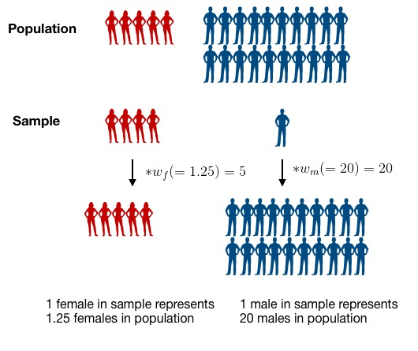

```{r setup, include=FALSE, message = FALSE}
knitr::opts_chunk$set(echo = TRUE)
```


```{r libraries, include=FALSE}
library(tidyverse)
library(haven)
library(knitr) 
library(ggpubr)
library(ggrepel)
library(tidyverse)
library(kableExtra)
library(survey)
library(broom)
library(plotrix)
library(patchwork)
library(pander)
# any other libraries you want to load
```

## Today's agenda

* Reminder of plans for remainder of course
* Talk about current status of your projects as a group
* Group discussion of your work
* Presentation of materials on survey weights and Poisson regression
* Questions and work time

## Plan for the remainder of the course

The goal of the rest of the course is to provide you with the support you need to create an excellent final report on a topic of your choice, including all steps of the process, from formulating a question through to getting the answer to it. We will provide you with time in class to work, so you need to plan for that and come prepared with next steps and questions.

We will be interacting with each other on these project topics: supporting each other through feedback and knowledge sharing.

There will be didactic components so support your learning:

* More advanced modeling topics such as Poisson regression, survival analysis and Cox proportional-hazards models, etc.
* More advanced data presentation topics such as data dashboards (interactive and static), enhanced R-markdown reports
* Whatever other holes you feel you have in your statistical/data science knowledge that you think will come in handy (totally open to suggestions!)


## Your project design

Your final project will have the following pieces:

* Question of interest
* Data set and design
  * Outcome variable
  * Predictor variable(s) of primary interest
  * Potential confounders
  * Potential effect modifiers
* Directed acyclic graph (DAG) showing the hypothesized relationships of interest and including potential confounders and effect modifiers
* A primary analysis to address the question of interest
* Communication of results in tables and figures


## When presenting your work

* Discuss your analysis idea (what's your question?)
* Discuss problems you ran into (and solutions if you have them!)
* Describe
    * Your data
    * Your data cleaning process
    * Results of your exploratory data analysis
* To provide feedback
    * Ask questions
    * Make suggestions for improvement!
    
### Working project document

We have created a working [working Google doc](https://docs.google.com/document/d/1zqzFqYCCs1mBlsVayRtn6XqYMYZMeiJgH_Otedkbc6E/edit?usp=sharing){target="_blank"} where you can record your plans. This will help you organize your thoughts, find classmates working on similar questions, and help us keep track of who is working on what. Please keep this document updated as your project changes!


## Poisson regression (log-linear regression)

Poisson regression is a useful modeling tool when the outcome variable, $Y$, is a count, or number of events. It's appropriate when $Y$ has a Poisson distribution, which is often an appropriate distributional assumption for count variables.

These notes will give you a rough idea of how Poisson regression works and how to fit the Poisson regression model using `R`.

#### Model equation

We write the model equation for Poisson regression as:
$$
\log (Y) = \beta_0 + \beta_1 \cdot X_1 + \beta_2 \cdot X_2 + ... + \beta_p\cdot X_p
$$
Because we model the $\log$ of the outcome variable, this is sometimes also called a *log-linear* model. **Note:** As in logistic regression, this is the *natural log* function not the log base 10 function.

#### Interpreting coefficients

How would we interpret the coefficients in a Poisson regression model?  

* $\beta_0$ represents the $log(Y)$ when all the $X$ variables are 0.
* $\beta_1$ represents the change in $log(Y)$ associated with a one-unit increase in $X_1$, holding the other $X$ variables constant.
* $\beta_2$ represents the change in $log(Y)$ associated with a one-unit increase in $X_2$, holding the other $X$ variables constant.
* Etc

Just like in logistic regression, we can exponentiate these coefficients to get them off the log scale:

* $e^{\beta_0}$ represents the $Y$ when all the $X$ variables are 0.  So the *count* of events when all the $X$ variables are 0.
* $e^{\beta_1}$ represents the ratio of $Y$ values associated with a one-unit increase in $X_1$, holding the other $X$ variables constant.  So the ratio of *counts* associated with a one-unit increase in $X_1$, holding the other $X$ variables constant.
* $e^{\beta_2}$ represents the ratio of $Y$ values associated with a one-unit increase in $X_2$, holding the other $X$ variables constant. So the ratio of *counts* associated with a one-unit increase in $X_2$, holding the other $X$ variables constant.
* Etc

Why do we get ratios of $Y$ values here?  Just like in logistic regression, when we take a difference in logs, this becomes a log of a ratio:
$$
\beta_1 = \log(Y | X_1 = x + 1) - \log(Y | X_1 = x) = log\left( \frac{Y | X_1 = x+1}{Y | X_1 = x} \right)
$$
So when we exponentiate we get:
$$
e^{\beta_1} = \frac{Y | X_1 = x+1}{Y | X_1 = x}
$$

#### Working with rates instead of counts

Often when our outcome variable is a count (number of events), we aren't really interested in the *number* of events but are really interested in the *rate* of events.  For example, if we are interested in comparing infant deaths across mother's racial groups in the US, we don't want to compare the *count* of deaths for white mothers to the *count* of infant deaths for Asian mothers, because there are more infants born to white mothers in the US than born to asian mothers in the US.  We would rather compare the *rate* of deaths for white mothers to the *rate* of infant deaths for asian mothers.  To do this, we need to account for the denominator in the rate calculation.  This denominator represents the *number of people* or the *person-time* at risk for the event to happen.  This is often the size of the population of the group where the events are counted.

To model *rates* instead of *counts*, we include an **offset** term in our model equation:
$$
\log (Y) = \log(N) + \beta_0 + \beta_1 \cdot X_1 + \beta_2 \cdot X_2 + ... + \beta_p\cdot X_p
$$
This $\log(N)$ term is called the offset, where $N$ is either the number at risk of the person-time at risk.  When we include the offset in the equation, we can rearrange the equation to get:
$$
\begin{eqnarray}
\log (number \ of \ events) &=& \log(N) + \beta_0 + \beta_1 \cdot X_1 + \beta_2 \cdot X_2 + ... + \beta_p\cdot X_p \\
\log (Y) &=& \log(N) + \beta_0 + \beta_1 \cdot X_1 + \beta_2 \cdot X_2 + ... + \beta_p\cdot X_p \\
\log (Y) - \log(N) &=& \beta_0 + \beta_1 \cdot X_1 + \beta_2 \cdot X_2 + ... + \beta_p\cdot X_p \\
\log \left(\frac{Y}{N} \right) &=& \beta_0 + \beta_1 \cdot X_1 + \beta_2 \cdot X_2 + ... + \beta_p\cdot X_p \\
\log (rate \ of \ events) &=& \beta_0 + \beta_1 \cdot X_1 + \beta_2 \cdot X_2 + ... + \beta_p\cdot X_p \\
\end{eqnarray}
$$
Now that the left-hand side of the equation is the $\log (rate \ of \ events)$, we can interpret the coefficients as follows:

* $\beta_0$ represents the $log(rate)$ when all the $X$ variables are 0.
* $\beta_1$ represents the change in $log(rate)$ associated with a one-unit increase in $X_1$, holding the other $X$ variables constant.
* $\beta_2$ represents the change in $log(rate)$ associated with a one-unit increase in $X_2$, holding the other $X$ variables constant.
* Etc

Now when we exponentiate these coefficients to get them off the log scale we get:

* $e^{\beta_0}$ represents the *rate* of events when all the $X$ variables are 0.
* $e^{\beta_1}$ represents the *rate ratio* associated with a one-unit increase in $X_1$, holding the other $X$ variables constant.
* $e^{\beta_2}$ represents the *rate ratio* associated with a one-unit increase in $X_2$, holding the other $X$ variables constant.
* Etc

We can interpret these *rate ratios* like we do the *odds ratios* we get from logistic regression.  For example, if the rate ratio (exponentiated coefficient) for a variable age, in years, is 1.8 we say: The rate of events is 80% higher for each additional year of age.  

#### Example: Concussions by sex and sport

**Are there differences in concussion rates between male and female college athletes?** We will investigate this question using data from *T. Covassin, C.B. Swanik, M.L. Sachs (2003). "Sex Differences and the Incidence of Concussions Among Collegiate Athletes", Journal of Athletic Training, Vol. (38)3, pp 238-244*.

The following table shows the data from this paper:


We see from this table that for each sport and for each sex, we have a count of the number of concussions (*Total concussions* column).  But we wouldn't want to directly compare the number of concussions between lacrosse and soccer because there were many more game exposures (*Game Exposures* column) played in soccer than in lacrosse.  So we need to actually model the *rate* of concussions by including an offset for the game exposures.

##### Data

First load the `tidyverse` and read in the data:
```{r}
conc_data <- read_csv("module_3/data/concussions.csv")
```

Let's take a look at the structure of the data:
```{r}
conc_data %>% as.data.frame()
```

I'm going to recode the `female` variable to be named `sex` and have levels of `Male` and `Female` instead of 0 and 1:
```{r}
# Create new sex variable
conc_data <- conc_data %>%
  mutate(sex = factor(female, levels=c(0,1), labels=c("Male", "Female")))

# Check that recoding worked
xtabs(~ sex + female, data = conc_data)

# Drop old female variable
conc_data <- conc_data %>%
  select(-female)
```

##### Exploratory graphs

We might want to make a bar graph showing the concussion rate by sex.  To do this, we will have to collapse the counts of concussions and game exposures across the different sports and years:

```{r}
# Get total # concussions and total # game exposures by sex
conc_data %>%
  group_by(sex) %>%
  summarize(conc_total = sum(conc),
            exp_total = sum(gameexp))

# Get rate of exposures by sex per 10,000 game exposures
conc_data %>%
  group_by(sex) %>%
  summarize(conc_total = sum(conc),
            exp_total = sum(gameexp)) %>%
  mutate(conc_rate = conc_total/exp_total * 10000)

# Save this new data in a table so we can make a graph
conc_by_sex <- conc_data %>%
  group_by(sex) %>%
  summarize(conc_total = sum(conc),
            exp_total = sum(gameexp)) %>%
  mutate(conc_rate = conc_total/exp_total * 10000)

conc_by_sex %>%
  ggplot(aes(x = sex, y = conc_rate)) +
  geom_bar(stat = "identity", fill = "blue") + 
  labs(title = "Concussion rates per 10,000 game exposures", x = "Sex", y = "Concussion rate per 10,000 game exposures")
```

We could make a similar plot of concussion rates by sport:
```{r}
conc_by_sport <- conc_data %>%
  group_by(sport) %>%
  summarize(conc_total = sum(conc),
            exp_total = sum(gameexp)) %>%
  mutate(conc_rate = conc_total/exp_total * 10000)

conc_by_sport %>%
  ggplot(aes(x = sport, y = conc_rate)) +
  geom_bar(stat = "identity", fill = "blue") + 
  labs(title = "Concussion rates per 10,000 game exposures", x = "Sport", y = "Concussion rate per 10,000 game exposures")
```

And we could make this plot by both sex and sport:
```{r}
conc_by_sex_sport <- conc_data %>%
  group_by(sex, sport) %>%
  summarize(conc_total = sum(conc),
            exp_total = sum(gameexp)) %>%
  mutate(conc_rate = conc_total/exp_total * 10000)

conc_by_sex_sport %>%
  ggplot(aes(x = sport, y = conc_rate)) +
  geom_bar(stat = "identity", fill = "blue") + 
  facet_wrap(~ sex) +
  labs(title = "Concussion rates per 10,000 game exposures", x = "Sport", y = "Concussion rate per 10,000 game exposures")
```

##### Fitting Poisson model

Like logistic regression, we fit a Poisson model using the `glm` function but we have to specify a `poisson` family and a `log` link.  We also give the `offset` value that we want to use as the denominator in our rate of events.  In our case, we will set the offset to be `log(gameexp)`.

Let's start with a model that just looks at the rate of concussions by sex:

```{r}
model_1 <- glm(conc ~ sex, data=conc_data, offset=log(gameexp), family=poisson(link="log"))
summary(model_1)
exp(model_1$coefficients)
exp(confint.default(model_1))
```

The coefficient for `sex` in this model is 0.284.  The exponentiated coefficient for `sex` is 1.33 with a 95% confidence interval of (1.12, 1.57).  We would say that female athletes have a 33% higher *rate* of concussions compared to male athletes.  And we are 95% confident their rate of concussions is between 12% and 57% higher.

Now let's look at a model to see whether concussion rates are different across sports:
```{r}
model_2 = glm(conc ~ sport, data=conc_data, offset=log(gameexp), family=poisson(link="log"))
summary(model_2)
exp(model_2$coefficients)
exp(confint.default(model_2))
```

Note that basketball is the reference category for our sport variable.  This means that all of the coefficients are comparing to basketball.  So we would say:

* The rate of concussions is 88% lower in gymnastics compared to basketball.  
* The rate of concussions in lacross is about twice the rate of concussions in basketball.
* The rate of concussions in soccer is 2.8 times the rate of concussions in basketball.
* The rate of concussions in softball/baseball is about half the rate of concussions in basketball.

If we wanted instead to compare all sports to soccer, which has the highest concussion rate, we could switch the reference category for the `sport` variable:
```{r}
conc_data <- conc_data %>%
  mutate(sport = relevel(as_factor(sport), ref="Soccer"))
```

Now when we fit the model we can interpret the rate ratios (exponentiated coefficients) all with respect to soccer.  Notice that they are all less than 1 now, since the rate of concussions is decreased for all sports relative to soccer.
```{r}
model_2 <- glm(conc ~ sport, data=conc_data, offset=log(gameexp), family=poisson(link="log"))
summary(model_2)
exp(model_2$coefficients)
exp(confint.default(model_2))
```

We could also consider the model with both `sex` and `sport` included:

```{r}
model_3 <- glm(conc ~ sex + sport, data=conc_data, offset=log(gameexp), family=poisson(link="log"))
summary(model_3)
exp(model_3$coefficients)
exp(confint.default(model_3))
```

Now we would say that the rate of concussion is 32% higher in females compared to males, *after adjusting for type of sport*.  We could also say that the rate of concussions for lacrosse players is 23% lower than for soccer players *of the same sex*.  And so on.

#### Other resources

This document is meant to give a brief introduction to Poisson regression.  It doesn't cover all the details, such as how to check the assumptions for a Poisson model to assess whether such a model is an appropriate choice for your data.

If you are interested in more information, here are a few links:

* https://en.wikipedia.org/wiki/Poisson_regression
* https://stats.idre.ucla.edu/r/dae/poisson-regression/ (only models the counts, not the rates)
* https://bookdown.org/roback/bookdown-bysh/ch-poissonreg.html#introduction-to-poisson-regression


## Survey weights 

### Data analysis concerns: model framework and survey weights

We will revisit the NYC HANES data set to illustrate a context where we need to consider incorporating survey weights in our analysis.

In a survey sample, we often end up with "too many" samples in a category, often due to the designed sampling plan.  By "too many", we mean more than would be expected based on the make-up of the population from which we are sampling.  For example, we may have a much higher proportion of women in our sample compared to the population and a much lower proportion of men than in the population. This may happen by design if we purposefully *oversample* a group that isn't well represented in the overall population. Why might we want to do this?

To analyze our survey data and infer back to the population, we can use data weighting to account for the mismatch between the population and sample. If we want the data to reflect the whole population, instead of treating each data point equally, we weight the data so that taken together, our sample does reflect the entire community.

To appropriately analyze our data as a survey, we will use the [package `survey`](https://cran.r-project.org/web/packages/survey/survey.pdf){target="_blank"}, which contains functions for various types of analysis that account for survey design. Note that there is a newer package that works with more "tidyverse" style of data interaction, called [`srvyr`](http://gdfe.co/srvyr/){target="_blank"}. For our purposes, it is not much easier to use than the `survey` package, but if you are interested in using it instead, feel free. Here is a link to a [short course](https://github.com/szimmer/tidy-survey-aapor-2021){target="_blank"} using this package, and it is also used in this [case study](https://www.opencasestudies.org/ocs-bp-vaping-case-study/){target="_blank"} from the Open Case Studies project, which is an awesome data analysis around vaping behaviors in American youth.


### What are survey weights?

Suppose that we have 25 students (20 male and 5 female) in our biostatistics class, and we want to talk with 5 of them to gauge their understanding of the content in the class. Although the proportion of female students in the population is small, we are very interested in getting their opinion, so we want to be sure to have some female students in our sample.  By randomly sampling 5 students from the class, it's quite possible we could end up with all male students in our sample, and we wouldn't learn anything about the female perspective in the class. 

Consider the extreme case where we are going to require that 4 of the 5 people we sample are female students, to be sure we get good information about the female perspective.  We sample 4 of the 5 female students and 1 of the 20 male students.   Do we expect this sample to represent the population? Definitely not, since there is a higher proportion of females in the sample than the population. We can correct for this by weighting our samples so that, taken together, they better reflect the composition of the population we want to learn about. 

Let's assume we sampled 4 of the 5 female students and 1 of the 20 male students from our population. Who do you think should get a higher weight in our analysis, males or females? What is your reasoning?


To calculate the survey weights, we could use the following formula:

$$
\begin{aligned}
Weight & = \frac{1}{Prob~of~being~selected~for~sample} \\
       & = \frac{1}{(Number~in~sample)/(Number~in~population)} \\
       & \\
       & =  \frac{Number~in~population}{Number~in~sample}
\end{aligned}
$$

That gives the following sample weights:

$$w_m=Male~Weight = \frac{20}{1} = 20$$

$$w_f=Female~Weight = \frac{5}{4} = 1.25$$

We can interpret these weights by saying that each male student in the sample represents 20 male students in the population and each female student in the sample represents 1.25 female students in the population.  Mathematically, we can see this as:

$$ 1~observed~male* w_m = 20~males $$ 
and 
$$ 4~observed~females * w_f = 5~females$$ 

<center>

</center>

By weighting the observations, we make the sample better represent the population.

For complex survey sampling designs, it can be complicated to calculate the weight for each individual observation. However, for many large survey data sets, such as NHANES, the appropriate weight is calculated by the organization that administers the survey and provided as a variable in the dataset. In our case study, this survey weight is calculated and provided as the `surveyweight` variable and we can simply apply this weight and perform a **survey-weighted logistic regression**.

### Selecting the weights

Because the NYC HANES 2013-2014 data have been collected to address a variety of different questions and using different surveys, the researchers who produced the data have employed a somewhat complex weighting scheme to compensate for unequal probability of selection. Five sets of survey weights have been constructed to correspond to different sets of variables that were collected: CAPI  weight, Physical weight, Blood Lab result weight, Urine Lab results weight and Saliva Lab results weight. **The determination of the most appropriate weight to use for a specific analysis depends upon the variables selected by the data analyst**. 

We will give a table to indicate each variable's origin stream:


| Variable names   |      Component      |
|---------------------------------|---------------------------------|
| age                                   | CAPI                                                                                                                                                                 |
| race                                  | CAPI                                                                                                                                                                 |
| gender                                | CAPI                                                                                                                                                                 |
| diet                                  | CAPI                                                                                                                                                                 |
| income                                | CAPI                                                                                                                                                                 |
| diabetes                               | CAPI                                                                                                                                                               |
| cholesterol                           | CAPI                                                                                                                                                                 |
| drink                                 | CAPI                                                                                                                                                                 |
| smoking                               | CAPI                                                                                                                                                                 |
| hypertension                           | CAPI                                                                                                                                                                |
| bmi                                    | EXAM                                                                                                                                                                |


When an analysis involves variables from different components of the survey, the analyst should decide whether the outcome is inclusive or exclusive, and then choose certain weights. To learn how to use weights for different purposes, refer to the particular [Analytics Guidelines](https://med.nyu.edu/departments-institutes/population-health/divisions-sections-centers/epidemiology/sites/default/files/nyc-hanes-datasets-and-resources-analytics-guidelines.pdf){target="_blank"} for the survey. 

In our case, we choose EXAM weight since our analysis is exclusive, i.e., we plan to restrict the samples included to those who have all of the data we are interested in looking at. Since one of the variables we are looking at is bmi, our dataset is limited to those who received a physical exam test, which means all of our survey participants have a value for the `EXAM_WT` variable. We selected this variable and renamed it as `surveyweight` in the earlier data cleaning part of this analysis. 

### Finite population correction factor

There is one more technical detail that we need to consider when using survey data. Many methods for analysis of survey data make the assumption that **samples were collected using sampling with replacement**, i.e., any time a new participant is drawn, each member in the population has an equal chance of being sampled, even if they have already been sampled. This is not usually how surveys are actually carried out, so an adjustment may be necessary to reflect this difference. This adjustment is called the **finite population correction factor** and it is defined as:

$$FPC = \left(\frac{N-n}{N-1}\right)^{\frac{1}{2}}$$
 
* `N` = population size
* `n` = sample size

In the case when the assumption above is violated (e.g. if you are sampling a sufficiently large proportion of the population), then you might sample the same person twice. The finite population correction (FPC) is used to reduce the variance when a substantial fraction of the total population of interest has been sampled. We can find the value of `N` and `n` for our survey from the [Analytics Guidelines](https://med.nyu.edu/departments-institutes/population-health/divisions-sections-centers/epidemiology/sites/default/files/nyc-hanes-datasets-and-resources-analytics-guidelines.pdf){target="_blank"}. Next let's calculate the FPC as below:

```{r fpcf}
dat <- read_sas('./module_2/d.sas7bdat')
N <-  6825749
n <- nrow(dat)
((N-n)/(N-1))^0.5
```

The FPC of our data set is very close to 1 since our sample is quite small compared to the size of the population, and we can simply ignore the FPC.


### Incorporating survey weights into our analysis

We will read in and recode the data, as we did last week. NOTE: We can't remove ANY data points from our set of data this time because we will be using survey weights. We will discuss how to address this below.

```{r read-data}
rename <- dat %>% 
  select(id = KEY,
         age = SPAGE,
         race = DMQ_14_1,
         gender = GENDER,
         born = US_BORN,
         diet = DBQ_1,
         income = INC20K,
         diabetes = DIQ_1,
         bmi = BMI,
         cholesterol = BPQ_16,
         drinkfreq = ALQ_1,
         drinkunit = ALQ_1_UNIT,
         smoking = SMOKER3CAT,
         hypertension = BPQ_2,
         surveyweight = EXAM_WT)

rename <- rename %>% 
  mutate(drink_denom = case_when(drinkfreq == 0 | drinkunit == 1 ~ 1,
                                   drinkunit == 2 ~ 52 / 12,
                                   drinkunit == 3 ~ 52),
         drink = drinkfreq / drink_denom)


hy_df <- rename %>% 
  mutate(race = factor(race, 
                       levels = c(100, 110, 120, 140, 180, 250), 
                       labels = c('White', 'Black/African American', 
                                  'Indian /Alaska Native', 
                                  'Pacific Islander', 
                                  'Asian', 'Other Race')),
         gender = factor(gender, 
                         levels = c(1, 2), 
                         labels = c('Male', 'Female')),
         born = factor(born, 
                       levels = c(1, 2),
                       labels = c("US Born", "Non-US Born")),
         diet = factor(diet, 
                       levels = c(5:1), 
                       labels = c('Poor', 'Fair', 'Good', 
                                  'Very good','Excellent')),
         income = factor(income, 
                         levels = c(1:6), 
                         labels = c('Less than $20,000','$20,000 - $39,999',
                                    '$40,000 - $59,999','$60,000 - $79,999',
                                    '$80,000 - $99,999','$100,000 or more')),
         diabetes = factor(diabetes, 
                           levels = c(2, 1, 3), 
                           labels = c('No','Yes','Prediabetes')),
         cholesterol = factor(cholesterol, 
                              levels = c(2, 1), 
                              labels = c('Low value','High value')),
         drinkcat = factor(drink >= 1, 
                        labels = c('<1 / wk', '1+ / week')),
         smoking = factor(smoking, levels=c(1,3,2), 
                         labels=c('Never smoker','Former smoker','Current smoker')),
         hypertension = factor(hypertension, 
                               levels = c(2, 1), 
                               labels = c('No','Yes'))
  ) 


## we will not use this in our survey design object, but will use it for comparisons below
hy_p_df <-
  hy_df %>%
  drop_na()

```

### Specify the survey design

We now need to figure out how to specify the survey design and incorporate the sampling weights in our modeling steps. To help us do this, we use the function `svydesign()` in the [package `survey`](https://cran.r-project.org/web/packages/survey/survey.pdf). This function combines a data frame and all the design information needed to specify a survey design. Here is the list of options provided in this function:

* `ids`: Formula used to specify the cluster sampling design. *Cluster sampling* is a multi-stage sampling design where the total population is divided into several clusters and a simple random sample of clusters is selected. Then a sample is taken from the elements of each selected cluster. Use `~0` or `~1` as the formula when there are no clusters.

* `data`: Data frame (or database table name) containing the variables for analysis look up variables in the formula arguments.

* `weights`: Formula or vector specifying the sampling weights. 

* `fpc`: Finite population correction, `~rep(N,n)`  generates a vector of length n where each entry is N (the population size). Default value is 1. The use of fpc indicates a sample without replacement, otherwise the default is a sample with replacement. Since our finite-population correction factor is very close to 1, we omit this argument, i.e., let it take the default value.
 
* `strata`: Specification for stratified sampling.  *Stratified sampling* is a sampling design which divides members of the population into homogeneous subgroups and then samples independently in these subpopulations. It is advantageous when subpopulations within an overall population vary.
 
In our situation, we don't have any clusters or stratified sampling to specify, we just need to include the appropriate survey weights provided with the data.  We will not include a FPC, since our FPC was approximately 1.
 
Here's how we specify the design relative to our dataset, `hy_df`:

```{r svydesign}
hypertension_design <- svydesign(
  ids = ~1,
  weights = ~hy_df$surveyweight,
#  fpc = rep(6825749, nrow(hy_df)),
  data = hy_df
)
```


The arguments are interpreted as the following:

* `ids = ~1` means there is no cluster sampling
* `data = hy_df` tells `svydesign` where to find the variables for analysis
* `weights= ~hy_df$surveyweight` tells it where to find the weight in our data frame

We can use `summary()` to show the results:
```{r summarydsgn}
summary(hypertension_design)
```

"Independent sampling design" means our sampling design is a simple random sample (SRS). By setting other parameters it is possible to specify different kinds of designs, such as stratified sampling, cluster sampling, or other multi-stage designs.


### Calculate survey-weighted summary statistics

Once we have created our `svydesign` object, we can use the convenient `svy*` functions to calculate summary statistics that account for survey design features.

First, we want to create a clean data set, where we no longer have observations with missing data. We will do this using the `subset` function since the `drop_na()` function does not work on the output of the `svydesign` function, but the `subset` function does. We can use the `complete.cases` function to identify which individuals in our `hy_df` data frame are not missing any of the variables.

```{r svynona}
h_design_nona <- subset(hypertension_design, complete.cases(hy_df))

dim(hypertension_design)
dim(h_design_nona)
```


To calculate the mean and its standard error, use the function `svymean()`. The `svymean()` function calculates a weighted estimate for the mean by weighting each observation with its sampling weight. We can compare this result to ignoring the survey weights using the `mean()` and `std.error()` functions in base R.

Here we look at both the weighted and un-weighted mean BMI:

```{r svymean}
svymean(~bmi, h_design_nona)
```

```{r meancomp}
mean(hy_p_df$bmi)
std.error(hy_p_df$bmi)
```

There is not a very large difference between these two values and their standard errors.  However, the survey-weighted results are "better" because they account for the sampling design of the HANES NYC survey.

To calculate a survey-weighted confidence interval for mean BMI value, we use the function `confint()` directly on the `svymean()` function:

```{r svyci2}
confint(svymean(~bmi, h_design_nona))
```

Statistics for subgroups are also easy to calculate with the function `svyby()`.  Here we look at mean BMI within groups defined by diet quality.
```{r svygroups}
svyby(~bmi, by=~diet, design = h_design_nona, 
      FUN = svymean)
```

If we are particularly interested in one subgroup of individuals, we can use the `subset()` to define a design for our subgroup of interest.  For example, if we are only interested in learning about the female population:
```{r svysubset}
h_design_female <- subset(h_design_nona,gender=="Female")
svymean(~bmi, h_design_female)
```

We estimate that the mean BMI for females in the population is 28.

Note that if we are limiting our analysis to a subgroup of the data, we **must** use the `subset` command to define a new survey design that relates to this new subpopulation.  This is because the survey weights need to be updated to reflect how the data represents this new population.  The `subset` command will appropriately update the survey weights so the analysis reflects the survey design of the subsetted data.  We **cannot** simply use a subset of the data with the original survey design. This is why we needed to start with the complete data set, not the one where we had already removed individuals with missing data.

How would we compare our mean and SE of bmi for the weighted and unweighted data?

### Survey-weighted logistic regression

#### Fit a simple model

Logistic regression is widely used to when the response variable is binary.  The standard logistic regression equation can be written as:

$logit(p)= log(\frac{p}{1-p})=X^{T}\beta$, where $p=P(Y=1)=E(Y)$ 

As we mentioned above, our data comes from a survey design so we need to take survey weights into account in our analysis.  We can do that with a survey-weighted logistic regression using the `svyglm()` function from the `survey` package.

The `svyglm()` function works similarly to using `glm()` to fit a standard logistic regression model.  The only difference is that instead of using the original data set in the `data` argument within `glm()`, we instead input the survey design object from `svydesign()` in the `design` argument in `svyglm()`.

Now we can fit our survey-weighted logistic regression model and look at the summarized output. We will start with a simple model by choosing one variable, `smoking`, as a predictor:

```{r svyglm, warning=TRUE}
g <- svyglm(hypertension ~ smoking, 
    family = binomial(link = 'logit'), design = h_design_nona)
summary(g)
```

If we allow `warning = TRUE`, a warning would appear as "non-integer #successes in a binomial glm!". But everything is right here! `glm` and `svyglm` are just picky. They warn us if they detect that the no. of trials or successes is non-integral, but they go ahead and fit the model anyway. If you want to suppress the warning (and you're sure it's not a problem), use `family=quasibinomial()` instead.

```{r svyglmquasi, warning=TRUE}
g0 <- svyglm(hypertension ~ smoking, 
    family = quasibinomial(link = 'logit'), design = h_design_nona)
summary(g0)
```

<details> <summary> Side note: Likelihood function </summary>


See `5_7_maximum_likelihood_estimation_INKED.pdf` file for derivation of likelihood function for logistic regression. It comes from binomial likelihood function, since we are considering a 0-1 outcome (someone has or does not have hypertension). We assume that conditional on the input variables, we can calculate the probability of a "success" (i.e., having hypertension) as a function of the estimated model coefficients and the values of the input variables, and each "trial" is independent of the others.

</details>

The `tidy()` function in the `broom` package can provide a dataframe representation of the model's output. Now we can see the model output as a nice dataframe!

```{r tidysvy}
g_res <- tidy(g0)
g_res
```

As in standard logistic regression using `glm()`, we see the coefficient estimate, standard error, test statistic, and p-value for each term in our model.  We can still get survey-weighted confidence intervals with the `confint()` function:
```{r svyci}
confint(g0)
```


What does the model output tell us about the relationship between predictor variables and the chance of getting hypertension? Look at the coefficient table. For the predictor variable `smoking`, the reference category is `Never smoker`. So the coefficient for `Former Smoker`, `r format(g_res$estimate[2], digits = 2)`, tells us that the log odds of hypertension for a former smoker is `r format(abs(g_res$estimate[2]), digits = 2)` higher than for a never smoker.  It makes more sense to exponentiate the coefficients and interpret them as odds ratios:
```{r svyexp}
exp(g0$coefficients)
```

The exponentiated coefficient for `Former smoker` is `r format(exp(g_res$estimate)[2], digits = 3)`, which means that former smokers have  `r round(100*(exp(g_res$estimate)[2] - 1), 0)`% increased odds of hypertension compared to never smokers. Similarly, the exponentiated coefficient for `Current smoker` is `r format(exp(g_res$estimate)[3], digits = 2)`, meaning current smokers have a `r round(100*(1-exp(g_res$estimate)[3]), 0)`% reduction in the odds of hypertension compared to those who have never smoked.  What's more, we can see the p-value for the coefficient of `Former smoker` is `r format(g_res %>% filter(term == "smokingFormer smoker") %>% pull(p.value), digits = 2)` which is < 0.05, so this difference is statistically significant. However, for `Current smoker`, the p-value is `r format(g_res %>% filter(term == "smokingCurrent smoker") %>% pull(p.value), digits = 2)`, which is > 0.05, meaning this difference is not statistically significant.


#### Fit a full model

Now we can fit a full model that includes all of our variables of interest: 

```{r svyglmfull}
g1 <- svyglm(hypertension ~ 
               age + race + gender + diet + income + 
               diabetes + bmi + cholesterol + drinkcat + smoking,
             family = binomial(link = 'logit'), 
             design = h_design_nona)
g1_res <- tidy(g1, exponentiate = TRUE)

g1_res %>% select(Variable = term, OR = estimate, `p-value` = p.value) %>% pander(digits = 2)
```

One interesting thing is that both the coefficients and p-values for the `smoking` variables are different than in our simple model.  Why did this happen? Remember that with other variables in the model, our interpretation of the coefficients for smoking changes.  We now have to interpret them as describing the relationship between smoking and hypertension *while holding the other variables in the model constant.*  If the other variables in the model are also related to `smoking`, then the relationship between smoking and hypertension may be different once we account for the other variables compared to the relationship of smoking on its own.

Now, let's interpret the new output. 

* `smoking`: Holding all other variables constant, former smokers have a 24% increased odds of hypertension compared to those who have never smoked.  Holding all other variables constant, current smokers have 25% reduced odds of hypertension compared to those who have never smoked. However, neither of these differences is statistically significant.

* `bmi`: Holding all other variables constant, a one-unit increase in bmi is associated with a 8% increase in the odds of hypertension.

## Assignment 3.3

* Use "Copy to" to create a new version of your final project Rmd file, with a new date: for this week it should be **Final_Project_Draft_2026_04_12.Rmd**
* Write a short introduction to your question of interest:
    * Question
    * Data source
    * Outcome variable
    * Primary predictor variable(s)
* **Add your data to your Github project** and read your data into RStudio Cloud
    * Many of you have not done this yet, which means I can't knit your files or provide detailed feedback
* Examine and explore your data:
    * How do you decide what variables to include in your data set?
    * Summaries of your variables of interest
        * Is there missing data?  Anything unusual or concerning?
    * Recode from numbers to factors
        * 1 -> "poor"", 0 -> "not poor", etc
    * Make a few basic exploratory plots to answer your question
* What type of regression analysis could you use to address your question?

As we have with all assignments in the past:

* Submit your assignment in R markdown through Github **by Sunday (April 12, 2026) at midnight**.  
* Share some information about your work so far on Piazza in the "Final Project Week 3" thread. This could be a **screenshot of a figure or table**, **some interpretation**, **a question** about how to do something, or **a problem** you would like help with. You are welcome to post this anonymously to your classmates, but remember that your project topic may be unique and so it may be hard to remain anonymous in these posts. 
* In your Piazza post, **give a little background on your project** (question of interest, variables, etc) so that classmates have a context with which to look at your post.


## Important dates for final project

Below you can find important dates for this final project.  **Each of you will work at your own pace through this project**, so the items listed for each week are suggested benchmarks to keep you on track for these last 5 weeks of class.  

**Each week you will submit your current work in R markdown through Github by Sunday at midnight.**  This includes your .Rmd file and either your dataset or your knit .html file if you are not sharing your data on the cloud.  **Each week you will also make a post on Piazza sharing something about your work in progress.**

When you submit your work each week, include specific questions you have or places where you are stuck.  Be prepared to present (talk about) your work in class on the following Monday.

**If you are struggling with any part of the project or want to talk through your code please come to office hours or reach out to us over email.**

* **Week of March 23:**
    * Identification of a question of interest and appropriate data set for answering the question.  
    * Set up Github repository with data; read data into RStudio in Posit cloud
    * Initial summaries, recoding, and possibly exploratory plots of the variables in your dataset
    * Submit your work (and questions for us) through Github and post on Piazza Week 1 thread by Sunday (3/29) at midnight; be prepared to discuss your work in class on Monday (3/30)
* **Week of March 30:**
    * Finish recoding and cleaning of your data
    * Finish exploratory analysis of your variables
    * Create a rough initial data display (figure/table) that addresses your question of interest
    * Submit your work (and questions for us) through Github and post on Piazza Week 2 thread by Sunday (4/5) at midnight; be prepared to discuss your work in class on Monday (4/6)
* **Week of April 6:**
    * Finalize your data display to answer your question of interest
    * Create some initial regression models that answer your question of interest
    * Submit your work (and questions for us) through Github and post on Piazza Week 3 thread by Sunday (4/12) at midnight; be prepared to discuss your work in class on Monday (4/13)
* **Week of April 13:**
    * Finalize your regression models for answering your question of interest
    * Begin writing up your interpretation of your results for your final project report
    * Submit your work (and questions for us) through Github by Sunday (4/19) at midnight
* **Week of April 20:**
    * Create a presentation (~ 4 slides, see below) to present your work to the class
    * Continue writing up your interpretation of your results for your final project report. 
    * Possible extension: Create a data dashboard, interactive Shiny or Rmd interface (for example with tabs)
    * Submit your work (and questions for us) through Github by Sunday (4/26) at midnight
    * Submit your presentation slides through Github by Sunday (4/26) at midnight and be prepared to give your presentation in class on Monday (4/27)
    * NOTE: Around 4-6 of you will need to present on Wednesday April 22 since there isn't time for 18 presentations in one class
* **April 27 (Monday): Class presentations**
    * Each person will present their results to the class.  You should present your results as far as they are at that time.
    * You will have 5 minutes to talk about your project.  
    * You should prepare ~ 4 slides to aid in your presentation:
        * Slide 1 will have your question, information about your data set, and your design (outcome, predictors, confounders, etc)
        * Slide 2 should have a DAG showing your proposed relationship with confounders/modifiers included
        * Slide 3 should show a data display that addresses your question of interest
        * Slide 4 should show the results of a statistical analysis to answer your question
        * You should submit these slides Sunday night through your project Github repository before coming to class; label the PPT file with your last name
* **May 11 (Monday): Final report due**
    * Your written report for your project is due at midnight through Github.
    * Include an introduction section to give some context for why your question is interesting.
    * Include a brief description of the data and variables you used for your project.
    * Include a directed acyclic graph (DAG) that shows how you think your variables relate to each other.  Note: You do not need to try to make this DAG in R.  Make it in Powerpoint and then take a screen shot.  You can then upload the image file to RStudio cloud and insert it into your R Markdown document like [this](https://www.earthdatascience.org/courses/earth-analytics/document-your-science/add-images-to-rmarkdown-report/). 
    * For each question of interest, you should have a data display and a statistical analysis to address the question.  
    * For each question of interest, give a few brief sentences to describe the methods (regression techniques) you used to answer the question.
    * Write up your results in a few paragraphs to answer your questions.  In your write-up, you should refer to your data display(s) and your analysis results.  Be numerate!
    * You will submit a .Rmd file that will knit into the final report that you are submitting, i.e., all code is provided and runnable to produce the report.


